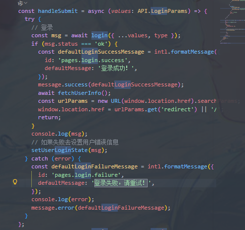
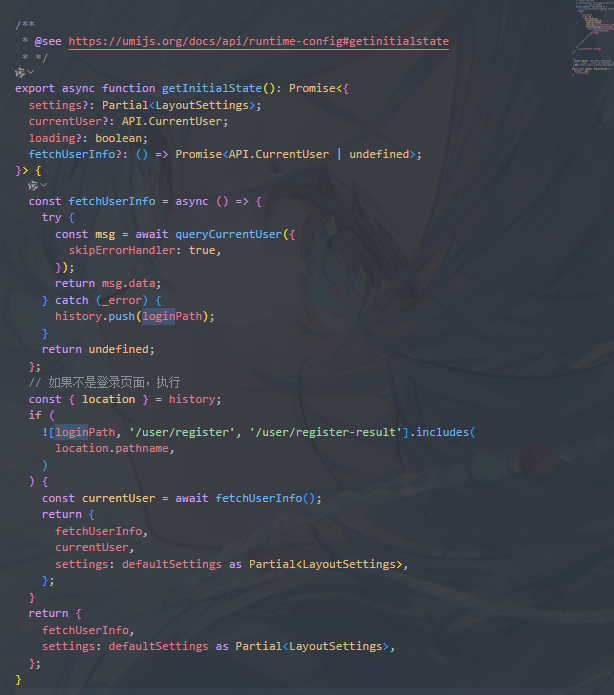
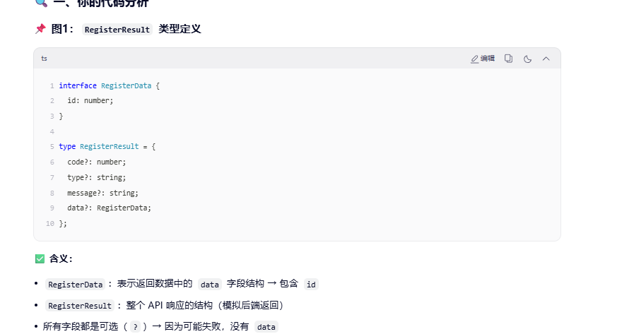
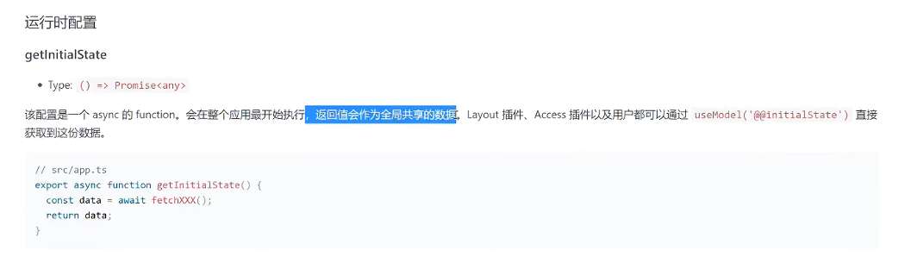
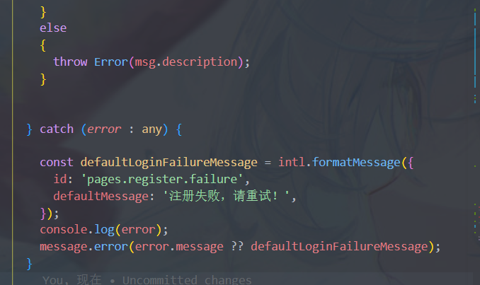
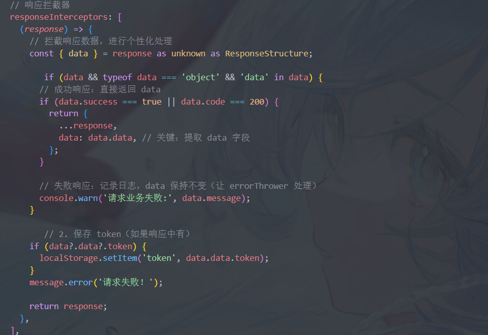
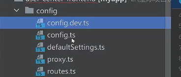
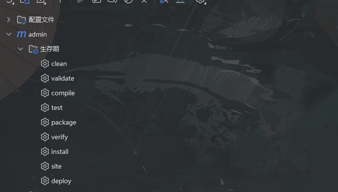
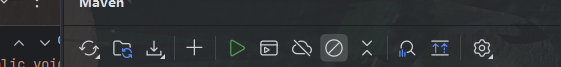
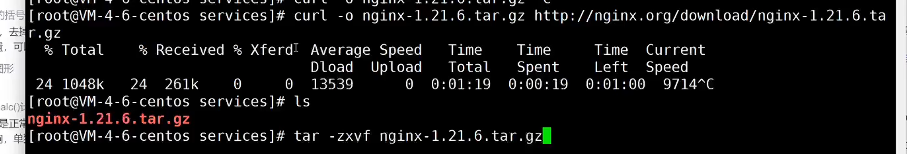

# 用户中心系统-管理系统

## 企业做项目流程

需求分析 -> 设计 ->技术选型->初始化/引入需要的技术->写demo ->写代码 ->测试->代码提交/评审->部署

## 需求分析

1.登入/注测

2.用户管理

3.用户校验

## 技术选型

前端:三件套  + React + 组件库Ant Design + Umi + Ant Design Pro

后端 :

java

spring (依赖注入框架,帮你管理java对象的)

springmvc (web框架,提供接口访问,restful接口能力)

mybatis (java操作数据库的框架,持久层,对jdbc的封装)

mybatis-plus(对mybatis的增强)

springboot (注解配置)

mysql

部署:服务器/容器(平台)

## 计划

初始化项目

    前端初始化

    初始化项目

    引入组件

    项目瘦身

    后端初始化

准备环境

引入框架

[程序员 - 高效开发之选：六款优秀的Vue3开源后台模板全面解析 - 个人文章 - SegmentFault 思否](https://segmentfault.com/a/1190000047298453)

Ant Design Pro

[设计价值观 - Ant Design](https://ant-design.antgroup.com/docs/spec/values-cn?locale=zh-CN)

vue-element-admin

[程序员 - 高效开发之选：六款优秀的Vue3开源后台模板全面解析 - 个人文章 - SegmentFault 思否](https://segmentfault.com/a/1190000047298453)

三种初始化java项目的方法

1.Github源码

2.Springboot官方模板  [Spring Initializr](https://start.spring.io/)

3.直接在idea开发工具中生成 √

# 数据库设计

有哪些表 ? 表内有哪些字段? 字段的类型 ? 数据库字段添加索引 (经常用哪个字段查询) ?
表与表间的关联

用户表 :

id (主键) 	varchar

username 名称   varchar

userAccout 登入账号

gender性别  tinyint

avatarUrl 头像 varchar

password密码  varchar

phone 电话 varchar

emai邮箱  varchar

isVaild 是否有效  tinyint   01

---

crateTime 创建时间 (数据插入时间)  datatime

updateTime更新时间 (数据更新)  datatime

isDelete是否删除  0 1 (逻辑删除) tinyint

快速生成对象的 setter 链式调用

* **新项目 → 优先用 Lombok `@Builder`**
* **Java 17+ 且对象不可变 → 用 `record`**
* **临时测试且不能改代码 → 用 GenerateAllSetter 插件（记得设快捷键）**
* **避免手写大量 setter！**

> **💡 小技巧：即使不用 Lombok，也可以在 IDEA 中用** `Alt + Insert`（Windows）或 `Cmd + N`（macOS）→ 选择  **Constructor** **,** **Getters and Setters** **快速生成基础代码。**

**MyBatis 默认会将 Java 属性转为**  **下划线命名法（snake_case）**

**因为 MyBatis 默认会把 Java 属性** `userAccount` **视为对应数据库字段** `user_account`（通过下划线分割）， **但如果你没有开启 `map-underscore-to-camel-case`，它就不会反向转换** **。**

**所以当你在 SQL 中写了** `user_account`，而数据库里只有 `userAccount`，自然就报错了。

|  |  |  |  |
| - | - | - | - |
|  |  |  |  |
|  |  |  |  |
|  |  |  |  |

# 自动生成器的使用

MybatisX插件

# 登入/注册

## 注册逻辑

1.用户在前端输入账户和密码,以及校验码

2.校验用户的账号,密码是否符合要求

    1. 账户不小于6位

    2.密码不小于8位   (必须包含什么,在网上搜下正则表达式)

    4.账户不能重复

    5.账户不能包含特殊字符

    6.密码和校验密码相同

    3.其它的校验

3.对密码进行加密(密码不能明文直接存在数据库中)

4.向数据库插入用户数据

后端

1.规划项目结构

2.实现基本的数据库操作

    -  自动生成

    -

用户管理

## 登入逻辑

接受参数:用户账号,密码

请求类型 : Post

请求体 : JSON格式

> 请求参数很长时不建议用git

返回值 : 用户信息 (脱敏)

### 逻辑

1.校验用户的账号,密码是否符合要求

    1. 账户不小4于位

    2.密码不小于8位   (必须包含什么,在网上搜下正则表达式)

    4.账户不能重复

    5.账户不能包含特殊字符

2.校验密码是否输入正确,要与数据库内的密文密码去对比

3.我们要记录用户的登入态(session),将其存在服务器上 (用后端Springboot框架封装的服务器tomacat去记录)

cookie

4.返回用户信息(脱敏)

### 如何知道哪个用户登入了

1.连接一个服务器端,得到一个session1状态,返回给前端

2.登入成功后,得到了登入成功的session,返回给前端一个设置cookie的"命令"

session =>cookie

3.前端接受到后端的命令吼,设置cookie,保存到浏览器中

4.前端再次请求后端的时候(相同的域名),在请求头中带上cookie去请求

5.后端拿到前端传来的cookie,遭到对应的session

6.后端从session中可以取出基于session存储的变量 (用户的登入信息,登入名)

### 控制层封装请求

> @RestController 适用于编写restful 风格的api,返回值默认为json类型

/user/Login

/userLogin

controller层倾向于校验,不是业务逻辑本身

servcie对业务逻辑的校验 (有可能被conteoller校验)

## 用户管理接口

1.查询用户

    1.允许根据用户名查询

    2.校验权限

    1.检查登陆态

    2.检查角色

2.删除用户

    1.

> 不能简单 user !=null  ,类型不一致时,会报错
>
> | **场景**                                | **是否安全** | **说明**                          |
> | --------------------------------------------- | ------------------ | --------------------------------------- |
> | `obj` **是** `null`                 | **✅ 安全**  | `instanceof` **返回** `false` |
> | `obj` **是错误类型（如** `String`） | **✅ 安全**  | `instanceof` **返回** `false` |
> | **直接强转非** `User` **对象**  | **❌ 崩溃**  | **抛** `ClassCastException`     |
>
> 所以：**只要类型不确定，就用 `instanceof` **—— 这是 Java 最佳实践之一。****

先做设计,然后持续设计

# 前后端交互

request 封装axios封装ajax

[22 用户管理功能 - 编程导航 - 程序员编程学习交流社区](https://www.codefather.cn/post/1881023982813155329#heading-9)

**最新版本（v7）的** `request` **配置已经**完全变了！

> 🔥 你看到的 `RequestOptionsInit` 和 `prefix/suffix` 等字段，**在最新版中已不再推荐使用或已被移除**。

## 跨域

### 方式一：在 `app.tsx` 中配置 `baseURL`（推荐）

你的项目当前已经在 `src/app.tsx` 文件中配置了请求的公共前缀：

```typescript
// src/app.tsx
export const request: RequestConfig = {
  baseURL: 'https://proapi.azurewebsites.net',  // 👈 这就是公共前缀
  ...errorConfig,
};
```

__如何修改：__ 只需修改 `baseURL` 的值即可。例如，如果你的后端服务地址是 `http://localhost:8080/api`，则改为：

```typescript
export const request: RequestConfig = {
  baseURL: 'http://localhost:8080/api',
  ...errorConfig,
};
```

---

### 方式二：在 `requestErrorConfig.ts` 中使用请求拦截器

如果你需要更灵活的控制，可以在请求拦截器中添加前缀。在 `src/requestErrorConfig.ts` 文件中：

```typescript
// 请求拦截器
requestInterceptors: [
  (config: RequestOptions) => {
    // 添加公共前缀
    const prefix = '/api';  // 你的公共前缀
    const url = prefix + config?.url;
    return { ...config, url };
  },
],
  
```

不推荐, 全区搜索不好搜 ,另外不同的代码风格不同的写法,会带来混乱

---

### 方式三：开发环境使用代理（适用于解决跨域）

在 `config/proxy.ts` 中配置代理，这种方式只在 __开发环境__ 有效：

```typescript
export default {
  dev: {
    '/api/': {
      target: 'http://localhost:8080',  // 后端服务器地址
      changeOrigin: true,
      // pathRewrite: { '^/api': '' },  // 如果需要去掉 /api 前缀
    },
  },
  // ... 其他环境配置
};
```

这样，所有以 `/api/` 开头的请求都会被代理到 `http://localhost:8080`。

---

### 方式四：使用环境变量区分不同环境

可以根据环境动态设置 baseURL：

```typescript
// src/app.tsx
const API_BASE_URL = process.env.NODE_ENV === 'development' 
  ? '/api'  // 开发环境使用代理
  : 'https://your-production-api.com/api';  // 生产环境

export const request: RequestConfig = {
  baseURL: API_BASE_URL,
  ...errorConfig,
};
```

### 总结建议

| 场景                        | 推荐方式                               |
| --------------------------- | -------------------------------------- |
| 统一配置所有请求的前缀      | 方式一：`app.tsx` 中设置 `baseURL` |
| 开发环境解决跨域            | 方式三：配置 `proxy.ts`              |
| 生产环境 + 开发环境不同配置 | 方式四：使用环境变量                   |
| 需要对 URL 做复杂处理       | 方式二：请求拦截器                     |

__后端其实不需要加 `/api` 前缀__，你只需要在前端代理配置中使用 `pathRewrite` 去掉 `/api` 前缀即可

## 在 Umi Max 项目中设置环境变量

你的项目是基于 **Umi Max** 框架，有以下几种方式设置环境变量：

方式一：.env 文件多环境（dev/test/pre/prod）

方式二：package.json + 环境映射需要在构建时确定的常量

方式三：config.ts 的 define

---

### 方式一：创建 `.env` 环境文件（推荐）

在 `user-center-admin/` 目录下创建环境文件：

| 文件名               | 用途                         |
| :------------------- | :--------------------------- |
| `.env`             | 所有环境通用                 |
| `.env.local`       | 本地环境（不提交到 git）     |
| `.env.development` | 开发环境 (`npm run dev`)   |
| `.env.production`  | 生产环境 (`npm run build`) |

**示例 `.env.development` 文件：**

```bash
# 开发环境 API 地址
REACT_APP_API_BASE_URL=/api
```

**示例 `.env.production` 文件：**

```bash
# 生产环境 API 地址
REACT_APP_API_BASE_URL=https://your-production-api.com/api
```

然后在 `src/app.tsx` 中使用：

```typescript
export const request: RequestConfig = {
  baseURL: process.env.REACT_APP_API_BASE_URL || '/api',
  ...errorConfig,
};
```

> ⚠️ **注意**：Umi 中自定义环境变量必须以 `UMI_APP_` 或 `REACT_APP_` 开头才会被注入到代码中。

---

### 方式二：通过 `package.json` 脚本设置

你的项目已经在用这种方式，查看 `package.json`：

```json
{
  "scripts": {
    "start:dev": "cross-env REACT_APP_ENV=dev MOCK=none UMI_ENV=dev max dev",
    "start:test": "cross-env REACT_APP_ENV=test MOCK=none UMI_ENV=dev max dev",
    "start:pre": "cross-env REACT_APP_ENV=pre UMI_ENV=dev max dev"
  }
}
```

你可以在代码中通过 `process.env.REACT_APP_ENV` 获取当前环境：

```typescript
// src/app.tsx
const API_BASE_URL_MAP = {
  dev: 'http://localhost:8080/api',
  test: 'https://test-api.example.com/api',
  pre: 'https://pre-api.example.com/api',
  prod: 'https://api.example.com/api',
};

const env = process.env.REACT_APP_ENV || 'dev';

export const request: RequestConfig = {
  baseURL: API_BASE_URL_MAP[env as keyof typeof API_BASE_URL_MAP],
  ...errorConfig,
};
```

---

## 注册页面

1.添加路由

2.确定是否有重定向

app.tsx是全局页面

* **首次进站 →** `getInitialState` **拦截**
* **站内跳转 →** `onPageChange` **拦截**





| **语法 / API**                                   | **说明**                                                                                                              |
| ------------------------------------------------------ | --------------------------------------------------------------------------------------------------------------------------- |
| `export async function getInitialState()`            | **Umi 运行时配置** **，用于设置全局初始状态（类似 React 的** `App` **初始化数据）**                     |
| `Promise<{ currentUser?: ... }>`                     | **TypeScript 返回类型声明，定义全局状态结构**                                                                         |
| `await queryCurrentUser({ skipErrorHandler: true })` | **调用封装的 API；**`skipErrorHandler: true` **表示**  **不自动弹错误提示** **（避免 401 弹窗）** |
| `history.push(loginPath)`                            | **使用 Umi 内置的** `history` **对象进行** **编程式导航** **（跳转页面）**                        |
| `location.pathname`                                  | **获取当前 URL 路径，用于判断是否在公开页面**                                                                         |
| `includes(...)`                                      | **检查当前路径是否属于白名单（免登录）**                                                                              |

* **模式** **：运行时鉴权（Runtime Authentication）**
* **思想** **：中心化权限控制（在应用入口统一拦截）**
* **对标概念** **：**
* **Vue 中的** `router.beforeEach`
* **React 中的** `<ProtectedRoute>`
* **但 Umi 用** `getInitialState` **实现了类似效果**

**用** **TypeScript + async/await + history API** **编写，是阿里 Ant Design Pro 的标准实践。**

---

ant design 组件库 +>react

ant design Procomponents =>ant desgin

ant design pro  后台管理系统  => ant design react

`typings.d.ts` 文件的作用

`typings.d.ts` 是一个 __TypeScript类型定义文件__，它的主要作用是

1. __定义类型（Type Definitions）__

为项目中的数据结构定义TypeScript类型，提供类型安全



## 重定向

__重定向__ = 用户访问 A 页面 → 自动跳转到 B 页面

重定向的两大类型

| 类型                   | 说明                    | 示例                               |
| ---------------------- | ----------------------- | ---------------------------------- |
| **服务端重定向** | 后端返回 301/302 状态码 | HTTP 响应头 `Location: /new-url` |
| **客户端重定向** | 前端 JS 控制跳转        | `window.location.href = '/home'` |

前端重定向方法汇总

原生 JavaScript

| 方法                 | 代码                                 | 是否添加历史记录 | 是否刷新页面 |
| -------------------- | ------------------------------------ | ---------------- | ------------ |
| `location.href`    | `window.location.href = '/home'`   | ✅ 是            | ✅ 是        |
| `location.replace` | `window.location.replace('/home')` | ❌ 否            | ✅ 是        |
| `location.assign`  | `window.location.assign('/home')`  | ✅ 是            | ✅ 是        |

Vue Router

| 方法        | 代码                                 | 说明               |
| ----------- | ------------------------------------ | ------------------ |
| `push`    | `router.push('/home')`             | 跳转，添加历史记录 |
| `replace` | `router.replace('/home')`          | 跳转，替换当前历史 |
| `go`      | `router.go(-1)`                    | 前进/后退          |
| 路由配置    | `{ path: '/', redirect: '/home' }` | 配置式重定向       |

React Router

| 方法                 | 代码                                     | 说明               |
| -------------------- | ---------------------------------------- | ------------------ |
| `navigate`         | `navigate('/home')`                    | 跳转，添加历史记录 |
| `navigate replace` | `navigate('/home', { replace: true })` | 替换当前历史       |
| `Navigate 组件`    | `<Navigate to="/home" replace />`      | 声明式重定向       |

UmiJS (您的项目)

| 方法                | 代码                                    | 说明     |
| :------------------ | --------------------------------------- | -------- |
| `history.push`    | `history.push('/home')`               | SPA 跳转 |
| `history.replace` | `history.replace('/home')`            | 替换历史 |
| 路由配置            | `{ path: '/', redirect: '/welcome' }` | 配置式   |

您项目中的重定向实现

在 `login/index.tsx` 中，登录成功后的重定向代码：

```typescript
// 登录成功后
const urlParams = new URL(window.location.href).searchParams;
window.location.href = urlParams.get('redirect') || '/';
```

__工作原理：__

- 从当前 URL 中获取 `redirect` 参数（如 `?redirect=/dashboard`）
- 如果有 `redirect` 参数，跳转到该地址
- 如果没有，默认跳转到首页 `/`

推荐使用：`history.push()` 或 UmiJS 的 `navigate`

- __一般页面跳转__：用 `history.push()`
- __登录成功跳转__：`window.location.href` 也可以接受（确保状态刷新）
- __登出后跳转__：建议用 `window.location.href = '/login'` 清除状态

| 方法                        | 刷新页面 | 添加历史 | 适用场景               |
| --------------------------- | -------- | -------- | ---------------------- |
| `window.location.href`    | ✅       | ✅       | 需要完全刷新、跨域跳转 |
| `window.location.replace` | ✅       | ❌       | 登出、不想后退         |
| `history.push()`          | ❌       | ✅       | SPA 常规跳转           |
| `history.replace()`       | ❌       | ❌       | 替换当前页、登录跳转   |
| 路由配置 `redirect`       | ❌       | ❌       | 首页默认、路由迁移     |

**在** **Umi 项目（包括 Ant Design Pro）中，必须从 `'umi'` **导入** `history`**

```
import { history } from 'umi';

```

Q1：为什么不用 `history.push`？

> **因为注册成功后，你不希望用户点“浏览器后退”又回到注册页。**
> `replace` **会** **替换当前记录** **，更安全。

**Q2：为什么不用 `window.location.href`？**

> **它会** **刷新整个页面** **，丢失所有状态（比如未保存的数据），体验差。**

Q3：需要判断 `redirect` **是否合法吗？**

> **如果你担心安全问题（比如有人传** `?redirect=https://hacker.com`），可以加个判断：

```
if (redirect && redirect.startsWith('/')) {
  // 只允许以 / 开头的内部路径
}

```

**“什么情况下 URL 里会有 `?redirect=xxx`？”**

**简单说：**

> **当用户在未登录状态下，试图访问一个需要登录才能看的页面时，系统会先跳转到登录页，并把原页面地址记在 `?redirect=...` **里，等登录成功后再自动跳回去。****

| **触发条件**                 | **URL 示例**                     |
| ---------------------------------- | -------------------------------------- |
| **访问需登录页面但未登录**   | `/user/login?redirect=/dashboard`    |
| **从某页面点击“登录”按钮** | `/user/login?redirect=/order/list`   |
| **分享链接给未登录用户**     | `/user/login?redirect=/share/abc123` |
| **注册入口带来源页面**       | `/register?redirect=/welcome`        |

> **💡** **核心目的：让用户登录/注册后，能自动回到他原本想去的地方，体验更流畅。**

> **`const {query} = history.location;` **这个方法？****

**这是一个**  **React Router v5 时代的写法** **，在现代 UmiJS（v4+）和 React Router v6 中**  **已经废弃或不推荐使用** **。**

**注意 !   注册成功 ≠ 自动登录** **，很多系统要求注册后手动登录。**

**如果注册后****不自动登录****，甚至可以去掉** `fetchUserInfo()`

先完成再优化

# 获取用户登入态

注意  信息的实时性 (从数据库还是session)

头像

字段名不匹配导致无限加载  (只要有一个字段不匹配就会这样的)

__Umi.js 路由路径规则__

1. __相对路径规则__：当使用相对路径（以 `./` 开头）时，Umi.js 会从 `src/pages` 目录开始查找组件
2. __目录结构对应关系__：路径中的 `/` 对应文件系统中的目录层级

全局变量  ,vue可以用vuex等



app.tsx项目全区入口文件,定义了整个项目中使用的公共数据(比如用户信息)

access.ts 控制用户的访问权限

__umi.js 的路由系统__

在 Umi.js 中：

- __路由配置决定路径__：`routes.ts` 中定义的路径会自动在应用中可用
- __不需要显式父组件__：Umi.js 会自动处理路由嵌套和布局
- __布局组件__：Umi.js 使用 ProLayout 或其他布局组件包装页面

模式A：使用 `Admin.tsx` 作为布局组件

模式B：使用默认布局 + `access` 控制

# ProComponents高级表单

1. 通过columns定义表格有哪些列
2. columns属性

   - dataIndex 对应返回数据对象的属性
   - title表格列名
   - copyable 是否允许复制
   - elipsis是否允许缩略
   - valueType 用于声明这一列的类型

`ProTable` **的** `request` **与 API 函数参数匹配**

1. **`ProTable.request` **的参数结构****

```
request:(params, sort, filter)=>Promise<{
  data:T[];
  total?:number;
  success?:boolean;
}>
```

* `params`：包含分页、表单查询条件等（如 `{ current: 1, pageSize: 20, name: '张三' }`）
* **必须返回** `data`，若启用分页还需 `total`

`options`

* **用途** **：配置请求行为（方法、头、超时等）**
* **包含** **：**`method`、`headers`、`timeout`、**`params`** **等**
* **传给** **：**`request(url, options)`

# 用户校验

> 仅适用于用户可信的情况下

让用户自己填: 2-5位编号

后台对编号的验证:长度校验,唯一性校验

# 全局异常处理

```java

/**
 * 错误码
 *
 * @author 13372
 */
public enum ErrorCode {
    FARAMS_ERROR (408,"请求参数错误","请求参数错误"),
    FARAMS_NULL_ERROR (409,"请求参数为空","请求参数为空"),
    Not_AUTH(401,"无权限","无权限");

    private final int code;
    private final String message;
    private final String description;

    ErrorCode(int code, String message, String description) {
        this.code = code;
        this.message = message;
        this.description = description;
    }

}

```

    -  自定义错误码

    -  返回值支持正常和错误

2.封装全局异常处理

定义业务异常类

- 定义业务异常类
- 自定义构造函数,跟灵活/快捷的设置字段

```java
package com.artsail.admin.exception;

import com.artsail.admin.common.ErrorCode;

public class BusinessException extends RuntimeException{
    private int code;
    private String description;

    public BusinessException(int code, String message, String description) {
        super(message);
        this.code = code;
        this.description = description;
    }

    public BusinessException(ErrorCode errorCode) {
        super(errorCode.getMessage());
        this.code = errorCode.getCode();
        this.description = errorCode.getDescription();
    }

    public BusinessException(ErrorCode errorCode, String description) {
        super(errorCode.getMessage());
        this.code = errorCode.getCode();
        this.description = description;
    }
}

```

编写全局异常处理器

- 捕获代码中所有的异常,内部消化,集中处理,让前端得到更详细的业务报错/信息
- 同时屏蔽封装项目框架本身的异常
- 集中处理,比如记入日志
- spring AOP 在调用方法的前后进行额外的处理

3.全局请求日志和登入校验

# 全局请求拦截器

```js

  // ====== 通用响应结构 ======
  type BaseResponse<T> = {
    code: number;       // 200 表示成功
    message: string;    // 描述信息
    data: T;           // 业务数据（可选）
    description?: string;
  };

```



**通过res.data去获得数据，太麻烦了，所以去做了响应拦截器的相关参数调整，新增一个全局相应拦截**



`errorThrower`（错误抛出器）

* **作用** **：把“业务失败”伪装成“异常”。**
* **触发时机** **：每次收到响应后（即使 HTTP 200）。**

`errorHandler`（错误处理器）

* **作用** **：统一展示错误。**
* **分两种情况处理** **：**
* **BizError** **→ 按** `showType` **展示（来自后端约定）**
* **其他 Error** **→ 判断是网络问题、HTTP 错误还是配置错误**

把 `errorThrower`（错误抛出器）删了,在响应拦截器处理,不然可能会冲突

---

第一阶段：后端响应格式统一

- 扩展 ErrorCode.java
- 完善 GlobalExceptionHander.java
- 统一 UserController 响应

第二阶段：前端响应处理优化

- 更新 typings.d.ts
- 修改 requestErrorConfig.ts
- 创建响应拦截器工具

更新 API 调用

更新页面中的调

第三阶段：增强功能

1. 添加请求重试机制

添加请求日志

# 多环境

[多环境 | 鱼皮的编程宝典](https://code.yupi.icu/%E5%A4%9A%E7%8E%AF%E5%A2%83/)

本地开发 localhost (127.0.0.1)

多环境 :同一套项目代码在不同的阶段需要根据实际情况来调整配置并且部署到不同的机器上

为何需要

1. 每个环境互不影响
2. 区分不同的阶段
3. 对项目进行优化
   1.本地日志级别
   2.精简依赖,节省项目体积
   3.项目的环境/参数可以调整,比如JVM参数

针对不同环境做不同的事情

多环境分类

    1.本地环境

    2.开发环境

    3.测试环境

    4.预发布环境

    5.正式环境

    6. 沙箱环境

请求地址

启动方式

开发环境 : npm run start (本地启动 ,监听端口,自动更新)

线上环境:npm run build (项目构建打包) 可以使用  serve工具 (npm i - g server)

.gitgnore

可以忽略 要打包的文件

用了umi框架,

build 时会自动传入 NODE_EVN==production 参数

start NODE

项目配置

不同的项目(框架)都有不同的配置文件 umi的配置文件是config.ts

- 开发环境 :

umi框架支持 在config.ts 中添加后缀来换环境



自己封装的东西不支持啊

**遵循 3 个步骤：抽象配置类 + 配置文件化 + 注入环境参数，就能轻松实现~**

按需加载,静态化

---

### 页面静态化

页面静态化技术是将动态生成的网页预先渲染成静态HTML文件，以提高性能、降低服务器负载和改善SEO的技术。

| 页面类型 | 静态化策略 | 更新频率 | 示例              |
| -------- | ---------- | -------- | ----------------- |
| 首页     | 完全静态化 | 每天     | `/`             |
| 产品详情 | 增量静态化 | 每小时   | `/product/:id`  |
| 用户面板 | 边缘缓存   | 实时     | `/dashboard`    |
| 搜索结果 | 客户端渲染 | 实时     | `/search?q=xxx` |

// 路由配置

中有static参数配置

## 前端

前端项目（如 React、Vue、Angular）在开发时使用开发服务器，但在生产环境中，这些框架构建后会产生纯 HTML/CSS/JS 静态文件，它们不需要复杂的应用服务器。

 **开发环境 (dev)** ：

* 本地运行：`npm run start:dev`
* 用于日常开发，连接本地后端

 **测试环境 (test)** ：

* 本地运行：`npm run start:test`
* 用于集成测试，连接测试服务器

 **预发布环境 (pre)** ：

* 本地运行：`npm run start:pre`
* 模拟生产环境，连接预发布服务器

部署方式：

 **开发/测试/预发布环境** ：

* 都可以用对应 [start](javascript:void(0)) 命令在本地运行测试

 **生产环境** ：

* 不能用 [start](javascript:void(0)) 命令
* 必须 `npm run build` 构建后部署到服务器
* 使用 `serve -s dist` 或类似工具提供服务

**生产环境的正确流程** ：

1. 运行 `npm run build` 构建生产包
2. 将 `dist` 目录中的文件部署到静态服务器 (如 Nginx、Apache、或使用 `serve`)

**cd** dist
serve -s **.** -l **8080**
**# 这里的 "." 表示当前目录（即 dist 目录），serve 会把当前目录作为根目录提供服务**

---

1. 前端多环境配置优化

- 创建 `.env` 环境文件（`.env.development`, `.env.test`, `.env.production`）
- 动态配置 `baseURL` 根据环境变化
- 优化构建脚本，支持不同环境的构建

在 `user-center-admin/` 目录下创建以下文件：

__`.env.development`__（开发环境）：

```bash
# 开发环境配置
REACT_APP_ENV=dev
REACT_APP_API_BASE_URL=/api
REACT_APP_TITLE=用户中心管理系统 - 开发环境
```

__`.env.test`__（测试环境）：

```bash
# 测试环境配置
REACT_APP_ENV=test
REACT_APP_API_BASE_URL=https://test-api.example.com/api
REACT_APP_TITLE=用户中心管理系统 - 测试环境
```

__`.env.production`__（生产环境）：

```bash
# 生产环境配置
REACT_APP_ENV=prod
REACT_APP_API_BASE_URL=https://api.example.com/api
REACT_APP_TITLE=用户中心管理系统
```

更新 `src/app.tsx` 中的请求配置

```typescript
// src/app.tsx
export const request: RequestConfig = {
  baseURL: process.env.REACT_APP_API_BASE_URL || '/api',
  ...errorConfig,
};
```

更新 `config/proxy.ts` 代理配置

```typescript
// config/proxy.ts
export default {
  dev: {
    '/api/': {
      target: 'http://localhost:8080',
      changeOrigin: true,
      pathRewrite: { '^/api': '' },
    },
  },
  test: {
    '/api/': {
      target: 'https://test-api.example.com',
      changeOrigin: true,
      pathRewrite: { '^/api': '' },
    },
  },
  pre: {
    '/api/': {
      target: 'https://pre-api.example.com',
      changeOrigin: true,
      pathRewrite: { '^/api': '' },
    },
  },
};
```

更新 `package.json` 构建脚本

```json
{
  "scripts": {
    "build:dev": "cross-env REACT_APP_ENV=dev UMI_ENV=dev max build",
    "build:test": "cross-env REACT_APP_ENV=test UMI_ENV=test max build",
    "build:pre": "cross-env REACT_APP_ENV=pre UMI_ENV=pre max build",
    "build:prod": "cross-env REACT_APP_ENV=prod UMI_ENV=prod max build",
    "deploy:test": "npm run build:test && scp -r dist/* user@test-server:/var/www/html/",
    "deploy:prod": "npm run build:prod && scp -r dist/* user@prod-server:/var/www/html/"
  }
}
```

## 后端多环境配置

- 创建多环境配置文件（`application-dev.yml`, `application-test.yml`, `application-prod.yml`）
- 使用 Spring Profiles 管理环境配置
- 配置数据库连接池、日志级别等环境相关设置

### 连远程数据库

**`application-dev.yml`** (本地开发):

```yaml
spring:
  datasource:
    url: jdbc:mysql://localhost:3306/artsail_admin_dev
    username: root
    password: 123456
```

**`application-prod.yml`** (生产环境 - 远程数据库):

```yaml
spring:
  datasource:
    driver-class-name: com.mysql.cj.jdbc.Driver
    url: jdbc:mysql://远程服务器IP:3306/artsail_admin?useSSL=true&serverTimezone=UTC&allowPublicKeyRetrieval=true
    username: ${DB_USERNAME}
    password: ${DB_PASSWORD}
    hikari:
      maximum-pool-size: 10
      minimum-idle: 5
      connection-timeout: 30000
      idle-timeout: 600000
      max-lifetime: 1800000
```


### 打包

1. **双击**  **`clean`** **：先清理旧的构建文件（防止缓存干扰）。**
2. **双击**  **`package`** **：开始编译、测试并打包。**

#### 启动时指定环境

* *注意：如果 `package` **没看到，可能在** `install` **下面，或者你需要点击 Maven 面板顶部的“刷新”按钮。***

3. **等待完成** **：当控制台显示** `BUILD SUCCESS` **时，打包完成**
4. 

打包流程：

1. 先修复测试代码（测试不通过会阻止打包）
2. 执行打包命令

```

# 方式 1：跳过测试直接打包（推荐快速打包）
mvn clean package -DskipTests

# 方式 2：运行测试后打包（确保质量）
mvn clean package

# 方式 3：打包并安装到本地仓库
mvn clean install -DskipTests

```



小图表跳过测试

获取打包产物
打包成功后，JAR 文件位置：

`admin/target/admin-{version}.jar`

运行打包后的应用

`java -jar admin/target/admin-{version}.jar`

提示：

生产环境配置已分离到 application-prod.yml
激活生产 profile：--spring.profiles.active=prod

```
# 启动时设置环境变量
export DB_USERNAME=your_username
export DB_PASSWORD=your_password
```

`cd .\target\`

`java -jar target/*.jar --spring.profiles.active=prod`

```
java -jar .\admin-0.0.1-SNAPSHOT.jar --spring.profiles.active=prod
```

原理 ：打出来的包是通用的（默认可能是 dev）。启动时通过 `--spring.profiles.active=prod` 强行覆盖默认值

#### 启动时注入环境（环境变量）

**特点** **：一个通用包，环境由操作系统/Docker 自动“喂”给程序**
**适合** **：** **生产环境、Docker、K8s、云服务器** **（现代主流做法）**

**原理** **：Spring Boot 启动时会自动读取系统环境变量** `SPRING_PROFILES_ACTIVE`。优先级仅次于命令行，但比改包安全灵活

> Spring Boot 有一个硬性规定：只要检测到系统里有 `SPRING_PROFILES_ACTIVE` 这个环境变量，它就自动使用对应的配置。

 **操作** **：**

1. **改 `application.yml`** **：保持默认（如** `dev`），无需改 `pom.xml`

**打包命令** **（只打一次）：**

**场景 A：传统 Linux 服务器**
写一个启动脚本 `start-prod.sh`：

```
#!/bin/bash
# 1. 设置环境变量 (这就是那个“暗号”)
exportSPRING_PROFILES_ACTIVE=prod

# 2. 启动项目 (不需要再输 --spring.profiles.active=prod 了！)
java -jar admin-1.0.0.jar
```

*以后每次重启，只要运行 `./start-prod.sh`，它自动就是生产环境*

**场景 B：Docker / K8s (最常用)**
在 `docker-compose.yml` **或 K8s 的 yaml 文件里配置：**

```
services:
my-app:
image: my-app:latest
environment:# <--- 在这里注入环境变量
- SPRING_PROFILES_ACTIVE=prod
- DB_PASSWORD=secret123
```

*容器启动时，会自动读取这个变量并生效*

#### 打包时定死环境

创建 Maven 多环境配置

可以在启动项目时传入环境变量

**它在** `pom.xml` **里定义了“开关”：**

* **当你运行** `mvn clean package -Pdev` **时，Maven 会把** `@activatedProperties@` **替换成** `dev`。
* **当你运行** `mvn clean package -Pprod` **时，它会替换成** `prod`。
* **结果** **：打出来的包里，**`application.yml` **里的** `active: @activatedProperties@` **会自动变成** `active: prod`。Spring Boot 启动时就会自动去加载 `application-prod.yml`。
* **你不需要改任何 Java 代码** **，只需要在打包命令里加个参数** `-Pprod` **即可。**

**操作**

**改 `pom.xml`** **：定义** `<profiles>` **(dev/test/prod)。**

**改 `application.yml`** **：写死** `spring.profiles.active: @activatedProperties@`

在 `pom.xml` 中添加：

```xml
<profiles>
  <profile>
    <id>dev</id>
    <properties>
      <activatedProperties>dev</activatedProperties>
    </properties>
    <activation>
      <activeByDefault>true</activeByDefault>
    </activation>
  </profile>
  <profile>
    <id>test</id>
    <properties>
      <activatedProperties>test</activatedProperties>
    </properties>
  </profile>
  <profile>
    <id>prod</id>
    <properties>
      <activatedProperties>prod</activatedProperties>
    </properties>
  </profile>
</profiles>
```

```
   # 打生产包
   mvn clean package -Pprod -DskipTests
```

```
   java -jar target/admin-1.0.0.jar
   # 不需要任何参数，包本身就是生产环境
```

## 部署

一台服务器

Linux主流

### 前端

需要web服务器: 	Nginx ,		apache ,	tomcat

安装nginx服务器

    1.用系统软件自带的软件管理器快速安装 如 yum

    2.自己到官网安装 (稳定版本)

还要自己手动上传到服务器 ?  ×


安装的服务都放在这吧

shift + insert  粘贴


安装 && 解压



部署策略

- __开发环境__：本地部署或 Docker 容器化
- __测试环境__：CI/CD 自动部署到测试服务器
- __生产环境__：蓝绿部署或滚动更新策略

创建 Dockerfile（前端）

```dockerfile
# user-center-admin/Dockerfile
FROM node:20-alpine AS builder

WORKDIR /app
COPY package*.json ./
RUN npm ci --only=production
COPY . .
RUN npm run build:prod

FROM nginx:alpine
COPY --from=builder /app/dist /usr/share/nginx/html
COPY nginx.conf /etc/nginx/conf.d/default.conf
EXPOSE 80
```

创建 Dockerfile（后端）

```dockerfile
# user-springboot-admin/admin/Dockerfile
FROM maven:3.9-eclipse-temurin-17 AS builder
WORKDIR /app
COPY pom.xml .
RUN mvn dependency:go-offline
COPY src ./src
RUN mvn clean package -DskipTests -Pprod

FROM eclipse-temurin:17-jre-alpine
WORKDIR /app
COPY --from=builder /app/target/*.jar app.jar
EXPOSE 8080
ENTRYPOINT ["java", "-jar", "app.jar"]
```

创建 docker-compose.yml

```yaml
version: '3.8'

services:
  mysql-dev:
    image: mysql:8.0
    environment:
      MYSQL_ROOT_PASSWORD: 123456
      MYSQL_DATABASE: artsail_admin_dev
    ports:
      - "3306:3306"
    volumes:
      - mysql-data:/var/lib/mysql

  backend-dev:
    build: ./user-springboot-admin/admin
    ports:
      - "8080:8080"
    environment:
      SPRING_PROFILES_ACTIVE: dev
      DB_HOST: mysql-dev
    depends_on:
      - mysql-dev

  frontend-dev:
    build: ./user-center-admin
    ports:
      - "3000:80"
    depends_on:
      - backend-dev
```

5.部署工具和平台

- __容器化__：Docker + Docker Compose
- __编排__：Kubernetes（可选）
- __CI/CD__：GitHub Actions 或 Jenkins
- __云平台__：阿里云、腾讯云或 AWS

4.1 GitHub Actions 配置（.github/workflows/deploy.yml）

```yaml
name: Deploy to Environments

on:
  push:
    branches:
      - main
      - develop
  pull_request:
    branches:
      - main

jobs:
  test:
    runs-on: ubuntu-latest
    steps:
      - uses: actions/checkout@v3
  
      - name: Setup Node.js
        uses: actions/setup-node@v3
        with:
          node-version: '20'
  
      - name: Install dependencies
        run: npm ci
        working-directory: ./user-center-admin
  
      - name: Run tests
        run: npm test
        working-directory: ./user-center-admin

  build-backend:
    runs-on: ubuntu-latest
    needs: test
    steps:
      - uses: actions/checkout@v3
  
      - name: Setup Java
        uses: actions/setup-java@v3
        with:
          java-version: '17'
          distribution: 'temurin'
  
      - name: Build with Maven
        run: mvn clean package -DskipTests
        working-directory: ./user-springboot-admin/admin
  
      - name: Upload artifact
        uses: actions/upload-artifact@v3
        with:
          name: backend-jar
          path: user-springboot-admin/admin/target/*.jar

  deploy-test:
    runs-on: ubuntu-latest
    needs: build-backend
    if: github.ref == 'refs/heads/develop'
    steps:
      - name: Deploy to test server
        uses: appleboy/ssh-action@v0.1.5
        with:
          host: ${{ secrets.TEST_SERVER_HOST }}
          username: ${{ secrets.SERVER_USERNAME }}
          key: ${{ secrets.SSH_PRIVATE_KEY }}
          script: |
            cd /opt/app
            docker-compose down
            git pull origin develop
            docker-compose up -d --build

  deploy-prod:
    runs-on: ubuntu-latest
    needs: [test, build-backend]
    if: github.ref == 'refs/heads/main'
    steps:
      - name: Deploy to production
        uses: appleboy/ssh-action@v0.1.5
        with:
          host: ${{ secrets.PROD_SERVER_HOST }}
          username: ${{ secrets.SERVER_USERNAME }}
          key: ${{ secrets.SSH_PRIVATE_KEY }}
          script: |
            cd /opt/app
            docker-compose down
            git pull origin main
            docker-compose up -d --build
```
