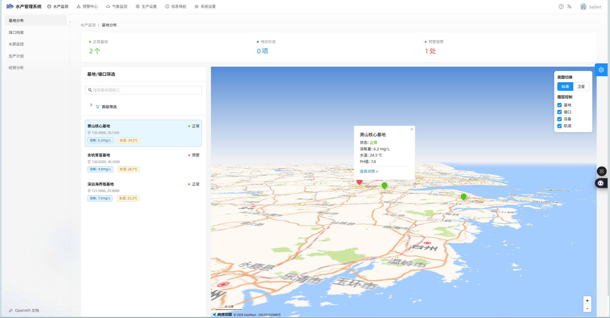
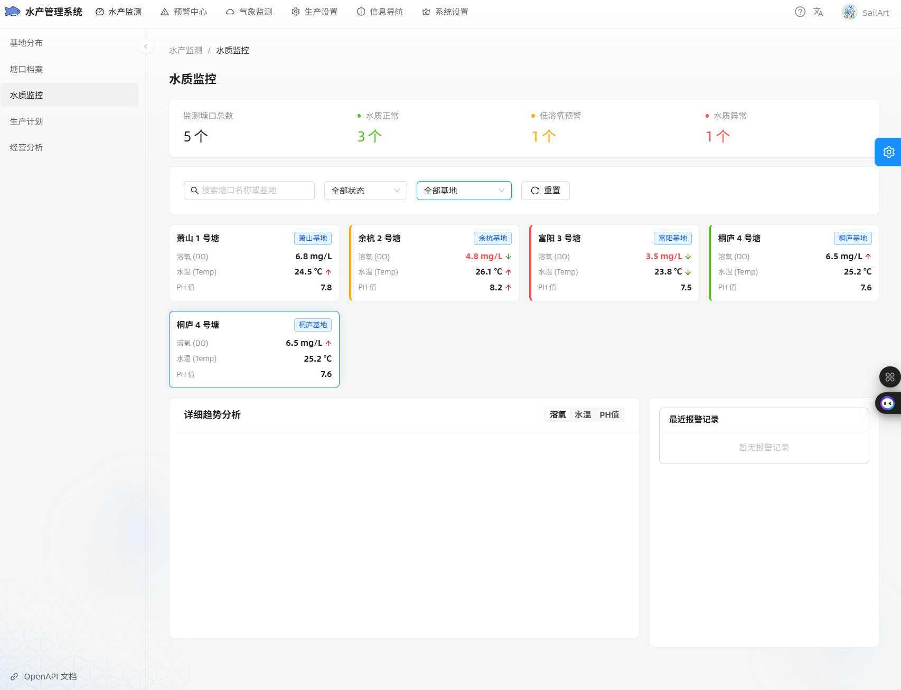
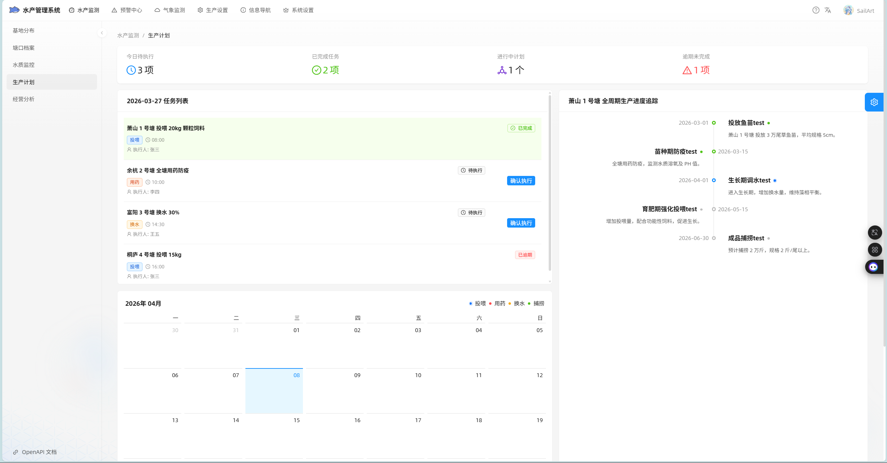
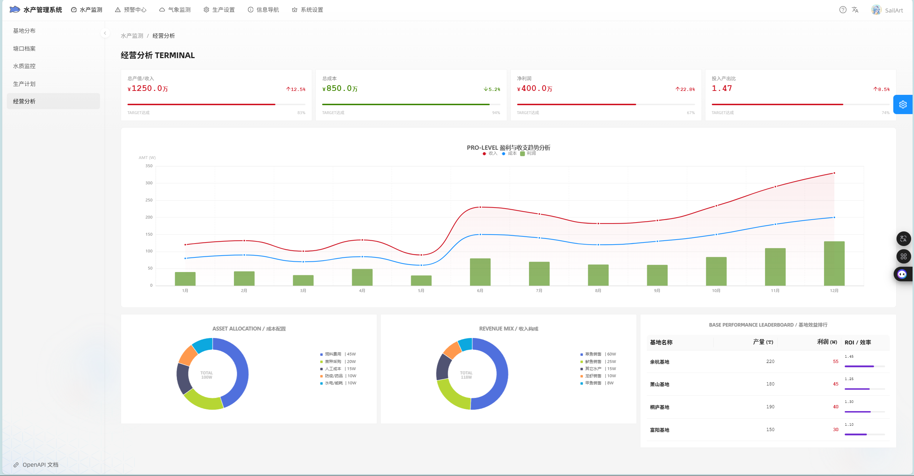

# 数字化水产养殖管理系统 - 完整技术设计方案

## 文档信息

- **项目名称**: 数字化水产养殖管理系统
- **版本**: v2.0
- **最后更新**: 2026-04-07
- **文档状态**: 完善中

---

## 目录

1. [系统概述](#1-系统概述)
2. [系统架构设计](#2-系统架构设计)
3. [数据库设计](#3-数据库设计)
4. [前端技术规范](#4-前端技术规范)
5. [后端API接口规范](#5-后端api接口规范)
6. [安全与权限设计](#6-安全与权限设计)
7. [页面详细设计方案](#7-页面详细设计方案)
   - 7.1 [GIS&#34;一张图&#34;管理页面](#71-gis一张图管理页面)
   - 7.2 [水质监控页面](#72-水质监控页面)
   - 7.3 [生产计划页面](#73-生产计划页面)
   - 7.4 [经营分析页面](#74-经营分析页面)
   - 7.5 [综合预警页面](#75-综合预警页面)
   - 7.6 [预警记录页面](#76-预警记录页面)
   - 7.7 [气象监测页面](#77-气象监测页面)
8. [部署与运维](#8-部署与运维)

---

## 1. 系统概述

### 1.1 项目背景

随着水产养殖业的快速发展，传统的人工管理方式已无法满足现代化、规模化养殖的需求。本系统旨在通过数字化手段，实现水产养殖全流程的智能化管理，提高养殖效率，降低运营风险。

### 1.2 核心目标

- **实时监控**: 24小时不间断监测水质、气象、设备状态
- **智能预警**: 基于阈值和AI算法的水质异常预警
- **生产管理**: 规范化的生产计划与任务执行跟踪
- **经营分析**: 财务数据与生产数据的交叉分析
- **决策支持**: 为管理层提供数据驱动的决策依据

### 1.3 业务范围

- 基地与塘口管理
- 水质监测与预警
- 生产计划与任务管理
- 物资与库存管理
- 财务与成本核算
- 气象监测与灾害预警
- 产品溯源与合格证管理

---

## 2. 系统架构设计

### 2.1 整体架构

```
┌─────────────────────────────────────────────────────────────┐
│                      前端展示层                              │
│  ┌──────────┐ ┌──────────┐ ┌──────────┐ ┌──────────┐       │
│  │  Web端   │ │  移动端  │ │  大屏端  │ │  小程序  │       │
│  │ React    │ │   H5     │ │  DataV   │ │  微信    │       │
│  └──────────┘ └──────────┘ └──────────┘ └──────────┘       │
└─────────────────────────────────────────────────────────────┘
                              │
                              ▼
┌─────────────────────────────────────────────────────────────┐
│                      网关与接入层                            │
│  ┌──────────┐ ┌──────────┐ ┌──────────┐ ┌──────────┐       │
│  │  Nginx   │ │  Gateway │ │  负载均衡 │ │  限流熔断 │       │
│  └──────────┘ └──────────┘ └──────────┘ └──────────┘       │
└─────────────────────────────────────────────────────────────┘
                              │
                              ▼
┌─────────────────────────────────────────────────────────────┐
│                      业务服务层                              │
│  ┌──────────┐ ┌──────────┐ ┌──────────┐ ┌──────────┐       │
│  │ 基地服务 │ │ 水质服务 │ │ 生产服务 │ │ 财务服务 │       │
│  └──────────┘ └──────────┘ └──────────┘ └──────────┘       │
│  ┌──────────┐ ┌──────────┐ ┌──────────┐ ┌──────────┐       │
│  │ 预警服务 │ │ 气象服务 │ │ 用户服务 │ │ 系统服务 │       │
│  └──────────┘ └──────────┘ └──────────┘ └──────────┘       │
└─────────────────────────────────────────────────────────────┘
                              │
                              ▼
┌─────────────────────────────────────────────────────────────┐
│                      数据存储层                              │
│  ┌──────────┐ ┌──────────┐ ┌──────────┐ ┌──────────┐       │
│  │  MySQL   │ │  Redis   │ │InfluxDB  │ │  MinIO   │       │
│  │ 主数据库 │ │  缓存    │ │ 时序数据 │ │  文件    │       │
│  └──────────┘ └──────────┘ └──────────┘ └──────────┘       │
└─────────────────────────────────────────────────────────────┘
                              │
                              ▼
┌─────────────────────────────────────────────────────────────┐
│                      基础设施层                              │
│  ┌──────────┐ ┌──────────┐ ┌──────────┐ ┌──────────┐       │
│  │  服务器  │ │  网络    │ │  安全    │ │  监控    │       │
│  └──────────┘ └──────────┘ └──────────┘ └──────────┘       │
└─────────────────────────────────────────────────────────────┘
```

### 2.2 技术栈选型

#### 前端技术栈

| 层级     | 技术选型        | 版本 | 用途               |
| -------- | --------------- | ---- | ------------------ |
| 框架     | React           | 18.x | UI框架             |
| 脚手架   | Ant Design Pro  | 6.x  | 中后台前端解决方案 |
| UI组件   | Ant Design      | 5.x  | 组件库             |
| 状态管理 | Zustand         | 4.x  | 全局状态管理       |
| 图表     | ECharts         | 5.x  | 数据可视化         |
| 地图     | 高德地图 JS API | 2.0  | GIS功能            |
| 网络请求 | Axios           | 1.x  | HTTP客户端         |
| 构建工具 | Umi             | 4.x  | 前端构建工具       |

#### 后端技术栈

| 层级       | 技术选型      | 版本   | 用途           |
| ---------- | ------------- | ------ | -------------- |
| 框架       | Spring Boot   | 3.x    | Java应用框架   |
| ORM        | MyBatis-Plus  | 3.5.x  | 数据访问层     |
| 缓存       | Redis         | 7.x    | 分布式缓存     |
| 消息队列   | RabbitMQ      | 3.x    | 异步消息处理   |
| 时序数据库 | InfluxDB      | 2.x    | 传感器时序数据 |
| 搜索引擎   | Elasticsearch | 8.x    | 日志与数据检索 |
| 文件存储   | MinIO         | 最新版 | 对象存储       |

### 2.3 微服务划分

```
用户服务 (user-service)
├── 用户管理
├── 角色权限
└── 登录认证

基地服务 (base-service)
├── 基地管理
├── 塘口管理
└── 设备管理

水质服务 (water-service)
├── 水质监测
├── 传感器数据
└── 水质分析

生产服务 (production-service)
├── 生产计划
├── 任务管理
└── 作业记录

财务服务 (finance-service)
├── 成本核算
├── 收入管理
└── 财务报表

预警服务 (alert-service)
├── 预警规则
├── 预警记录
└── 通知推送

气象服务 (weather-service)
├── 气象数据
├── 灾害预警
└── 气象分析
```

---

## 3. 数据库设计

### 3.1 数据库架构

采用**主从分离 + 读写分离**架构：

- **主库**: 负责写操作和实时性要求高的读操作
- **从库**: 负责报表查询和统计分析
- **缓存层**: Redis缓存热点数据
- **时序库**: InfluxDB存储传感器时序数据

### 3.2 数据库表清单（共46张表）

| 模块                 | 表名                           | 说明             |
| -------------------- | ------------------------------ | ---------------- |
| **系统权限**   | `sys_user`                   | 系统用户账号管理 |
|                      | `sys_role`                   | 角色定义         |
|                      | `sys_permission`             | 权限定义         |
|                      | `sys_user_role`              | 用户角色关联     |
|                      | `sys_role_permission`        | 角色权限关联     |
| **基地管理**   | `base_info`                  | 基地主表         |
|                      | `base_ext`                   | 基地扩展表       |
|                      | `pond_info`                  | 塘口主表         |
|                      | `pond_ext`                   | 塘口扩展表       |
|                      | `device_info`                | 设备信息表       |
| **水质监测**   | `water_quality`              | 水质数据主表     |
|                      | `water_quality_ext`          | 水质数据扩展表   |
|                      | `sensor_data`                | 传感器原始数据   |
|                      | `water_threshold`            | 水质阈值配置     |
| **生产管理**   | `production_plan`            | 生产计划主表     |
|                      | `production_task`            | 生产任务表       |
|                      | `operation_log`              | 作业日志表       |
|                      | `feeding_record`             | 投喂记录表       |
| **物资管理**   | `mat_info`                   | 物资信息表       |
|                      | `mat_stock`                  | 物资库存表       |
|                      | `mat_inout`                  | 物资出入库表     |
|                      | `supplier`                   | 供应商表         |
| **财务管理**   | `finance_account`            | 财务账户表       |
|                      | `finance_record`             | 财务记录表       |
|                      | `cost_item`                  | 成本明细表       |
|                      | `income_record`              | 收入记录表       |
| **预警中心**   | `warn_rule`                  | 预警规则表       |
|                      | `warn_record`                | 预警记录表       |
|                      | `warn_notification`          | 预警通知表       |
| **深远海装备** | `vsl_info`                   | 工船主表         |
|                      | `vsl_ext`                    | 工船扩展表       |
|                      | `cage_info`                  | 智能网箱表       |
|                      | `deep_sea_equipment`         | 深远海装备档案表 |
|                      | `deep_sea_operation_log`     | 深远海作业日志表 |
| **两岸协同**   | `cs_enterprise`              | 台资企业表       |
|                      | `cs_seed`                    | 台湾种苗表       |
|                      | `taiwan_enterprise`          | 台资企业备案表   |
|                      | `taiwan_seed_import`         | 台湾种苗引进表   |
|                      | `cross_strait_tech_exchange` | 两岸技术交流表   |
| **产品溯源**   | `trace_record`               | 溯源记录表       |
|                      | `gov_cert_info`              | 产品合格证表     |
| **信息导航**   | `mkt_quote`                  | 市场行情表       |
|                      | `cont_info`                  | 通讯录表         |
|                      | `kb_article`                 | 知识库表         |
| **气象数据**   | `weather_data`               | 气象数据表       |
|                      | `weather_forecast`           | 气象预报表       |
|                      | `disaster_warning`           | 灾害预警表       |

### 3.3 核心表结构

#### 3.3.1 基地主表 (base_info)

| 字段名              | 类型     | 长度 | 允许空 | 默认值            | 主键 | 说明                         |
| ------------------- | -------- | ---- | ------ | ----------------- | ---- | ---------------------------- |
| id                  | VARCHAR  | 32   | NO     | -                 | ✅   | 基地ID                       |
| name                | VARCHAR  | 100  | NO     | -                 | -    | 基地名称                     |
| base_type           | TINYINT  | 1    | NO     | 1                 | -    | 类型(1:近海 2:深远海 3:陆基) |
| deep_sea_certified  | TINYINT  | 1    | YES    | 0                 | -    | 是否深远海认证基地           |
| taiwan_cooperation  | TINYINT  | 1    | YES    | 0                 | -    | 是否有台资合作               |
| green_certification | VARCHAR  | 50   | YES    | -                 | -    | 绿色认证等级                 |
| manager             | VARCHAR  | 50   | NO     | -                 | -    | 负责人                       |
| phone               | VARCHAR  | 20   | NO     | -                 | -    | 联系电话                     |
| area                | DECIMAL  | 10,2 | NO     | -                 | -    | 占地面积(亩)                 |
| status              | TINYINT  | 1    | NO     | 1                 | -    | 状态(1:active 2:inactive)    |
| create_time         | DATETIME | -    | YES    | CURRENT_TIMESTAMP | -    | 创建时间                     |
| update_time         | DATETIME | -    | YES    | CURRENT_TIMESTAMP | -    | 更新时间                     |

**索引**:

- `idx_base_type` (base_type)
- `idx_status` (status)
- `idx_deep_sea_certified` (deep_sea_certified)
- `idx_taiwan_cooperation` (taiwan_cooperation)

#### 3.3.2 塘口主表 (pond_info)

| 字段名           | 类型     | 长度 | 允许空 | 默认值            | 主键 | 说明                                    |
| ---------------- | -------- | ---- | ------ | ----------------- | ---- | --------------------------------------- |
| id               | VARCHAR  | 32   | NO     | -                 | ✅   | 塘口ID                                  |
| base_id          | VARCHAR  | 32   | NO     | -                 | -    | 所属基地ID                              |
| name             | VARCHAR  | 100  | NO     | -                 | -    | 塘口名称                                |
| area             | DECIMAL  | 10,2 | NO     | -                 | -    | 面积(亩)                                |
| depth            | DECIMAL  | 5,2  | YES    | -                 | -    | 平均水深(米)                            |
| pond_type        | TINYINT  | 1    | NO     | 1                 | -    | 类型(1:传统 2:网箱 3:工船)              |
| ecological_index | DECIMAL  | 5,2  | YES    | -                 | -    | 生态健康指数                            |
| carbon_footprint | DECIMAL  | 10,2 | YES    | -                 | -    | 碳足迹(吨/年)                           |
| status           | TINYINT  | 1    | NO     | 1                 | -    | 状态(1:active 2:inactive 3:maintenance) |
| create_time      | DATETIME | -    | YES    | CURRENT_TIMESTAMP | -    | 创建时间                                |
| update_time      | DATETIME | -    | YES    | CURRENT_TIMESTAMP | -    | 更新时间                                |

**索引**:

- `idx_base_id` (base_id)
- `idx_pond_type` (pond_type)
- `idx_status` (status)

#### 3.3.3 水质数据表 (water_quality)

| 字段名           | 类型     | 长度 | 允许空 | 默认值            | 主键 | 说明           |
| ---------------- | -------- | ---- | ------ | ----------------- | ---- | -------------- |
| id               | BIGINT   | 20   | NO     | -                 | ✅   | 记录ID         |
| pond_id          | VARCHAR  | 32   | NO     | -                 | -    | 塘口ID         |
| do_value         | DECIMAL  | 5,2  | YES    | -                 | -    | 溶氧量(mg/L)   |
| temperature      | DECIMAL  | 4,1  | YES    | -                 | -    | 水温(°C)      |
| ph_value         | DECIMAL  | 4,2  | YES    | -                 | -    | PH值           |
| ammonia_nitrogen | DECIMAL  | 6,3  | YES    | -                 | -    | 氨氮(mg/L)     |
| nitrite          | DECIMAL  | 6,3  | YES    | -                 | -    | 亚硝酸盐(mg/L) |
| turbidity        | DECIMAL  | 5,2  | YES    | -                 | -    | 浊度(NTU)      |
| record_time      | DATETIME | -    | NO     | -                 | -    | 记录时间       |
| create_time      | DATETIME | -    | YES    | CURRENT_TIMESTAMP | -    | 创建时间       |

**索引**:

- `idx_pond_id_time` (pond_id, record_time)
- `idx_record_time` (record_time)

### 3.4 分库分表策略

#### 3.4.1 水平分表

**水质数据表 (water_quality)**:

- 按时间分表: `water_quality_202401`, `water_quality_202402`
- 保留策略: 热数据(3个月)在MySQL, 冷数据迁移至InfluxDB

**传感器原始数据 (sensor_data)**:

- 按塘口ID取模分表: `sensor_data_00` ~ `sensor_data_99`
- 单表数据量控制在500万条以内

#### 3.4.2 读写分离

```sql
-- 写操作(主库)
INSERT INTO water_quality (...) VALUES (...);

-- 读操作(从库)
SELECT * FROM water_quality WHERE pond_id = 'xxx';
```

---

## 4. 前端技术规范

### 4.1 项目结构

```
src/
├── components/          # 公共组件
│   ├── CommonTable/     # 通用表格
│   ├── ChartCard/       # 图表卡片
│   ├── StatusBadge/     # 状态标签
│   └── ...
├── pages/               # 页面
│   ├── dashboard/       # 数据看板
│   ├── base/            # 基地管理
│   ├── water/           # 水质监控
│   ├── production/      # 生产计划
│   ├── finance/         # 经营分析
│   ├── warning/         # 预警中心
│   ├── weather/         # 气象监测
│   └── system/          # 系统设置
├── services/            # API服务
│   ├── api/             # 业务API
│   └── ant-design-pro/  # 基础API
├── models/              # 数据模型
├── hooks/               # 自定义Hooks
├── utils/               # 工具函数
├── styles/              # 样式文件
│   └── global.less      # 全局样式
├── types/               # TypeScript类型
└── config/              # 配置文件
```

### 4.2 命名规范

#### 文件命名

- **组件**: PascalCase (如: `BaseList.tsx`)
- **页面**: index.tsx + 文件夹 (如: `pages/base/index.tsx`)
- **工具函数**: camelCase (如: `formatDate.ts`)
- **样式文件**: 与组件同名 (如: `BaseList.less`)

#### 代码规范

```typescript
// 接口命名: I前缀
interface IBaseInfo {
  id: string;
  name: string;
}

// 类型命名: T前缀
type TBaseStatus = 'active' | 'inactive';

// 枚举命名: E前缀 + 全大写下划线
enum EBaseType {
  NEARSHORE = 1,
  DEEPSEA = 2,
  LAND_BASED = 3,
}

// 组件Props: 接口名 + Props
interface BaseListProps {
  bases: IBaseInfo[];
  onSelect: (id: string) => void;
}
```

### 4.3 全局样式规范

```less
// styles/global.less

// 金融终端风格字体
.fin-number {
  font-family: 'Roboto Mono', 'Consolas', monospace;
  font-variant-numeric: tabular-nums;
}

// 金融卡片样式
.fin-card {
  border-radius: 0;
  box-shadow: none;
  border: 1px solid #d9d9d9;
  
  .ant-card-head {
    border-bottom: 1px solid #d9d9d9;
    background: #fafafa;
  }
}

// 趋势颜色(中国金融习惯: 红涨绿跌)
.fin-trend-up {
  color: #ff4d4f;
}

.fin-trend-down {
  color: #52c41a;
}

// 预警级别颜色
.alert-p0 {
  background: #ff4d4f;
  color: #fff;
}

.alert-p1 {
  color: #fa8c16;
}

.alert-p2 {
  color: #faad14;
}
```

### 4.4 组件开发规范

#### 组件模板

```typescript
import React, { useState, useEffect } from 'react';
import { Card, Spin } from 'antd';
import styles from './index.less';

// 类型定义
interface ComponentNameProps {
  // props定义
}

interface ComponentNameState {
  // state定义
}

// 组件实现
const ComponentName: React.FC<ComponentNameProps> = (props) => {
  // 状态管理
  const [loading, setLoading] = useState(false);
  const [data, setData] = useState<any>(null);

  // 副作用
  useEffect(() => {
    fetchData();
  }, []);

  // 方法
  const fetchData = async () => {
    setLoading(true);
    try {
      // API调用
    } finally {
      setLoading(false);
    }
  };

  // 渲染
  return (
    <Card className={styles.container}>
      <Spin spinning={loading}>
        {/* 内容 */}
      </Spin>
    </Card>
  );
};

export default ComponentName;
```

---

## 5. 后端API接口规范

### 5.1 接口设计原则

- **RESTful风格**: 使用HTTP方法表示操作类型
- **版本控制**: URL中包含版本号 (如: `/api/v1/bases`)
- **统一响应格式**: 所有接口返回统一的数据结构
- **状态码规范**: 使用标准HTTP状态码

### 5.2 统一响应格式

```json
{
  "success": true,
  "code": 200,
  "message": "操作成功",
  "data": {
    // 具体数据
  },
  "timestamp": 1712486400000
}
```

### 5.3 标准HTTP状态码

| 状态码 | 含义                  | 使用场景       |
| ------ | --------------------- | -------------- |
| 200    | OK                    | 请求成功       |
| 201    | Created               | 资源创建成功   |
| 400    | Bad Request           | 请求参数错误   |
| 401    | Unauthorized          | 未认证         |
| 403    | Forbidden             | 无权限         |
| 404    | Not Found             | 资源不存在     |
| 500    | Internal Server Error | 服务器内部错误 |

### 5.4 接口列表

#### 5.4.1 基地管理接口

```yaml
# 获取基地列表
GET /api/v1/bases
参数:
  - page: 页码
  - size: 每页数量
  - keyword: 搜索关键词
  - baseType: 基地类型
  - status: 状态
响应:
  - data.list: 基地列表
  - data.total: 总数

# 获取基地详情
GET /api/v1/bases/{id}
响应:
  - data: 基地详情

# 创建基地
POST /api/v1/bases
参数:
  - name: 基地名称
  - baseType: 基地类型
  - manager: 负责人
  - phone: 联系电话
  - area: 面积
响应:
  - data.id: 新基地ID

# 更新基地
PUT /api/v1/bases/{id}
参数: (同创建)

# 删除基地
DELETE /api/v1/bases/{id}

# 获取基地统计
GET /api/v1/bases/summary
响应:
  - data.total: 总基地数
  - data.normal: 正常基地数
  - data.warning: 预警基地数
  - data.alert: 报警基地数
```

#### 5.4.2 水质监控接口

```yaml
# 获取塘口实时水质
GET /api/v1/ponds/{id}/water-quality/latest
响应:
  - data.do: 溶氧量
  - data.temperature: 水温
  - data.ph: PH值
  - data.status: 状态

# 获取塘口历史水质
GET /api/v1/ponds/{id}/water-quality/history
参数:
  - startTime: 开始时间
  - endTime: 结束时间
  - interval: 数据间隔(1min/5min/1hour)
响应:
  - data.list: 时序数据列表

# 获取水质阈值配置
GET /api/v1/ponds/{id}/thresholds
响应:
  - data.do.warning: 溶氧预警值
  - data.do.alert: 溶氧报警值
  - data.temperature.warning: 水温预警值
  - data.temperature.alert: 水温报警值

# 更新水质阈值配置
PUT /api/v1/ponds/{id}/thresholds
参数: (同获取)
```

#### 5.4.3 预警接口

```yaml
# 获取实时预警列表
GET /api/v1/alerts/realtime
参数:
  - level: 预警级别(P0/P1/P2)
  - status: 状态(unprocessed/processing/resolved)
  - limit: 返回数量
响应:
  - data.list: 预警列表

# 获取预警历史
GET /api/v1/alerts/history
参数:
  - startTime: 开始时间
  - endTime: 结束时间
  - level: 预警级别
  - page: 页码
  - size: 每页数量
响应:
  - data.list: 预警历史列表
  - data.total: 总数

# 处理预警
POST /api/v1/alerts/{id}/process
参数:
  - action: 处理动作
  - remark: 处理备注
响应:
  - data: 处理结果

# 获取预警统计
GET /api/v1/alerts/statistics
参数:
  - startTime: 开始时间
  - endTime: 结束时间
响应:
  - data.total: 总预警数
  - data.byLevel: 按级别统计
  - data.byType: 按类型统计
  - data.resolvedRate: 解决率
```

#### 5.4.4 气象接口

```yaml
# 获取实时气象数据
GET /api/v1/weather/current
参数:
  - baseId: 基地ID
响应:
  - data.temperature: 温度
  - data.humidity: 湿度
  - data.windSpeed: 风速
  - data.windDirection: 风向
  - data.pressure: 气压
  - data.precipitation: 降水量

# 获取气象预报
GET /api/v1/weather/forecast
参数:
  - baseId: 基地ID
  - days: 预报天数(1-7)
响应:
  - data.list: 预报数据列表

# 获取灾害预警
GET /api/v1/weather/disaster-warning
参数:
  - baseId: 基地ID
响应:
  - data.list: 灾害预警列表
```

### 5.5 接口安全

#### 5.5.1 认证方式

- **JWT Token**: 使用JSON Web Token进行身份认证
- **Token刷新**: 支持Access Token和Refresh Token机制
- **Token有效期**: Access Token 2小时, Refresh Token 7天

#### 5.5.2 请求签名

敏感接口需要请求签名:

```
签名算法: HMAC-SHA256
签名内容: method + url + timestamp + body
签名密钥: 用户私钥
```

#### 5.5.3 限流策略

```yaml
# 普通接口
- 限流阈值: 100次/分钟
- 限流范围: 按用户ID

# 高频接口(如水质数据查询)
- 限流阈值: 1000次/分钟
- 限流范围: 按用户ID

# 导出接口
- 限流阈值: 10次/小时
- 限流范围: 按用户ID
```

---

## 6. 安全与权限设计

### 6.1 权限模型

采用**RBAC (Role-Based Access Control)** 权限模型:

```
用户(User) <-> 角色(Role) <-> 权限(Permission) <-> 资源(Resource)
```

### 6.2 角色定义

| 角色       | 权限范围           | 说明              |
| ---------- | ------------------ | ----------------- |
| 超级管理员 | 全部权限           | 系统最高权限      |
| 基地管理员 | 所属基地全部权限   | 管理单个基地      |
| 技术员     | 水质监测、生产计划 | 日常养殖管理      |
| 财务       | 财务报表、成本核算 | 财务管理          |
| 观察员     | 只读权限           | 查看数据,不可操作 |

### 6.3 数据权限

#### 6.3.1 数据隔离级别

```
级别1: 全部数据(超级管理员)
级别2: 本基地数据(基地管理员)
级别3: 指定塘口数据(技术员)
级别4: 只读数据(观察员)
```

#### 6.3.2 数据权限实现

```java
// 数据权限注解
@DataScope(type = DataScopeType.BASE)
public List<BaseInfo> listBases() {
    // 自动添加基地ID过滤条件
}

// 数据权限拦截器
@Component
public class DataScopeInterceptor implements HandlerInterceptor {
    @Override
    public boolean preHandle(HttpServletRequest request, 
                           HttpServletResponse response, 
                           Object handler) {
        // 获取当前用户数据权限范围
        DataScope scope = getDataScope();
        // 将权限范围存入ThreadLocal
        DataScopeContext.set(scope);
        return true;
    }
}
```

### 6.4 安全策略

#### 6.4.1 密码安全

- **加密算法**: BCrypt (自适应哈希)
- **密码复杂度**: 至少8位,包含大小写字母、数字、特殊字符
- **密码有效期**: 90天强制修改
- **历史密码**: 禁止重复使用最近5次密码

#### 6.4.2 登录安全

- **登录失败锁定**: 连续5次失败锁定30分钟
- **异地登录提醒**: 检测到异常登录地点发送通知
- **多设备登录**: 支持,但可配置单点登录
- **会话超时**: 30分钟无操作自动登出

#### 6.4.3 操作审计

记录所有敏感操作:

```sql
CREATE TABLE sys_audit_log (
    id BIGINT PRIMARY KEY,
    user_id VARCHAR(32),
    operation VARCHAR(100),
    method VARCHAR(200),
    params TEXT,
    ip VARCHAR(50),
    location VARCHAR(100),
    status TINYINT,
    error_msg TEXT,
    create_time DATETIME
);
```

---

## 7. 页面详细设计方案

### 7.1 GIS"一张图"管理页面

#### 7.1.1 设计目标

为老板提供一个直观的、基于地图的基地和塘口管理视图，通过"一张图"实现全局监控和快速定位。

#### 7.1.2 页面布局





#### 7.1.3 功能模块详解

**顶部状态条 (GISStats组件)**

| 指标           | 说明                  | 交互                             |
| -------------- | --------------------- | -------------------------------- |
| 正常运行基地数 | 🟢 正常状态的基地数量 | 点击筛选地图显示正常基地         |
| 待办任务数     | 🟡 待处理的任务数量   | 点击跳转任务中心或闪烁相关基地   |
| 预警/报警数    | 🔴 预警和报警的数量   | 点击自动缩放至告警基地并弹出详情 |

**左侧筛选面板 (BaseFilter组件)**

1. **搜索栏**

   - 支持模糊搜索: 基地名称、塘口编号、ID
   - 实时响应,输入即过滤列表
2. **高级筛选器(可折叠)**

   - 区域: 下拉多选(华东、华南、华北...)
   - 基地类型: 近海/深远海/陆基工厂化
   - 状态: 正常/预警/离线/维护中
   - 合作属性:
     - ☑️ 台资合作
     - ☑️ 深远海认证
     - ☑️ 绿色认证
3. **基地列表(可滚动)**

   ```
   [🟢] 华南深蓝1号基地
   📍 广东·湛江
   💧 溶氧: 6.2 mg/L | pH: 7.8
   🕒 最后上报: 2分钟前
   ```

   - 点击交互: 地图自动panTo(location), 弹出InfoWindow


**中央地图区域 (GisMap组件)**

1. **底图控制**

   - 切换按钮: 标准地图 / 卫星影像 / 地形图
   - 缩放控件、比例尺、定位按钮
2. **图层管理面板(右上角)**

   - ☑️ 基地分布点(默认开启)
   - ☑️ 塘口边界(GeoJSON多边形)
   - ☑️ 设备位置(传感器、摄像头等)
   - ☑️ 航道/禁养区
3. **标记点(Markers)**

   | 状态 | 图标          | 说明     |
   | ---- | ------------- | -------- |
   | 正常 | 🟢 蓝色水滴   | 正常运行 |
   | 预警 | 🟡 黄色感叹号 | 存在预警 |
   | 报警 | 🔴 红色火焰   | 存在报警 |
   | 离线 | ⚪ 灰色虚框   | 设备离线 |
4. **信息窗体(InfoWindow)**

   ```
   ┌─────────────────────────────┐
   │ 华南深蓝1号基地          [X] │
   ├─────────────────────────────┤
   │ 📍 广东·湛江                │
   │ 👤 负责人: 张三            │
   │ 📞 电话: 138****8888       │
   ├─────────────────────────────┤
   │ 实时数据:                  │
   │ 💧 溶氧: 6.2 mg/L 🟢       │
   │ 🌡️ 水温: 25.3°C           │
   │ 📊 pH值: 7.8               │
   ├─────────────────────────────┤
   │ [查看详情] [实时监控]      │
   └─────────────────────────────┘
   ```

#### 7.1.4 技术实现

```typescript
// 核心组件结构
BaseDistribution/
├── index.tsx           # 主页面容器
├── components/
│   ├── GISStats.tsx    # 顶部统计条
│   ├── BaseFilter.tsx  # 左侧筛选面板
│   ├── BaseList.tsx    # 基地列表
│   ├── GisMap.tsx      # 地图核心组件
│   ├── InfoWindow.tsx  # 信息窗体
│   └── LayerControl.tsx # 图层控制
├── hooks/
│   └── useMap.ts       # 地图相关Hooks
└── service.ts          # API服务
```

```typescript

// 关键接口定义
interface BaseInfo {
  id: string;
  name: string;
  baseType: number;  // 1:近海 2:深远海 3:陆基
  deepSeaCertified: boolean;
  taiwanCooperation: boolean;
  greenCertification: string;
  manager: string;
  phone: string;
  latitude: number;
  longitude: number;
  status: 'normal' | 'warning' | 'alert' | 'offline';
  waterQuality: {
    do: number;
    temperature: number;
    ph: number;
  };
  lastReportTime: string;
}

interface MapStats {
  normal: number;
  pending: number;
  alert: number;
}
```

#### 7.1.5 后端接口

```yaml
# 获取基地汇总统计
GET /api/bases/summary
响应:
  data:
    total: 100      # 总基地数
    normal: 42      # 正常基地数
    warning: 8      # 预警基地数
    alert: 3        # 报警基地数
    offline: 2      # 离线基地数

# 查询基地列表
GET /api/bases
参数:
  keyword: 搜索关键词
  region: 区域
  baseType: 基地类型
  status: 状态
  deepSeaCertified: 是否深远海认证
  taiwanCooperation: 是否台资合作
  page: 页码
  size: 每页数量

# 获取基地详情(包含实时水质)
GET /api/bases/{id}
响应:
  data:
    baseInfo: 基地基本信息
    waterQuality: 实时水质数据
    deviceStatus: 设备状态
```

---

### 7.2 水质监控页面

#### 7.2.1 设计目标

为养殖管理人员提供各基地、各塘口的实时水质数据监控与历史趋势分析，确保水质安全并能及时预警。

#### 7.2.2 页面布局



#### 7.2.3 功能模块详解

**顶部统计条 (WaterQualityStats组件)**

| 指标           | 说明                        | 数据来源         |
| -------------- | --------------------------- | ---------------- |
| 监测中塘口总数 | 当前正在监测的塘口数量      | 塘口表统计       |
| 正常塘口数     | 🟢 所有指标正常的塘口       | 水质数据实时计算 |
| 低溶氧预警数   | 🟡 溶氧量低于预警阈值的塘口 | 水质数据实时计算 |
| 异常报警数     | 🔴 存在严重异常的塘口       | 水质数据实时计算 |

**塘口实时监控网格 (PondCardGrid组件)**


- **卡片设计**:

  ```
  ┌────────────────────┐
  │ 1号塘口        🟢  │  <- 右上角状态标识
  │ 华南深蓝1号基地    │
  ├────────────────────┤
  │ 💧 溶氧: 6.2 mg/L │  <- 核心指标
  │    状态: 正常 ↑    │  <- 趋势箭头
  ├────────────────────┤
  │ 🌡️ 水温: 25.3°C   │
  │ 📊 pH值: 7.8       │
  ├────────────────────┤
  │ 🕒 更新: 2分钟前   │
  └────────────────────┘
  ```
- **状态颜色**:

  - 🟢 正常: 绿色边框
  - 🟡 预警: 黄色边框 + 黄色角标
  - 🔴 报警: 红色边框 + 红色角标 + 闪烁动画
- **趋势箭头**:

  - ↑ 上升: 红色(中国金融习惯)
  - ↓ 下降: 绿色
  - → 平稳: 灰色


**详细趋势分析 (QualityTrendChart组件)**

- **图表类型**: ECharts多轴折线图
- **指标选择**: 溶氧、水温、pH值、氨氮、亚硝酸盐
- **时间范围**: 24小时 / 7天 / 30天
- **预警线显示**: 虚线标注安全预警线和紧急报警线

**最近报警记录 (RecentAlerts组件)**

- 展示当前选中塘口的最近10条报警
- 包含: 报警类型、发生时间、处理状态、处理人

#### 7.2.4 技术实现

```typescript
// 核心组件结构
WaterQuality/
├── index.tsx
├── components/
│   ├── WaterQualityStats.tsx
│   ├── PondCardGrid.tsx
│   ├── PondCard.tsx
│   ├── QualityTrendChart.tsx
│   ├── RecentAlerts.tsx
│   └── ThresholdConfig.tsx
├── hooks/
│   ├── useWaterQuality.ts
│   └── useRealtimeData.ts
└── service.ts
```

```typescript
// 关键接口定义
interface PondWaterQuality {
  pondId: string;
  pondName: string;
  baseName: string;
  status: 'normal' | 'warning' | 'alert';
  do: {
    value: number;
    trend: 'up' | 'down' | 'stable';
    status: 'normal' | 'warning' | 'alert';
  };
  temperature: {
    value: number;
    trend: 'up' | 'down' | 'stable';
  };
  ph: {
    value: number;
    trend: 'up' | 'down' | 'stable';
  };
  updateTime: string;
}

interface WaterQualityHistory {
  timestamps: string[];
  do: number[];
  temperature: number[];
  ph: number[];
  ammoniaNitrogen: number[];
  nitrite: number[];
  thresholds: {
    do: { warning: number; alert: number };
    temperature: { warning: number; alert: number };
    ph: { warning: number; alert: number };
  };
}
```

#### 7.2.5 后端接口


```yaml
# 获取塘口实时水质数据
GET /api/ponds/water-quality/realtime
参数:
  baseId: 基地ID(可选)
  status: 状态筛选(可选)
响应:
  data:
    list: 塘口水质列表
    total: 总数

# 获取单个塘口历史水质数据
GET /api/ponds/{id}/water-quality/history
参数:
  range: 时间范围(24h/7d/30d)
  interval: 数据间隔(1min/5min/1hour)
响应:
  data:
    timestamps: 时间数组
    do: 溶氧数组
    temperature: 温度数组
    ph: pH值数组
    thresholds: 阈值配置

# 获取塘口报警记录
GET /api/ponds/{id}/alerts
参数:
  limit: 返回数量
响应:
  data:
    list: 报警记录列表
```

---

### 7.3 生产计划页面

#### 7.3.1 设计目标

为养殖户和基地管理者提供一个清晰的生产作业视图，帮助其科学规划、按时执行并追踪各项生产任务。

#### 7.3.2 页面布局




#### 7.3.3 功能模块详解

**生产计划汇总条 (PlanStats组件)**

| 指标       | 说明                       | 计算方式   |
| ---------- | -------------------------- | ---------- |
| 今日待执行 | 今天计划执行但未完成的任务 | 任务表查询 |
| 已完成     | 今天已完成的任务           | 任务表查询 |
| 进行中     | 正在执行中的任务           | 任务表查询 |
| 逾期未完成 | 超过计划时间未完成的任务   | 任务表查询 |

**生产计划日历 (PlanCalendar组件)**

- **日历标记**:

  - 🔵 蓝色圆点: 投喂任务
  - 💊 红色圆点: 用药任务
  - 💧 绿色圆点: 换水任务
  - 🔧 灰色圆点: 维护任务
  - 📊 多任务: 显示数字(如"3"表示当天有3个任务)
- **交互**:

  - 点击日期: 下方任务列表切换为该日期的任务
  - 双击日期: 打开新建任务弹窗

**任务执行中心 (TaskCenter组件)**

- **任务列表**:

  ```
  ☐ 08:00 | 1号塘口 | 投喂 | 标准饲料5kg | [执行]
  ☐ 10:00 | 2号塘口 | 用药 | 消毒剂 | [执行]
  ☑ 14:00 | 3号塘口 | 换水 | 换水30% | [已完成]
  ```
- **快捷操作**:

  - 点击"执行"按钮: 标记任务为进行中
  - 点击"完成"按钮: 标记任务为已完成
  - 点击任务行: 查看任务详情

**计划执行时间轴 (PlanTimeline组件)**

- **全周期视角**:

  ```
  苗种期 [========>    ] 60%
  生长期 [====>        ] 30%
  育肥期 [>            ] 0%
  收获期 [             ] 0%
  ```
- **当前阶段高亮**: 当前所处阶段用不同颜色标识
- **预计收获时间**: 根据当前进度计算预计收获日期

#### 7.3.4 技术实现

```typescript
// 核心组件结构
ProductionPlan/
├── index.tsx
├── components/
│   ├── PlanStats.tsx
│   ├── PlanCalendar.tsx
│   ├── TaskCenter.tsx
│   ├── TaskItem.tsx
│   ├── PlanTimeline.tsx
│   └── TaskTypeChart.tsx
├── hooks/
│   └── useProductionPlan.ts
└── service.ts
```

```typescript
// 关键接口定义
interface ProductionTask {
  id: string;
  pondId: string;
  pondName: string;
  type: 'feeding' | 'medication' | 'water_change' | 'maintenance' | 'harvest';
  title: string;
  description: string;
  scheduledTime: string;
  status: 'pending' | 'in_progress' | 'completed' | 'overdue';
  executor: string;
  materials?: {
    name: string;
    quantity: number;
    unit: string;
  }[];
}

interface PlanCalendarData {
  date: string;
  tasks: {
    type: string;
    count: number;
  }[];
}

interface PlanTimeline {
  currentPhase: string;
  phases: {
    name: string;
    startDate: string;
    endDate: string;
    progress: number;
    status: 'completed' | 'in_progress' | 'pending';
  }[];
  estimatedHarvestDate: string;
}
```

#### 7.3.5 后端接口

```yaml
# 获取生产计划日历数据
GET /api/plans/calendar
参数:
  month: 月份(如: 2026-03)
响应:
  data:
    list:
      - date: "2026-03-27"
        tasks:
          - type: "feeding"
            count: 3
          - type: "medication"
            count: 1

# 获取某日任务列表
GET /api/plans/tasks
参数:
  date: 日期(如: 2026-03-27)
响应:
  data:
    list: 任务列表
    summary:
      pending: 8
      completed: 15
      inProgress: 3
      overdue: 2

# 创建生产任务
POST /api/plans/tasks
参数:
  pondId: 塘口ID
  type: 任务类型
  title: 任务标题
  scheduledTime: 计划时间
  description: 任务描述

# 更新任务状态
PUT /api/plans/tasks/{id}/status
参数:
  status: 新状态
  remark: 备注
```

---

### 7.4 经营分析页面

#### 7.4.1 设计目标

为老板和财务主管提供全局的经营概览，通过财务数据与生产数据的交叉分析，辅助决策，提升盈利能力。

#### 7.4.2 页面布局



#### 7.4.3 功能模块详解


**行情看板 (BusinessStats组件)**

- **指标说明**:| 指标       | 说明             | 计算方式                  |
  | ---------- | ---------------- | ------------------------- |
  | 总收入     | 所有收入来源总和 | 销售收入 + 其他收入       |
  | 总成本     | 所有成本支出总和 | 饲料 + 人工 + 药品 + 其他 |
  | 净利润     | 总收入 - 总成本  | 利润计算                  |
  | 投入产出比 | 收入 / 成本      | ROI计算                   |

**专业交易级图表 (ProfitTrendChart组件)**

- **图表特性**:

  - 十字准星(Crosshair): 鼠标悬停显示精确参考线
  - 数据网格(Grid Lines): 细密虚线网格
  - 渐变填充(Area Shading): 曲线下方渐变填充
  - 双Y轴: 左侧金额, 右侧百分比
- **交互功能**:

  - 点击数据点: 下钻到该月详细数据
  - 图例点击: 显示/隐藏对应曲线
  - 缩放: 鼠标滚轮缩放时间范围

**资产配置与业绩排行榜**

- **成本构成分析**:

  - 空心环形图(Donut Chart)
  - 中心显示总成本
  - 侧边图例显示Top5详细数值
- **基地产量与利润排名**:

  - 表格形式展示
  - 每行包含: 基地名、实时产量、利润(迷你柱状图)、ROI
  - 支持按产量/利润/ROI排序


#### 7.4.4 技术实现

```typescript
// 核心组件结构
BusinessAnalysis/
├── index.tsx
├── components/
│   ├── BusinessStats.tsx
│   ├── ProfitTrendChart.tsx
│   ├── CostDistribution.tsx
│   └── BaseRanking.tsx
├── hooks/
│   └── useBusinessData.ts
└── service.ts
```

```typescript
// 关键接口定义
interface BusinessKPI {
  income: {
    current: number;
    previous: number;
    changeRate: number;
  };
  cost: {
    current: number;
    previous: number;
    changeRate: number;
  };
  profit: {
    current: number;
    previous: number;
    changeRate: number;
  };
  roi: number;
}

interface ProfitTrend {
  months: string[];
  income: number[];
  cost: number[];
  profit: number[];
}

interface CostBreakdown {
  categories: {
    name: string;
    amount: number;
    percentage: number;
  }[];
}

interface BaseRanking {
  rank: number;
  baseName: string;
  production: number;
  profit: number;
  roi: number;
  trend: number[];  // 最近6个月利润趋势
}
```

#### 7.4.5 后端接口

```yaml
# 获取经营核心指标
GET /api/finance/kpis
参数:
  period: 周期(year/quarter/month)
  baseId: 基地ID(可选)
响应:
  data:
    income: 总收入
    cost: 总成本
    profit: 净利润
    roi: 投入产出比
    changeRates: 环比变化率

# 获取月度盈利趋势
GET /api/finance/trends
参数:
  range: 时间范围(last12months)
  baseId: 基地ID(可选)
响应:
  data:
    months: 月份数组
    income: 收入数组
    cost: 成本数组
    profit: 利润数组

# 获取成本构成明细
GET /api/finance/cost-breakdown
参数:
  date: 日期(如: 2026-03)
  baseId: 基地ID(可选)
响应:
  data:
    categories:
      - name: 饲料
        amount: 850000
        percentage: 45

# 获取基地产量与利润排名
GET /api/finance/ranking
参数:
  date: 日期
  sortBy: 排序字段(production/profit/roi)
响应:
  data:
    list: 排名列表
```

---

### 7.5 综合预警页面

#### 7.5.1 设计目标

作为养殖系统的"指挥中心"，采用金融交易终端的高信息密度风格，帮助管理人员在最短时间内发现风险、评估严重程度并快速下达处理指令。

#### 7.5.2 页面布局

```
┌─────────────────────────────────────────────────────────────┐
│  实时预警行情条 (Alert Tickers)                              │
│  ┌──────────────┐ ┌──────────────┐ ┌──────────────┐        │
│  │ 未处理预警   │ │ 近1小时新增  │ │ 今日已处理   │        │
│  │     23       │ │     +5 ↑     │ │     42       │        │
│  │   🔴 P0: 3   │ │   频率: 高   │ │   效率: 95%  │        │
│  └──────────────┘ └──────────────┘ └──────────────┘        │
├───────────────────────────────────┬─────────────────────────┤
│                                   │                         │
│  实时预警流水 (Real-time Stream)   │  风险分布与诊断          │
│  (65%宽度)                        │  (35%宽度)              │
│                                   │                         │
│  ┌─────────────────────────────┐  │  ┌───────────────────┐ │
│  │ 级别 时间     来源    描述   │  │  │   风险热力分布     │ │
│  │                             │  │  │                   │ │
│  │ 🔴P0 10:23:15 1号塘口 溶氧↓ │  │  │   [热力图]        │ │
│  │      [处理] [忽略]          │  │  │                   │ │
│  │                             │  │  │   高风险区: 3个    │ │
│  │ 🟠P1 10:20:08 2号塘口 温度↑ │  │  │   中风险区: 5个    │ │
│  │      [处理] [忽略]          │  │  │                   │ │
│  │                             │  │  └───────────────────┘ │
│  │ 🟡P2 10:15:33 3号塘口 pH↓  │  │  ┌───────────────────┐ │
│  │      [处理] [忽略]          │  │  │   预警类型占比     │ │
│  │                             │  │  │                   │ │
│  │ ...                         │  │  │   [环形图]        │ │
│  │                             │  │  │                   │ │
│  │ 水质: 60% 设备: 25% 气象:15%│  │  │  水质 60%         │ │
│  │                             │  │  │  设备 25%         │ │
│  └─────────────────────────────┘  │  │  气象 15%         │ │
│                                   │  │                   │ │
│  [自动刷新: 每30秒]               │  └───────────────────┘ │
└───────────────────────────────────┴─────────────────────────┘
```

#### 7.5.3 功能模块详解

**实时预警行情条 (AlertSummary组件)**

| 指标           | 说明                       | 更新频率 |
| -------------- | -------------------------- | -------- |
| 未处理预警总数 | 当前所有未处理的预警数量   | 实时     |
| 近1小时新增    | 最近1小时内新增的预警数量  | 实时     |
| 今日已处理     | 今天已处理的预警数量       | 实时     |
| 平均响应时间   | 从预警产生到处理的平均时间 | 实时计算 |

**实时预警流水 (RealTimeAlertList组件)**

- **表格设计**:

  | 字段     | 说明               | 样式       |
  | -------- | ------------------ | ---------- |
  | 级别     | P0/P1/P2           | 色块标识   |
  | 时间     | 精确到秒           | 等宽字体   |
  | 来源     | 基地/塘口          | 可点击跳转 |
  | 描述     | 预警内容           | 简洁描述   |
  | 持续时长 | 从产生到现在的时间 | 自动计算   |
  | 操作     | 处理/忽略按钮      | 快捷操作   |
- **交互功能**:

  - 点击行: 右侧图表展示该指标历史波动
  - 快捷操作: 一键处理或标记为误报
  - 自动刷新: 每30秒自动刷新列表

**风险分布与诊断 (RiskDistribution组件)**

- **风险热力分布**:

  - 使用热力图展示各基地/塘口的风险密集度
  - 颜色越深表示风险越高
  - 支持按基地筛选查看
- **预警类型占比**:

  - 环形图展示各类预警占比
  - 水质异常、设备离线、气象灾害等类别
  - 点击图例可筛选对应类型的预警

#### 7.5.4 技术实现

```typescript
// 核心组件结构
ComprehensiveAlert/
├── index.tsx
├── components/
│   ├── AlertSummary.tsx
│   ├── RealTimeAlertList.tsx
│   ├── RiskHeatmap.tsx
│   ├── AlertTypeChart.tsx
│   └── AlertDetailDrawer.tsx
├── hooks/
│   └── useRealtimeAlerts.ts
└── service.ts
```

```typescript
// 关键接口定义
interface AlertItem {
  id: string;
  level: 'P0' | 'P1' | 'P2';
  type: 'water_quality' | 'device' | 'weather' | 'other';
  source: {
    baseId: string;
    baseName: string;
    pondId?: string;
    pondName?: string;
  };
  description: string;
  metric?: {
    name: string;
    value: number;
    unit: string;
    threshold: number;
  };
  createTime: string;
  duration: number;  // 持续时长(秒)
  status: 'unprocessed' | 'processing' | 'resolved' | 'ignored';
  handler?: string;
}

interface AlertSummary {
  total: number;
  byLevel: {
    P0: number;
    P1: number;
    P2: number;
  };
  lastHourNew: number;
  todayResolved: number;
  avgResponseTime: number;  // 平均响应时间(秒)
}

interface RiskDistribution {
  byBase: {
    baseId: string;
    baseName: string;
    riskScore: number;
    alertCount: number;
  }[];
  byType: {
    type: string;
    count: number;
    percentage: number;
  }[];
}
```

#### 7.5.5 后端接口

```yaml
# 获取实时预警列表
GET /api/alerts/realtime
参数:
  level: 级别筛选(P0/P1/P2)
  status: 状态筛选
  limit: 返回数量(默认50)
响应:
  data:
    list: 预警列表
    summary: 统计摘要

# 获取预警统计
GET /api/alerts/summary
响应:
  data:
    total: 总数
    byLevel: 各级别数量
    lastHourNew: 近1小时新增
    todayResolved: 今日已处理
    avgResponseTime: 平均响应时间

# 处理预警
POST /api/alerts/{id}/process
参数:
  action: 处理动作(resolve/ignore)
  remark: 处理备注
响应:
  data: 处理结果

# 获取风险分布
GET /api/alerts/distribution
响应:
  data:
    byBase: 按基地分布
    byType: 按类型分布
```

---

### 7.6 预警记录页面

#### 7.6.1 设计目标

作为系统的"历史档案库"，提供对过去所有预警事件的深度检索、统计与复盘分析。设计上延续金融软件的高信息密度与专业感。

#### 7.6.2 页面布局

```
┌─────────────────────────────────────────────────────────────┐
│  高级筛选工具栏 (可折叠)                                      │
│  [今日] [近7日] [近30日] [自定义] | [基地▼] [级别▼] [状态▼]   │
├─────────────────────────────────────────────────────────────┤
│  历史统计快照 (10%高度)                                       │
│  ┌──────────────┐ ┌──────────────┐ ┌──────────────┐        │
│  │   总预警数   │ │   平均解决率 │ │  平均处置耗时 │        │
│  │    1,258     │ │    92.5%     │ │   15分钟     │        │
│  │  ↑ 12.3%    │ │  ↑ 5.2%      │ │  ↓ 3分钟     │        │
│  └──────────────┘ └──────────────┘ └──────────────┘        │
├─────────────────────────────────────────────────────────────┤
│  高密度历史流水表 (主体区域)                                  │
│  ┌─────────────────────────────────────────────────────┐   │
│  │ ID      级别  发生时间    恢复时间    内容    处理人  │   │
│  │ ─────────────────────────────────────────────────── │   │
│  │ #10001  🔴P0  2026-03-27  2026-03-27  溶氧过低  张三  │   │
│  │       10:23:15   10:35:20           [已解决]        │   │
│  │                                                     │   │
│  │ #10002  🟠P1  2026-03-27  --        温度异常  李四  │   │
│  │       09:15:33                      [处理中]        │   │
│  │ ...                                                 │   │
│  └─────────────────────────────────────────────────────┘   │
│  [导出CSV] [导出Excel]          [分页: < 1 2 3 ... 10 >]   │
└─────────────────────────────────────────────────────────────┘
```

#### 7.6.3 功能模块详解

**高级筛选工具栏**

- **时间维度**:

  - 快捷选项: 今日、近7日、近30日
  - 自定义范围: 日期选择器
- **多维过滤**:

  - 基地/塘口联动选择
  - 预警级别(P0-P2)
  - 处理状态(已解决、处理中、误报、未处理)
  - 关键词搜索

**历史统计快照**

| 指标         | 说明                   | 计算方式   |
| ------------ | ---------------------- | ---------- |
| 总预警数     | 筛选条件下的预警总数   | 统计查询   |
| 平均解决率   | 已解决预警 / 总预警    | 百分比计算 |
| 平均处置耗时 | 从产生到解决的平均时间 | 时间差计算 |

**高密度历史流水表**

- **表格字段**:

  - ID: 流水号(等宽字体)
  - 级别: P0/P1/P2色块
  - 发生时间: 精确到秒
  - 恢复时间: 解决时间或"--"
  - 内容: 预警描述
  - 处理人: 负责人
  - 状态: 处理状态标签
- **交互功能**:

  - 点击行: 打开详情抽屉
  - 导出: 支持CSV/Excel导出
  - 分页: 支持大数据量分页

**预警深度复盘(详情抽屉)**

- **时序分析**: 展示报警时刻前后的关键指标曲线
- **操作日志**: 记录谁在什么时间接收、处理预警
- **处理方案**: 记录采取的解决措施

#### 7.6.4 技术实现

```typescript
// 核心组件结构
AlertHistory/
├── index.tsx
├── components/
│   ├── FilterBar.tsx
│   ├── HistoryStats.tsx
│   ├── AlertHistoryTable.tsx
│   ├── AlertDetailDrawer.tsx
│   └── ExportButton.tsx
├── hooks/
│   └── useAlertHistory.ts
└── service.ts
```

```typescript
// 关键接口定义
interface AlertHistoryItem {
  id: string;
  level: 'P0' | 'P1' | 'P2';
  type: string;
  source: {
    baseId: string;
    baseName: string;
    pondId?: string;
    pondName?: string;
  };
  description: string;
  createTime: string;
  resolveTime?: string;
  duration?: number;  // 持续时长(秒)
  status: 'resolved' | 'processing' | 'unprocessed' | 'ignored';
  handler?: string;
  resolution?: string;
}

interface AlertHistoryStats {
  total: number;
  resolvedRate: number;
  avgResolveTime: number;  // 平均解决时间(秒)
  byLevel: {
    P0: number;
    P1: number;
    P2: number;
  };
}
```

#### 7.6.5 后端接口

```yaml
# 获取预警历史列表
GET /api/alerts/history
参数:
  startTime: 开始时间
  endTime: 结束时间
  baseId: 基地ID
  level: 级别
  status: 状态
  keyword: 关键词
  page: 页码
  size: 每页数量
响应:
  data:
    list: 历史记录列表
    total: 总数
    stats: 统计信息

# 获取预警详情
GET /api/alerts/{id}/detail
响应:
  data:
    alert: 预警基本信息
    timeline: 时间线
    metrics: 相关指标数据

# 导出预警历史
POST /api/alerts/export
参数:
  format: 格式(csv/excel)
  filters: 筛选条件
响应:
  data:
    downloadUrl: 下载链接
```

---

### 7.7 气象监测页面

#### 7.7.1 设计目标

为管理层和养殖技术人员提供全方位的实时气象监控与预警，采用金融软件的高信息密度风格，确保关键天气变动能第一时间转化为生产决策。

#### 7.7.2 页面布局

```
┌─────────────────────────────────────────────────────────────┐
│  实时气象行情条 (Weather Tickers)                            │
│  ┌──────────────┐ ┌──────────────┐ ┌──────────────┐        │
│  │  平均气温    │ │  空气湿度    │ │  风力风向    │        │
│  │   25.3°C     │ │    78%       │ │   3级 东南  │        │
│  │   ↑ 2.1°C   │ │   ↑ 5%       │ │   → 变化    │        │
│  └──────────────┘ └──────────────┘ └──────────────┘        │
├─────────────────────────────────────────────────────────────┤
│  基地实时气象网格 (45%高度)                                   │
│  ┌────────────┐ ┌────────────┐ ┌────────────┐              │
│  │ 深蓝1号基地 │ │ 深蓝2号基地 │ │ 深蓝3号基地 │              │
│  │ 广东·湛江   │ │ 福建·厦门   │ │ 浙江·舟山   │              │
│  │            │ │            │ │            │              │
│  │ ☀️ 晴 26°C  │ │ 🌧️ 雨 22°C  │ │ ⛅ 多云 24°C │              │
│  │ 💧 湿度: 75%│ │ 💧 湿度: 85%│ │ 💧 湿度: 70%│              │
│  │ 🌬️ 东南风3级│ │ 🌬️ 南风4级  │ │ 🌬️ 东风2级  │              │
│  │ 🕒 更新:1分钟│ │ 🕒 更新:2分钟│ │ 🕒 更新:1分钟│              │
│  └────────────┘ └────────────┘ └────────────┘              │
├───────────────────────────────────┬─────────────────────────┤
│                                   │                         │
│  7天气象趋势图 (70%宽度)           │  灾害预警看板 (30%宽度)  │
│                                   │                         │
│  ┌─────────────────────────────┐  │  ┌───────────────────┐ │
│  │                             │  │  │  🌀 台风预警      │ │
│  │  气温 ─────────────────    │  │  │  级别: 黄色       │ │
│  │       ╱╲    ╱╲             │  │  │  预计影响: 2天后  │ │
│  │  ────╱──╲──╱──╲────────    │  │  │                   │ │
│  │      ╱    ╲╱    ╲          │  │  │  ⛈️ 暴雨预警      │ │
│  │ 降水║║║  ║║║  ║║║         │  │  │  级别: 橙色       │ │
│  │                             │  │  │  预计影响: 6小时后│ │
│  │  ─────────────────────────  │  │  │                   │ │
│  │  今天 明天 后天 ... 7天后   │  │  │  🌡️ 高温预警      │ │
│  │                             │  │  │  级别: 黄色       │ │
│  │  [气温] [降水] [气压] [风速]│  │  │  预计影响: 明天   │ │
│  └─────────────────────────────┘  │  └───────────────────┘ │
└───────────────────────────────────┴─────────────────────────┘
```

#### 7.7.3 功能模块详解

**实时气象行情条 (WeatherStats组件)**

| 指标        | 说明               | 数据来源 |
| ----------- | ------------------ | -------- |
| 平均气温    | 所有基地的平均温度 | 气象API  |
| 空气湿度    | 平均湿度           | 气象API  |
| 风力风向    | 平均风力和主导风向 | 气象API  |
| 紫外线/光照 | 光照强度           | 气象API  |

**基地实时气象网格 (BaseWeatherGrid组件)**

- **卡片设计**:

  ```
  ┌────────────────────┐
  │ 深蓝1号基地        │
  │ 广东·湛江          │
  ├────────────────────┤
  │ ☀️ 晴 26°C         │
  ├────────────────────┤
  │ 💧 湿度: 75%       │
  │ 🌬️ 东南风3级       │
  │ 📊 气压: 1012hPa   │
  ├────────────────────┤
  │ 🕒 更新: 1分钟前   │
  └────────────────────┘
  ```
- **天气图标**:

  - ☀️ 晴、⛅ 多云、☁️ 阴、🌧️ 雨、⛈️ 雷阵雨、🌨️ 雪
- **交互**:

  - 点击卡片: 下方趋势图切换为该基地数据
  - 悬停: 显示更详细的气象信息

**7天气象趋势图 (WeatherTrendChart组件)**

- **图表类型**: ECharts多轴图表
- **指标**:

  - 气温: 折线图
  - 降水量: 柱状图
  - 气压: 面积图
  - 风速: 折线图
- **交互功能**:

  - 十字准星: 精确显示某时刻数据
  - 指标切换: 点击按钮显示/隐藏对应指标
  - 缩放: 支持时间范围缩放

**灾害预警看板 (DisasterWarning组件)**

- **预警类型**:

  - 🌀 台风预警
  - ⛈️ 暴雨预警
  - 🌡️ 高温预警
  - ❄️ 寒潮预警
  - 🌊 风暴潮预警
- **预警级别**:

  - 🔴 红色: 特别严重
  - 🟠 橙色: 严重
  - 🟡 黄色: 较重
  - 🔵 蓝色: 一般
- **信息展示**:

  - 预警类型和级别
  - 预计影响时间
  - 影响范围和程度
  - 防御建议

#### 7.7.4 技术实现

```typescript
// 核心组件结构
WeatherMonitor/
├── index.tsx
├── components/
│   ├── WeatherStats.tsx
│   ├── BaseWeatherGrid.tsx
│   ├── WeatherCard.tsx
│   ├── WeatherTrendChart.tsx
│   └── DisasterWarning.tsx
├── hooks/
│   └── useWeatherData.ts
└── service.ts
```

```typescript
// 关键接口定义
interface WeatherData {
  baseId: string;
  baseName: string;
  location: {
    province: string;
    city: string;
    latitude: number;
    longitude: number;
  };
  current: {
    temperature: number;
    humidity: number;
    windSpeed: number;
    windDirection: string;
    pressure: number;
    precipitation: number;
    weather: string;
    weatherIcon: string;
    updateTime: string;
  };
}

interface WeatherForecast {
  baseId: string;
  dates: string[];
  temperature: {
    high: number[];
    low: number[];
  };
  precipitation: number[];
  pressure: number[];
  windSpeed: number[];
  weather: string[];
}

interface DisasterWarning {
  id: string;
  type: 'typhoon' | 'rainstorm' | 'heat' | 'cold' | 'storm_surge';
  level: 'red' | 'orange' | 'yellow' | 'blue';
  title: string;
  content: string;
  affectedBases: string[];
  startTime: string;
  endTime?: string;
  suggestions: string[];
}
```

#### 7.7.5 后端接口

```yaml
# 获取实时气象数据
GET /api/weather/current
参数:
  baseId: 基地ID(可选,不传返回所有)
响应:
  data:
    list: 气象数据列表

# 获取气象预报
GET /api/weather/forecast
参数:
  baseId: 基地ID
  days: 预报天数(1-7,默认7)
响应:
  data:
    forecast: 预报数据

# 获取灾害预警
GET /api/weather/disaster-warning
参数:
  baseId: 基地ID(可选)
响应:
  data:
    list: 预警列表

# 获取气象统计
GET /api/weather/statistics
参数:
  baseId: 基地ID
  range: 时间范围
响应:
  data:
    avgTemperature: 平均温度
    totalPrecipitation: 总降水量
    maxWindSpeed: 最大风速
    extremeWeatherDays: 极端天气天数
```

---

## 8. 部署与运维

### 8.1 部署架构

```
┌─────────────────────────────────────────────────────────────┐
│                         生产环境                             │
│  ┌─────────────────────────────────────────────────────┐   │
│  │                  Kubernetes集群                      │   │
│  │  ┌─────────────┐ ┌─────────────┐ ┌─────────────┐   │   │
│  │  │   Web服务    │ │   API服务    │ │  定时任务    │   │   │
│  │  │   (Nginx)   │ │  (SpringBoot)│ │  (XXL-Job)  │   │   │
│  │  └─────────────┘ └─────────────┘ └─────────────┘   │   │
│  │                                                      │   │
│  │  ┌─────────────┐ ┌─────────────┐ ┌─────────────┐   │   │
│  │  │   MySQL      │ │    Redis     │ │  InfluxDB   │   │   │
│  │  │  (主从集群)  │ │   (集群)     │ │  (时序库)   │   │   │
│  │  └─────────────┘ └─────────────┘ └─────────────┘   │   │
│  └─────────────────────────────────────────────────────┘   │
│                                                              │
│  ┌─────────────────────────────────────────────────────┐   │
│  │              监控与日志系统                          │   │
│  │  ┌─────────────┐ ┌─────────────┐ ┌─────────────┐   │   │
│  │  │ Prometheus  │ │   Grafana   │ │    ELK      │   │   │
│  │  └─────────────┘ └─────────────┘ └─────────────┘   │   │
│  └─────────────────────────────────────────────────────┘   │
└─────────────────────────────────────────────────────────────┘
```

### 8.2 环境配置

#### 8.2.1 开发环境

```yaml
# docker-compose.dev.yml
version: '3.8'
services:
  mysql:
    image: mysql:8.0
    environment:
      MYSQL_ROOT_PASSWORD: dev_password
      MYSQL_DATABASE: aquaculture_dev
    ports:
      - "3306:3306"
  
  redis:
    image: redis:7-alpine
    ports:
      - "6379:6379"
  
  influxdb:
    image: influxdb:2.0
    ports:
      - "8086:8086"
```

#### 8.2.2 生产环境

```yaml
# 资源配置
resources:
  web:
    replicas: 3
    cpu: 500m
    memory: 512Mi
  
  api:
    replicas: 5
    cpu: 1000m
    memory: 2Gi
  
  mysql:
    replicas: 2  # 主从
    cpu: 2000m
    memory: 4Gi
  
  redis:
    replicas: 3  # 集群
    cpu: 500m
    memory: 1Gi
```

### 8.3 CI/CD流程

```yaml
# .github/workflows/deploy.yml
name: Deploy

on:
  push:
    branches: [main]

jobs:
  build:
    runs-on: ubuntu-latest
    steps:
      - uses: actions/checkout@v3
    
      - name: Build Frontend
        run: |
          cd user-center-admin
          npm ci
          npm run build
    
      - name: Build Backend
        run: |
          cd aquaculture-server
          mvn clean package
    
      - name: Build Docker Images
        run: |
          docker build -t aquaculture-web:${{ github.sha }} .
          docker build -t aquaculture-api:${{ github.sha }} ./server
    
      - name: Deploy to Kubernetes
        run: |
          kubectl set image deployment/web web=aquaculture-web:${{ github.sha }}
          kubectl set image deployment/api api=aquaculture-api:${{ github.sha }}
```

### 8.4 监控告警

#### 8.4.1 监控指标

| 层级   | 指标        | 告警阈值 |
| ------ | ----------- | -------- |
| 应用   | API响应时间 | > 500ms  |
| 应用   | 错误率      | > 1%     |
| 应用   | QPS         | > 1000   |
| 数据库 | 连接数      | > 80%    |
| 数据库 | 慢查询      | > 10/min |
| 系统   | CPU使用率   | > 80%    |
| 系统   | 内存使用率  | > 85%    |
| 系统   | 磁盘使用率  | > 80%    |

#### 8.4.2 告警通知

- **通知渠道**: 短信、邮件、企业微信、钉钉
- **告警级别**:
  - P0: 立即电话通知
  - P1: 5分钟内通知
  - P2: 邮件/IM通知

### 8.5 备份策略

#### 8.5.1 数据库备份

```bash
# 每日全量备份
0 2 * * * mysqldump -u root -p aquaculture > /backup/mysql/aquaculture_$(date +%Y%m%d).sql

# 实时增量备份(MySQL Binlog)
mysqlbinlog --read-from-remote-server --host=localhost --user=root --password --raw --stop-never mysql-bin.000001

# 保留策略: 本地7天, 异地30天
```

#### 8.5.2 文件备份

```bash
# 每日备份上传文件
0 3 * * * rsync -avz /data/uploads/ /backup/uploads/

# 同步至对象存储
aws s3 sync /backup/uploads/ s3://aquaculture-backup/uploads/
```

### 8.6 灾难恢复

#### 8.6.1 RTO/RPO目标

| 系统       | RTO(恢复时间) | RPO(数据丢失) |
| ---------- | ------------- | ------------- |
| 核心业务   | < 4小时       | < 1小时       |
| 非核心业务 | < 24小时      | < 24小时      |

#### 8.6.2 恢复流程

1. **数据库恢复**:

   ```bash
   # 从备份恢复
   mysql -u root -p aquaculture < /backup/mysql/aquaculture_20260327.sql

   # 应用Binlog
   mysqlbinlog mysql-bin.0000xx | mysql -u root -p aquaculture
   ```
2. **应用恢复**:

   ```bash
   # 重新部署
   kubectl apply -f k8s-deployment.yaml
   ```

---

## 附录

### A. 术语表

| 术语       | 说明                             |
| ---------- | -------------------------------- |
| 溶氧(DO)   | 溶解氧,水中氧气的溶解量,单位mg/L |
| pH值       | 酸碱度,7为中性                   |
| 氨氮       | 水中氨和铵离子的总称,有毒物质    |
| 亚硝酸盐   | 氮循环中间产物,有毒物质          |
| 浊度       | 水的浑浊程度,单位NTU             |
| 深远海     | 离岸较远、水深较大的海域养殖     |
| 陆基工厂化 | 陆地上的封闭式循环水养殖         |

### B. 参考文档

- [Ant Design Pro 官方文档](https://pro.ant.design)
- [高德地图 JS API 文档](https://lbs.amap.com/api/javascript-api-v2/summary)
- [ECharts 官方文档](https://echarts.apache.org/zh/option.html)
- [Spring Boot 官方文档](https://spring.io/projects/spring-boot)

### C. 版本历史

| 版本 | 日期       | 修改内容                                    | 作者 |
| ---- | ---------- | ------------------------------------------- | ---- |
| v1.0 | 2026-03-01 | 初始版本                                    | -    |
| v2.0 | 2026-04-07 | 完善系统架构、数据库设计、API规范、页面设计 | -    |

---

**文档结束**
