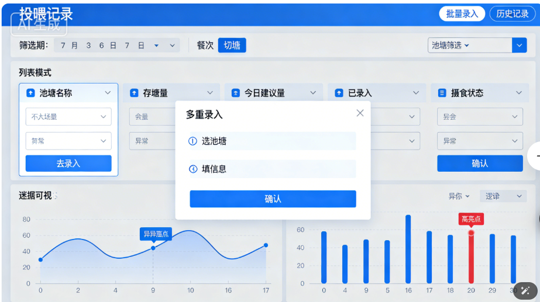
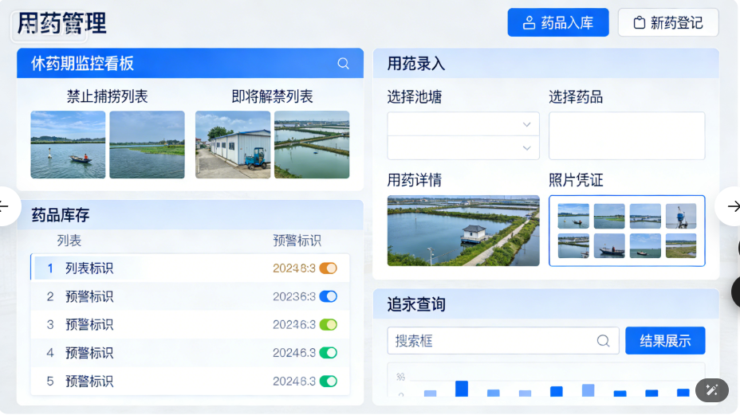
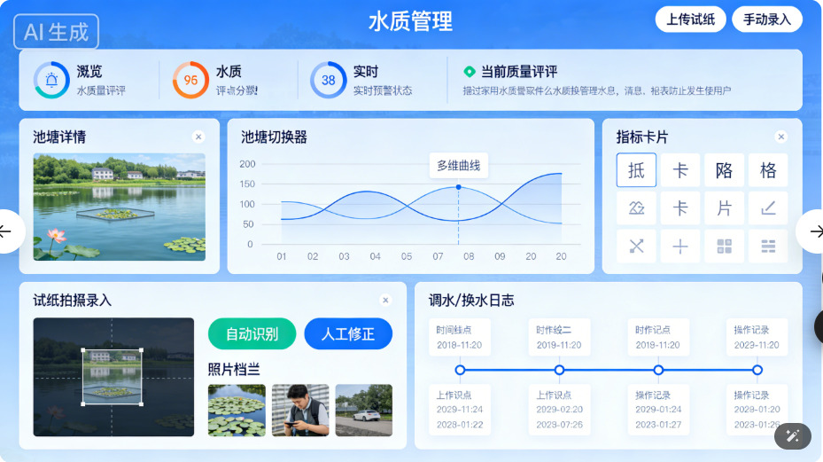
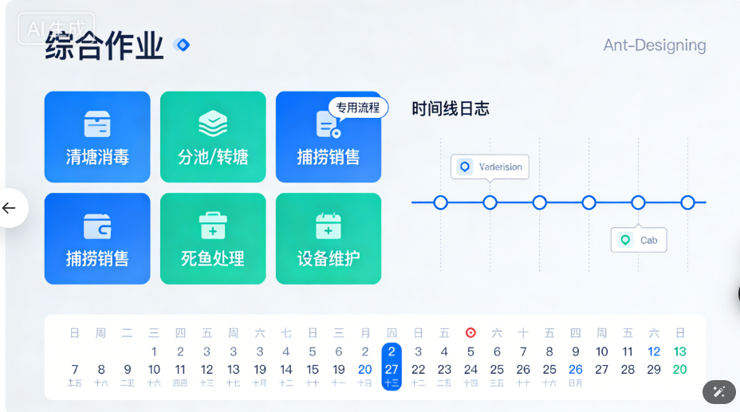

# 水产管理系统

[技术实现计划交付文档](https://agent.qianwen.com/mos/c1403b800ebb4e71b5d5638635dff14b/f7c7c9af5bf2bb6ea98c7e1a78ff954c)

# 模块1 - 日志管理

## 需求

* **替代纸质日志，实现**电子化、标准化记录
* **满足《水产养殖生产日志制度》合规要求（福建/厦门有明确规范）**
* **支持** **病害预警、用药追溯、环保监管** **（对接政府平台预留接口）**
* **提升养殖户管理效率，降低风险（如误投药、水质恶化）**

---

**文档的核心逻辑是“防人”，这会导致极差的用户体验。**

* **日志管理的“自嗨”** **：**
* **痛点** **：文档里写了“批量录入”、“扫码录入”，这还不够。养殖户在投喂时通常是双手沾满饲料粉尘，或者手湿漉漉的。他们根本没法在手机上精确点击“下拉框”或“输入数字”。**
* **狠批** **：文档里的表单设计太重了。谁会在投喂时看手机上的“建议投喂量”？那是技术员干的活。工人只管“喂完了”。**
* **建议** **：** **投喂记录必须极简** **。只有一个按钮：“喂完了”。数字自动填入（基于上次记录或计划）。如果要改，只能点“+”或“-”，不能手输。** **把“填表”变成“打卡”** **。**
* **水质管理的“伪需求”** **：**
* **痛点** **：文档提到了“蓝牙传感器”和“拍照OCR试纸”。现实是，廉价的蓝牙传感器在户外高温高湿下故障率极高，OCR识别试纸颜色在户外强光下根本扫不准。**
* **狠批** **：文档假设了养殖户都有高精度的智能设备。实际上，大多数散户还在用几块钱的玻璃管测试剂。**
* **建议** **：** **放弃完美的OCR** **。直接做一个“色卡选择器”，让用户手指点一下“这个颜色”对应哪个色号，比拍照识别靠谱100倍。**

---

### 养殖日志核心功能模块

* **养殖场档案（名称、地址、法人、养殖证编号、经纬度）**
* **养殖单元管理（池塘/网箱/车间编号、面积、水深、养殖品种、放苗日期、放苗数量）**
* **品种库（预设厦门主流品种：南美白对虾、鲍鱼、石斑鱼、𩾃鱼、鳗鲡等）**

> **💡 建议：养殖证编号必填，便于未来对接“福建省水产养殖智慧化管理平台”**

#### 投喂记录模块

 **核心目标** **：解决“吃多少、吃了没、吃得怎么样”的问题，辅助判断鱼的生长健康状态。**

* **批量录入（核心痛点）**

  * **场景** **：不是每次只喂一个池塘，而是要一次性喂多个池塘。**
  * **功能** **：支持勾选多个池塘，统一填写“投喂量”、“饲料品牌”、“投喂时间”。**
  * **交互** **：勾选池塘后，系统自动读取该池塘的鱼规格/密度，给出建议投喂量参考。(todo)**
* **摄食统计（数据分析)**

  * **看板** **：展示日投喂量曲线图、周投喂总量。**
  * **转化率** **：结合生长周期，计算投喂转化率（吃进去多少料，长了多少肉）。**
  * **报警** **：如果某池塘投喂量突然大幅下降，系统标红预警（可能生病或水质不好）。**

  ---
* **记录详情** **：记录投喂员、天气情况（晴/雨，影响摄食）。**
* **日期 + 时间（支持多餐次）**
* **池塘选择（可多选）**
* **饲料品牌、型号、批次号（扫码录入更佳）**
* **投喂量（kg 或 g/万尾）**
* **摄食情况（下拉选项：正常 / 偏少 / 剩料 / 拒食）**
* **备注（天气、水温等）**

---

#### 水质管理模块

 **核心目标** **：从“单一数据查看”升级为“水质综合治理”，结合传统与智能手段。**

* **历史曲线分析**
  * **多维度对比** **：支持查看“溶解氧、水温、pH值、氨氮”等指标的历史走势。**
  * **异常标注** **：在曲线上自动标记出报警点（如：某天凌晨4点缺氧）。**
* **试纸照片上传（人机结合）**
  * **场景** **：有些指标（如亚盐、总碱度）物联网设备测不准，需要人工测。**
  * **功能** **：拍照上传试纸，系统OCR识别色卡数值，自动填入表格。**
  * **存档** **：照片与对应池塘、时间绑定，方便日后追溯。**
* **水质评价** **：根据上传的数据，系统自动给出“优良/一般/差”的评价，并给出调水建议（如：建议增氧、建议换水）。**

**水质与换水日志**

* **换水时间、换水量（m³ 或 %）**
* **水源类型（海水/淡水/处理水）**
* **水质检测数据（pH、DO、氨氮、亚盐、水温等，支持手动输入或设备对接）**
* **使用的调水产品（如芽孢、EM菌，记录用量）**

#### **用药记录模块**

 **核心目标** **：合规、安全，严防食品安全事故。**

* **休药期管理（强制逻辑）**
  * **规则** **：每种药品数据库内置“休药期”天数。**
  * **拦截** **：如果某池塘刚用药，系统自动锁定“捕捞”按钮，直到休药期结束才解锁。**
  * **预警** **：在休药期结束前3天，给负责人推送提醒。**
* **药品库存管理**
  * **入库/出库** **：记录药品的采购、领用。**
  * **过期提醒** **：药品快过期时自动预警，防止用过期药。**
* **药残追溯** **：点击某条捕捞记录，能反查出该批鱼养殖期间所有的用药记录（台账）。**

#### 其他作业模块

 **核心目标** **：记录那些不常发生，但至关重要的关键节点事件。**

* **清塘/消毒**
  * **记录** **：清塘日期、使用的消毒剂种类、晾晒天数。**
  * **作用** **：作为下一个养殖周期的“干净起点”证明。**
* **分池/转塘**
  * **操作** **：记录从哪个池塘转到哪个池塘，转了多少尾/多少斤。**
  * **关联** **：自动更新两个池塘的库存数量。**
* **捕捞/销售**
  * **称重** **：记录捕捞重量、规格、去向（卖给谁）。**
  * **结算** **：关联销售价格，计算本批次利润（可选）。**

**辅助功能**

* **日历视图** **：按日查看所有操作，避免遗漏**
* **快速录入模板** **：常用操作一键复用（如“每日早投喂”）**
* **照片上传** **：病体、水质试纸、剩料等**
* **数据导出** **：PDF/Excel格式，用于检查或保险理赔**
* **提醒功能** **：休药期到期、定期水质检测提醒**

**报表与分析（管理层关注）**

* **日/周/月汇总报表（总投喂量、用药次数、换水频率）**
* **单池塘生长曲线（结合定期抽样体重）**
* **用药合规性报告（是否超量、是否使用禁药）**
* **异常事件统计（死亡高峰、摄食异常）**

### 注意事项

* **批量录入** **：养殖现场最烦的就是重复劳动。“勾选多个池塘统一填”，直接解决了喂料时跑断腿、记断手的问题。**
* **扫码录入饲料** **：饲料型号多，容易记错。扫码既快又准，还能自动关联批次号，方便追溯。**
* **拍照识别试纸** **：人工读色卡容易有误差，拍照+OCR识别是现在的技术趋势，既客观又留了证据。**
* **休药期强制拦截** **：这是整个系统的** **核心风控点** **。很多养殖事故是因为人忘了休药期就捕捞。“用药即锁定，到期才解锁”，从系统底层杜绝了违规上市的风险，这对食品安全至关重要。**
* **分池自动更新库存** **：鱼从一个塘转到另一个塘，如果不自动改数据，后面的投喂计算全都会错。这个联动逻辑非常关键。**
* **摄食异常报警** **：不仅仅是记录“喂了多少”，而是通过“突然不吃”来预警疾病或水质问题。这是从“记录员”变成了“分析师”。**
* **转化率计算** **：把“吃了多少料”和“长了多少肉”结合起来，直接算出成本效益，这是老板最关心的数据。**
* **多餐次支持** **：鱼一天喂好几顿，分开记录才能看清每顿的摄食状态。**
* **日历视图** **：一眼看清今天该干嘛，有没有漏掉检测或用药。**
* **导出报表** **：应对检查、保险理赔、或者给合作伙伴看，**

## 自动化输入需求 (todo)

待确认

---

**核心批评：录入成本过高，严重低估了养殖现场的恶劣环境。**
你设计了“批量录入”、“扫码录入”、“拍照OCR识别试纸”，这些功能听起来很美好，但在实际操作中，养殖户的手通常是湿的、脏的，甚至带着泥腥味。让他们在塘口掏手机、对焦扫码、或者在复杂的表单里勾选“饲料批次号”，这违背了人性。一旦录入太麻烦，用户就会放弃，或者为了应付检查而编造数据（假数据）。一旦数据是假的，后面所有的“智能分析”、“转化率计算”都成了垃圾进、垃圾出。

**整改建议：**
必须做减法。

1. **默认值与极简操作** **：不要让用户每次都选“饲料品牌”，系统应该记住他上次用的品牌。投喂量应该基于历史数据给出一个“建议值”，用户只需要点“确认”或者微调，而不是从头输入。**
2. **强制与激励的平衡** **：对于“用药记录”这种涉及食品安全的，必须强制且严格（如休药期锁死）；但对于“日常投喂”，如果用户觉得麻烦，应该允许“语音速记”甚至“拍照打卡”代替文字录入，后台再想办法通过图像识别去估算，而不是逼着用户填表。**
3. **离线优先** **：文档里提到了离线能力，这很好，但要强调“弱网环境下的本地存储与自动同步机制”，很多鱼塘信号极差，如果同步慢，用户会以为没存上。**

---

投喂记录：从“填表”变为“执行”

* **方案 A：计划转实际（一键确认）**
  * **逻辑** **：系统根据鱼的生长模型，每天早上自动生成“今日投喂计划”（例如：1号塘 50kg）。**
  * **操作** **：工人走到塘边，打开APP，看到列表全是预设好的任务。**
  * **动作** **：喂完后，直接点一个巨大的** **“✅ 完成”** **按钮。**
  * **微调** **：如果今天鱼吃得少，旁边有个“➖”号，点一下自动变为 45kg，无需手打数字。**
* **方案 B：蓝牙电子秤直连（硬件自动化）**
  * **场景** **：使用吊秤或地磅称重饲料。**
  * **操作** **：手机通过蓝牙连接电子秤。当秤上显示“50.5kg”稳定时，手机APP自动抓取该数值填入输入框。**
  * **优势** **：彻底杜绝“估摸个大概”，数据精准到小数点。**
* **方案 C：语音指令（解放双手）**
  * **操作** **：按住说话：“1号塘，喂了40公斤，海大料，吃得很好。”**
  * **处理** **：系统自动解析语义** →**→** **池塘：1号 | 重量：40kg | 摄食：好** →**→** **生成记录待确认。**

换水/排污：从“记录”变为“控制”

 **核心思路** **：换水通常是设备动作，记录应该是设备运行的“副产品”，而不是额外的工作。**🤖 自动输入方案（设备联动）

* **智能水泵/阀门联动**

  * **逻辑** **：如果你的进水泵或排污阀是智能物联网设备。**
  * **操作** **：工人在APP上点击“开启换水”，或者在现场按下物理开关（带电流检测）。**
  * **自动记录** **：**
  * **开始时间** **：设备启动瞬间自动记录。**
  * **结束时间** **：设备停止瞬间自动记录。**
  * **换水量** **：系统根据** `流量 × 时长` **自动计算（例如：流量 10m³/h，开了2小时** →**→** **自动记入“换水 20m³”）。**
  * **用户感知** **：工人完全不需要录入，系统日志里自动生成一条：“10:00-12:00 自动换水 20m³”。**

  ⚡ 极速输入方案（无设备改造）
* **方案 A：时长换算水量**

  * **预设** **：在系统里设置好“1号泵 = 10m³/小时”。**
  * **操作** **：工人只需输入“开了1.5小时”。**
  * **计算** **：系统自动算出水量 = 15m³，无需工人做乘法。**
* **方案 B：NFC 标签打卡**

  * **设置** **：在进水口或排污泵旁贴一个几块钱的 NFC 标签。**
  * **操作** **：工人去开水泵时，用手机碰一下标签。**
  * **记录** **：系统自动记录“某人于此刻在1号塘进行了换水操作”，默认时长可设为常用值（如1小时），后续可改**

用药记录：从“打字”变为“扫码”

**核心思路** **：药品是标准工业品，信息都在包装上，不要让人手写药名。**

📸 自动输入方案（OCR 识别）

* **扫码枪/相机模式**
  * **操作** **：直接调用手机摄像头，扫描药瓶上的****条形码**或 **二维码** **。**
  * **自动填充** **：系统自动识别药品名称（如“恩诺沙星”）、规格、厂家。**
  * **关联库存** **：如果系统里有这个药，直接调取；如果没有，自动新建药品档案。**
* **拍照识字 (OCR)**
  * **操作** **：对着药盒上的“成分表”或“使用说明”拍张照。**
  * **提取** **：系统自动提取“休药期：500度日”、“用法：拌饵”等关键信息填入表单。**

⚡ 极速输入方案（模板化）

* **方案 A：常用药方（套餐）**
  * **场景** **：定期消毒或预防。**
  * **操作** **：设置一个“ monthly 消毒套餐”（包含：二氧化氯 500g + 维生素C 200g）。**
  * **动作** **：一键应用套餐，系统自动列出明细，只需确认数量即可。**
* **方案 B：库存扣减法**
  * **逻辑** **：基于库存管理。**
  * **操作** **：工人不需要填“用了什么药”，只需要在库存列表里，对着“恩诺沙星”点一下“➖”，输入“用了1瓶”。**
  * **自动关联** **：系统自动把这笔消耗记录到当天的“用药日志”里，并标记到对应的池塘（需先选池塘）。**

| **功能模块** | **传统输入 (痛苦)**           | **极速/自动输入 (爽快)**              | **核心技术点**                        |
| ------------------ | ----------------------------------- | ------------------------------------------- | ------------------------------------------- |
| **投喂**     | **手打“1号塘 50kg”**        | **点“完成” / 蓝牙秤自动读数**       | **预设计划、蓝牙HID、语音识别**       |
| **换水**     | **手打“换了2小时，约20方”** | **设备自动记录 / 输入时长自动算水量** | **IoT设备联动、流量积分、NFC**        |
| **用药**     | **手打“恩诺沙星粉 100g”**   | **扫条形码 / 拍照识别 / 扣库存**      | **条形码扫描、OCR文字识别、库存联动** |

## 板块逻辑

**数据源头** **：**

* **物联网设备 -> 自动写入**  **水质管理** **。**
* **养殖员 -> 手动录入** **投喂** **和**  **用药** **。**

**逻辑联动** **：**

* **水质差** **->** **投喂** **模块自动建议“减料”或“停喂”。**
* **用药** **了 ->** **捕捞** **模块自动锁死（休药期逻辑）。**
* **分池** **了 ->** **投喂** **模块需要重新计算新的投喂量（因为密度变了）。**

**管理后台** **：**

* **管理员可以查看所有模块的汇总报表，比如：“本月总投喂量 vs 总捕捞量”，“本月用药次数统计”。**

## 原型设计

## 字段清单

### 公共基础字段

| **字段名**                            | **类型** | **必填** | **说明**                                                                                                                    | **示例**                                                                                                       |
| ------------------------------------------- | -------------- | -------------- | --------------------------------------------------------------------------------------------------------------------------------- | -------------------------------------------------------------------------------------------------------------------- |
| **记**录**I**D                  | **文**本 | **是**   | **唯**一**编**号（**如 **L**O**G**2**0**2**6**0**3**2**6**0**0**1**） | **L**O**G**2**0**2**6**0**3**2**6**0**0**1                                 |
| **养**殖**场**名**称**    | **文**本 | **是**   | **全**称，**与**养**殖**证**一**致                                                                        | **厦**门**海**丰**水**产**养**殖**场**                                                 |
| **养**殖**证**编**号**    | **文**本 | **是**   | **福**建**省**水**产**养**殖**证**号**                                                              | **闽**养**证**（**2**0**2**4）**第**0**5**8**7**号                         |
| **池**塘/**网**箱**编**号 | **文**本 | **是**   | **自**定**义**编**号**                                                                                          | **A**-0**3**、**鲍**鱼**排**B**2**                                                     |
| **养**殖**品**种                | **文**本 | **是**   | **从**预**设**下**拉**列**表**选**择**                                                              | **南**美**白**对**虾**、**皱**纹**盘**鲍、**珍**珠**龙**胆**石**斑鱼 |
| **养**殖**阶**段                | **文**本 | **否**   | **幼**体/**中**苗/**成**体/**亲**本                                                                       | **成**虾**期**                                                                                           |
| **记**录**日**期                | **日**期 | **是**   | **操**作**发**生**日**期                                                                                        | **2026-03-2**6                                                                                                 |
| **记**录**时**间                | **时**间 | **是**   | **精**确**到**分**钟**                                                                                          | **0**8:**3**0                                                                                            |
| **操**作**人**                  | **文**本 | **是**   | **姓**名**或**工**号**                                                                                          | **张**三                                                                                                       |
| **天**气**状**况                | **文**本 | **否**   | **晴**/**雨**/**阴**/**台**风**等**                                                                 | **晴**，**东**南**风**3**级**                                                                |
| **水**温（**℃**）              | **数**值 | **否**   | **当**日**池**塘**水**温                                                                                        | **2**2.5                                                                                                       |

### 投喂日志字段（Sheet: 投喂日志）

| **字段名**       | **类型** | **必填** | **说明**                 | **示例**                        |
| ---------------------- | -------------- | -------------- | ------------------------------ | ------------------------------------- |
| **投喂餐次**     | **文本** | **是**   | **早/中/晚/夜**          | **早**                          |
| **饲料品牌**     | **文本** | **是**   | **商品名**               | **通威牌南美白对虾膨化料**      |
| **饲料型号**     | **文本** | **是**   | **如 8512、SP-3**        | **8512**                        |
| **饲料批次号**   | **文本** | **否**   | **包装袋上的批号**       | **TW202512A**                   |
| **投喂量（kg）** | **数值** | **是**   | **实际投喂重量**         | **12.5**                        |
| **投喂方式**     | **文本** | **否**   | **手撒/自动投饵机/定点** | **自动投饵机**                  |
| **摄食情况**     | **文本** | **是**   | **下拉选项**             | **正常 / 偏少 / 剩料多 / 拒食** |
| **剩料量（kg）** | **数值** | **否**   | **未吃完的饲料**         | **0.8**                         |
| **备注**         | **文本** | **否**   | **其他说明**             | **因降温减量10%**               |

### 换水与水质管理日志（Sheet: 换水日志）

| **字段名**                      | **类型**  | **必填** | **说明**                          | **示例**         |
| ------------------------------------- | --------------- | -------------- | --------------------------------------- | ---------------------- |
| **操作类型***                   | **文本**  | **是**   | **换水 / 排污 / 增氧 / 调水**     | **换水**         |
| **换水量（m³）**               | **数值**  | **否**   | **排出+注入量**                   | **20**           |
| **换水比例（%）**               | **数值**  | **否**   | **如30%**                         | **30**           |
| **水源类型***                   | **文本**  | **是**   | **海水 / 淡水 / 处理水 / 循环水** | **过滤海水**     |
| **是否使用调水产品**            | **是/否** | **否**   | **如益生菌、底改**                | **是**           |
| **调水产品名称**                | **文本**  | **否**   | **如“枯草芽孢杆菌”**            | **枯草芽孢杆菌** |
| **使用量（g 或 kg）**           | **数值**  | **否**   |                                         | **200**          |
| **水质检测 - pH**               | **数值**  | **否**   |                                         | **8.2**          |
| **水质检测 - 溶解氧（mg/L）**   | **数值**  | **否**   |                                         | **5.6**          |
| **水质检测 - 氨氮（mg/L）**     | **数值**  | **否**   |                                         | **0.15**         |
| **水质检测 - 亚硝酸盐（mg/L）** | **数值**  | **否**   |                                         | **0.05**         |
| **水质检测 - 盐度（‰）**       | **数值**  | **否**   | **海水养殖重要**                  | **28**           |
| **备注**                        | **文本**  | **否**   |                                         | **大潮期间换水** |

### 用药与健康管理日志（Sheet: 用药日志）

| **字段名**              | **类型**      | **必填** | **说明**                                       | **示例**            |
| ----------------------------- | ------------------- | -------------- | ---------------------------------------------------- | ------------------------- |
| **药品通用名**          | **文本**      | **是**   | **国家兽药典名称**                             | **恩诺沙星**        |
| **药品商品名**          | **文本**      | **否**   | **厂家商品名**                                 | **菌毒清**          |
| **药品类别**            | **文本**      | **是**   | **抗生素 / 消毒剂 / 中草药 / 益生菌 / 杀虫剂** | **抗生素**          |
| **是否为禁用药品**      | **是/否**     | **是**   | **系统自动判断（需内置禁药库）**               | **否**              |
| **用药目的**            | **文本**      | **是**   | **预防 / 治疗**                                | **治疗**            |
| **疾病名称**            | **文本**      | **否**   | **如“红体病”、“烂鳃”**                     | **红体病**          |
| **使用方式**            | **文本**      | **是**   | **全池泼洒 / 拌料 / 药浴**                     | **拌料**            |
| **用药剂量**            | **文本**      | **是**   | **含单位（如 g/kg 饲料）**                     | **5g/kg**           |
| **实际用量（g 或 mL）** | **数值**      | **是**   |                                                      | **60**              |
| **休药期（天）**        | **数值**      | **是**   | **根据药品自动推荐**                           | **21**              |
| **休药期结束日**        | **日期**      | **是**   | **自动计算 = 记录日期 + 休药期**               | **2026-04-16**      |
| **兽药二维码**          | **文本/图片** | **否**   | **扫码录入更佳**                               | **[图片链接]**      |
| **异常反应**            | **文本**      | **否**   | **死亡增加、拒食等**                           | **无异常**          |
| **兽医/技术员签字**     | **文本**      | **是**   | **责任人**                                     | **李工**            |
| **备注**                | **文本**      | **否**   |                                                      | **配合维生素C使用** |

> **✅**  **合规提示** **：**
>
> * **禁用药品示例：孔雀石绿、氯霉素、呋喃唑酮、五氯酚钠等（需内置黑名单）**
> * **休药期数据可参考《NY 5071-2002 无公害食品 渔用药物使用准则》**

# 模块2 -  水质中心

* **形式：** **曲线图 + 仪表盘。**
* **输入方式：**

  * **蓝牙传感器：** **自动同步，实时显示。**
  * **手动输入：** **提供一个显眼的“+”号，用于录入试纸/测试液的结果。**
* **提醒功能：** **设置阈值（如温度>30℃），超标即推送通知。**
* **水质（传感器/手动）是“眼睛”** **：负责看环境好不好，负责报警。**
* **日志（投喂/死鱼）是“手”** **：负责记录你做了什么干预。**

**最佳体验是：**
水质模块监测到问题 -> 推送提醒 -> 用户去处理（如换水/用药） -> 在日志模块记录处理过程。两者通过“提醒”和“待办”连接起来。

---

**文档里提到了很多高大上的技术，但在实际养殖环境中可能全是坑。**

* **蓝牙直连的陷阱** **：**
* **狠批** **：文档里说“蓝牙连接电子秤”。你试过在养虾棚里，手机连蓝牙吗？信号干扰严重，连接成功率极低。而且电子秤通常是工业级的，协议不开放，根本连不上手机。**
* **建议** **：如果要做自动录入，不如做** **“称重拍照”** **。工人拍一下秤面，后台人工审核（或者简单的图像识别），比搞蓝牙协议省心多了。**
* **气象管家的“算命”** **：**
* **狠批** **：文档里提到“水温预测”和“最佳换水窗口”。气象局的气温预测都经常不准，你一个APP凭什么能预测池塘水温？如果系统建议“适合换水”，结果用户换了水导致鱼应激死亡，谁赔？**
* **建议** **：** **只做“风险提示”，不做“操作建议”** **。只告诉用户“明天降温10度”，别告诉用户“建议换水30%”。把决策权留给养殖户，别替他做决定。**

---

### 双模数据采集（输入层）

**系统需要无缝切换或同时支持两种模式。**

* **手动录入模式（辅助化）**
  * **快捷录入：** **针对无法蓝牙连接的指标（如氨氮、亚硝酸盐、透明度），提供大字体数字键盘。**
  * **拍照存证：** **录入时，支持直接调用相机拍摄****试纸比色卡**或**检测管**的照片。
    * *作用：* **防止记错数，日后复盘时可查看照片确认当时的比色结果。**
  * **语音输入（可选）：** **考虑到养殖户手湿，支持按住说话“氨氮0.2，亚硝酸盐0.05”，系统自动转文字填入。**

---

todo

**A. 蓝牙直连模式（自动化）*** **设备配对：** **支持蓝牙4.0/5.0，自动搜索附近的工业级水质传感器（如溶氧、pH、温度探头）。**

* **实时同步：** **无需人工干预，传感器数据（如每10分钟一次）自动上传至APP。**
* **状态显示：** **在界面上显示“设备在线”、“电量剩余”、“最后同步时间”。若设备离线（如蓝牙断开），自动切换为“手动补录”提示。**
* **优势：** **解决夜间（凌晨3-5点）溶氧监测难的问题，防止因睡觉错过缺氧浮头。**

---

1. **弱化硬件，强化趋势** **：不要过分吹嘘“实时同步”，除非你的系统能兼容市面上主流的廉价传感器。对于大多数散户，应该侧重于“试纸拍照+人工录入”的便捷性，OCR识别率如果不达标，不如直接让用户选“色卡颜色”。**
2. **数据联动才是核心** **：水质数据不能只展示，要“指挥”日志。比如，当系统检测到（或用户录入）溶氧低于3mg/L时，投喂模块应该自动弹出红色警告：“当前溶氧过低，建议暂停投喂”，甚至直接锁定投喂记录，防止用户误操作导致泛塘。这才是B端系统该有的“风控”。**

---

### 可视化数据看板（展示层）

**拒绝枯燥的数字表格，用直观的图表展示水质变化趋势。**

* **实时仪表盘：**
  * **首页展示核心指标（溶氧、温度、pH）的** **大号数值** **。**
  * **使用** **颜色编码** **：绿色代表正常，黄色代表临界，红色代表危险。**

---

---

* **状态颜色** **：**
* **绿色：正常范围。**
* **橙色：警戒范围（如溶氧<3mg/L）。**
* **红色：危险范围（如溶氧<1mg/L）。**
* **来源标识** **：显示数据图标（蓝牙图标代表自动，铅笔图标代表手动）。**

---

---

* **历史趋势曲线：**

  * **将蓝牙自动记录的数据和手动录入的数据画在同一张时间轴折线图上。**
  * **叠加分析：** **例如，可以将“投喂时间”（来自日志模块）作为标记点，叠加在“溶氧曲线”上，直观看到投喂后溶氧是否下降过快。**
* **数据报表：**

  * **自动生成日/周/月报表，支持导出Excel，方便发给技术员或专家诊断。**

---

* **多曲线叠加** **：允许用户在同一张图上对比不同指标（例如：同时看“溶氧”和“温度”的变化）。**
* **时间跨度** **：支持切换“24小时”、“7天”、“30天”。**
* **关键事件标记** **：在曲线上标记“投喂点”或“换水点”（需关联日志模块数据），帮助用户分析水质波动原因。**
* **极值显示** **：自动标注该时间段内的最高值和最低值。**

---

### **智能预警系统（核心风控）**

**这是该模块的“大脑”，变“被动查看”为“主动通知”。**

* **多级阈值报警：**

  * **自定义设置：** **用户可设定不同鱼类的适宜范围（如草鱼pH 6.8-8.5，对虾pH 7.8-8.6）。**
  * **分级提醒：**
    * **黄色预警（关注）：** **数值接近临界值（如溶氧<4mg/L），APP推送消息。**
    * **红色报警（危急）：** **数值严重超标（如溶氧<2mg/L 或 pH骤变），触发****电话语音通知**或 **短信轰炸** **，确保用户醒来或听到。**

  ---

  * **预设模板** **：系统内置常见鱼虾的适宜水质范围（如草鱼、对虾）。**
  * **自定义范围** **：用户可手动设置上下限（如：溶氧 下限4.0，上限10.0）。**

---

* **设备异常报警：**

  * **当蓝牙传感器数据长时间未更新（如设备被鱼撞歪、没电、断网），系统自动推送“设备离线，请检查”，防止因设备故障导致的数据盲区。**
* **报警触发**

  * **实时报警** **：蓝牙数据超标，立即推送APP通知。**
  * **离线报警** **：蓝牙设备超过设定时间（如30分钟）未上传数据，提示“设备可能掉线或被遮挡”。**
  * **持续低值报警** **：如溶氧连续1小时低于警戒线，触发电话/短信强提醒（需接入第三方服务）。**
* **报警记录**

  * **记录所有触发报警的时间点和数值，形成“事故档案”。**

  ---

  todo

  * **数据修正** **：允许用户删除或修改错误的录入数据。**
  * **报表导出** **：支持将水质数据导出为Excel或PDF，包含：时间、指标、数值、来源、试纸照片（缩略图）。**

---

非功能需求（性能与体验）

* **离线能力** **：在无网络（鱼塘通常信号差）的情况下，手动录入的数据应保存在本地数据库，待网络恢复后自动上传服务器。**
* **低功耗** **：蓝牙连接模式下，APP应尽量在后台运行，不占用过多手机电量。**
* **易用性** **：考虑到户外强光环境，界面应采用高对比度设计，按钮要大，方便手指粗大的用户操作。**

### 决策辅助与建议（增值服务  todo）

**不仅告诉你“水坏了”，还告诉你“怎么办”。**

* **关联建议：**
  * **当监测到**pH过低 **-> 弹窗建议：“建议泼洒生石灰调节酸碱度”。**
  * **当监测到**溶氧持续走低 **-> 弹窗建议：“气压低，建议提前开启增氧机，今晚不要投喂”。**
* **换水/调水提醒：**
  * **结合水质趋势，若连续3天氨氮累积升高，系统提示：“水质老化，建议换水10-20%”。**

# 模块3-**AI病害识别**

* **关键功能** **：**
* **拍照诊断** **：拍摄病鱼体表或解剖图，AI识别病害（如细菌性败血症、寄生虫）。**
* **综合推理** **：结合“水质数据”辅助判断（例如：排除传染病，判断为“缺氧浮头”）。**
* **智能开方** **：输出诊疗方案（用药建议、停食建议），并支持一键转为“用药日志”。**

---

**在水产领域，病害往往伴随着复杂的环境因素。仅凭一张照片，AI很难准确判断是细菌性还是病毒性，更别提给出精准的“开方”建议。如果AI误诊，导致用户用错药，这个责任谁负？而且，养殖户在鱼生病时最急，如果APP识别慢或者识别不出来，他们会立刻去找兽医，而不是对着手机发呆。**

**整改建议：**
不要把这个做成全自动的“AI医生”，而要做成“远程问诊工具”。

1. **人机结合** **：拍照后，AI给出一个“疑似范围”（仅供参考），更重要的是提供“一键连线专家”的功能，把照片和刚才录入的“水质数据”、“用药历史”打包发给后台的真人技术员。**
2. **辅助决策** **：与其让AI开方，不如让AI查“禁忌”。比如用户刚录入了“恩诺沙星”，AI应该提示“注意休药期”，而不是建议“再加量”。**

---

# 模块4-信息导航

待定

---

**消除信息不对称，帮养殖户快速找到“哪里有卖、谁家有货、电话多少”。**

**结合“热点方式”（即利用热门关键词、热门标签、热门排行来组织信息）**

* **不做** **：在线下单、支付、库存实时同步（太重，且供应商不配合）。**
* **只做** **：供应商信息聚合 + 热门产品索引 + 一键联系（电话/导航）。**

---

如果是C端导航，用户希望看到“谁家便宜”、“谁家送货快”；如果是B端监管，你只允许展示“合规药店”。如果“合规药店”价格贵又远，养殖户为什么要用你的导航？他们会有自己的“鱼中”或“黑药店”渠道。此外，“爬虫抓取”的数据如果不及时清洗，会导致大量无效信息（如已倒闭的店），用户体验极差。

---

**明确这是** **“监管下的服务”** **。**

1. **黑白名单机制** **：导航里只能出现“白名单”商家（合规、有资质）。对于养殖户关心的“价格”和“服务”，可以通过“用户评价”或“标签”（如：24小时配送）来体现，但前提是商家必须接受你的监管（如上传进销存台账）。**
2. **利益捆绑** **：为什么养殖户要用这个找店？因为在这里买药，系统自动帮他生成“合规用药记录”，卖鱼时能多卖钱（溯源溢价）。如果没有这个利益闭环，导航功能就是个鸡肋。**

---

### 页面一：资源导航首页（金刚区入口）

 **定位** **：系统的“工具箱”，用最直观的图标把服务分发出去。**

* **顶部：全局搜索栏**
  * **支持搜“店名”、“产品”（如：恩诺沙星）、“服务”（如：拉鱼车）。**
* **核心区域：金刚区（图标宫格）**
  * **这是页面的心脏，建议放 8-10 个高频入口：**
    * **[找药店]** **（核心，跳转至合规药店列表）**
    * **[找饲料]** **（跳转至饲料经销商列表）**
    * **[找鱼中]** **（跳转至收鱼行情页）**
    * **[找维修]** **（增氧机/电路维修师傅）**
    * **[找检测]** **（水质检测/病害实验室）**
    * **[急用物资]** **（筛选24小时营业的店）**
* **辅助区域：热门公告/行情**
  * **滚动显示：“今日草鱼收购价：5.5元/斤” 或 “XX渔药店新到一批增氧片”。**

### **页面二：资源地图与列表页（找店/找人）**

 **定位** **：展示“哪里有”，支持按距离和类型筛选。**

* **顶部：分类筛选栏**
  * **切换标签：[全部] [渔药] [饲料] [收鱼] [服务]。**
  * **排序：[离我最近] [评分最高] [销量最多]。**
* **主体：地图模式 / 列表模式（可切换）**
  * **地图模式** **：满屏地图，显示周边的红点（药店）、蓝点（饲料）、绿点（收鱼）。点击红点弹出小卡片（店名+距离+电话）。**
  * **列表模式** **：**
  * **卡片内容** **：店铺头像、名称、** **“官方认证”标签** **（增加信任）、距离（如：1.2km）、营业时间。**
  * **关键操作** **：卡片右下角直接放** **[导航]** **按钮。**

### 页面三：供应商/经纪人详情页（电子名片）

 **定位** **：展示“是谁”，促成“联系”或“前往”。**

* **头部：信任背书**
  * **店铺大图 + 名称。**
  * **资质标签** **：[持证经营] [兽药GSP认证] [官方推荐]（这些是你作为管理者赋予的价值）。**
  * **基本信息** **：老板姓名、经营年限、联系电话（一键拨打）。**
* **中部：业务详情**
  * **主营范围** **：标签化展示（如：#草鱼药 #海大饲料 #增氧机）。**
  * **热销产品/服务** **：列出3-5个核心产品（如：XX品牌杀虫剂），** **只展示不售卖** **。**
  * **营业时间** **：显示“营业中”或“已打烊”。**
* **底部：悬浮操作栏**
  * **[一键拨号]** **（最醒目）**
  * **[微信咨询]** **（复制微信号）**
  * **[去这里]** **（唤起地图导航）**

---

爬虫+人工（冷启动）

* **公开数据抓取** **：利用地图API（高德/百度）的公开数据，抓取周边的“饲料店”、“兽药经营部”的基础位置和名称。**
* **行业名录整理** **：收集本地的农资批发商名录。**

用户“纠错”与“爆料”（众包）

* **报错/补充** **：用户在查看某家店时，可以点击“信息有误”或“补充产品”，比如“这家店已经搬走了”或“这家店新进了XX品牌”。**
* **求货悬赏** **：用户发布“急需XX药”，系统推送给附近的供应商（如果供应商端有入驻），或者仅作为信息展示。**

供应商自荐（轻量级入驻）

* **不需要复杂的后台，供应商只需填写一个简单的表单（类似问卷），上传营业执照和门头照，即可生成“电子名片”。**

---

# 模块5 -**气象管家**

**不要直接调用手机自带的天气接口，要做** **“场景化翻译”** **。**

* **普通预报** **：明天大风8级。**
* **养殖预报** **：明天8级大风，****不适合**出海/换水，**建议**加固渔排。

---

文档中提到的“水温预测”和“最佳换水窗口”在实际技术实现上难度很大。

---

### 页面一：养殖气象看板（首页或独立页）

 **定位** **：一眼看清“能不能干活”。**

#### 顶部：当前状态卡片

* **核心数据** **：温度、风力（阵风/持续风）、降雨概率。**
* **潮汐状态** **：当前是“涨潮”还是“退潮”，以及** **“最佳换水窗口期”** **倒计时（例如：距离下次满潮还有2小时，适合纳水）。**

#### 中部：未来3天养殖建议（场景化）

* **台风/暴雨预警** **：如果有台风，直接红色高亮，显示“预计24小时后影响我区，建议提前降低水位”。**
* **作业指数** **：**
* **出海指数** **：⭐⭐⭐⭐（适宜）**
* **换水指数** **：⭐⭐（不宜，温差大）**
* **投喂指数** **：⭐⭐⭐（正常）**

#### 底部：景观与特殊预报（参考石狮模式）

* **日出日落** **：方便安排早晚巡塘。**
* **水温预测** **：预测未来3天表层水温变化（对鲍鱼、对虾很重要）。**

### 🌊 潮汐专项模块（关键功能）

**福建沿海养殖户对潮汐极其敏感。**

* **潮汐曲线图** **：**
* **展示24小时潮位变化曲线。**
* **标记高低潮时间** **：明确标出“满潮”和“干潮”的具体时间点。**
* **智能提醒** **：**
* **“大潮汛提醒”** **：农历初一、十五前后，提醒注意大潮可能带来的水质剧烈变化。**
* **“排水窗口”** **：结合潮汐和天气，提示“今晚退潮，适合排污”。**

### 🚨 灾害预警与联动（管理者视角）

**这是你作为“管理者”最能体现价值的地方。**

* **分级预警推送** **：**
* **蓝色/黄色预警** **：APP内弹窗，“注意大风，请加固设施”。**
* **橙色/红色预警** **：短信+APP强提醒，“台风红色预警！请立即撤离人员上岸！”（参考连江鲍鱼预警模式）。**
* **一键导航避险** **：**
* **在预警页面直接挂载** **“避风港导航”** **或** **“最近撤离点”** **，与之前的“信息导航”模块打通。**

---

* **福建省“知天气”APP** **：福建气象局有专门针对鲍鱼、渔业的接口，数据非常精准。**
* **本地潮汐表** **：接入厦门港的潮汐数据。**

**核心批评：数据源的不确定性与算法的复杂性。**

**通用的气象局数据只能提供大气温度，无法提供“池塘水温”。池塘水温受水深、遮阴、水流影响巨大。如果系统预测“适合换水”，结果用户换了水导致鱼应激死亡，系统的权威性就崩塌了。**

**整改建议：**

1. **保守策略** **：不要做过于精准的“水温预测”，除非你有当地的历史大数据模型。建议改为“风险提示”，例如：“明日大幅降温，温差可能超过5度，建议加深水位”。**
2. **潮汐本地化** **：潮汐数据相对标准，可以做得更细致。比如结合厦门本地渔民的术语（如“初一十五流”），让界面更接地气。**
3. **预警的强制性** **：作为B端系统，气象预警不能只是“弹窗”，对于红色预警（如台风），应该强制推送到“管理员”端，要求管理员去确认“养殖户是否已收到通知”，形成闭环。**

---

# 可行性

**B端监管系统最痛的痛点****——****“体外循环”****。**

**确实，如果养殖户想违规，他完全可以：**

1. **不用你的APP** **：偷偷下药，不记日志。**
2. **不走你的证** **：鱼熟了，直接叫鱼贩子来塘口拉走，不开合格证，现金交易。**

**面对这种“人治”的漏洞，单纯靠软件是管不住的。必须引入** **“物理手段”** **和** **“利益机制”** **来倒逼他必须进系统。**

**结合你之前提供的搜索材料（如佛山南海、常州武进等地的经验），我有以下几套** **“组合拳”** **方案，专门治这种“偷偷卖”**

| **角色**      | **你的对策**                                                                      | **目的**           |
| ------------------- | --------------------------------------------------------------------------------------- | ------------------------ |
| **养殖户**    | **给甜头** **（保险、品牌溢价）+**  **给大棒** **（飞行检查）** | **让他**想进系统   |
| **鱼中/市场** | **压责任** **（无码不收、收错担责）**                                       | **让他**帮你管     |
| **技术**      | **装天眼** **（AI监控、数据比对）**                                         | **让他***不敢*跑 |

---

这是目前国家推行力度最大的手段，也是系统最核心的抓手。

逻辑

**鱼要出塘，必须过“关卡”。这个关卡不是你在塘口守着，而是** **“鱼中（收鱼贩子）”** **和** **“市场”** **。

具体做法

1. **绑定“鱼中”端** **：**

* **你的系统不能只给养殖户用，必须给辖区内的** **收鱼经纪人（鱼中）** **开发一个简易版小程序。**
* **规则** **：鱼中来收鱼，必须在系统里录入“收购单”。录入时，系统强制要求扫描养殖户的** **“承诺达标合格证”二维码** **。**
* **拦截** **：如果养殖户的鱼还在休药期，系统****开不出合格证** **-> 鱼中扫不到码 -> 鱼中无法录入收购单 -> 鱼中不敢收（因为收了要担责）。**

1. **市场准入** **：**

联合本地最大的农批市场，规定入场必须出示系统生成的电子合格证。没有码，鱼车进不去。

效果

**养殖户想偷偷卖，但鱼中为了自保（怕被罚款），不敢收没有系统“绿码”的鱼。**

---

**这是参考了****佛山南海**和**常州武进**的做法，用技术手段解决“看不见”的问题。

逻辑

**既然人会撒谎，就让摄像头说话。**

具体做法

1. **关键点位监控** **：**

* **在养殖密集区的路口、塘口主干道安装****高位监控**或 **人脸识别摄像头** **（政府出钱建）。**
* **AI识别** **：训练AI识别“收鱼车”和“装鱼动作”。**

1. **数据比对（抓现行）** **：**

* **系统逻辑：摄像头拍到了“XX塘口”有收鱼车在装鱼（时间：凌晨4点） -> 系统自动去查数据库 ->**  **发现该塘口没有“出塘备案”记录** **。**
* **报警** **：系统判定为“疑似偷卖”，立即推送给网格员（你），网格员直接去现场拦截。**

效果

**让“偷偷卖”的风险成本极高。一旦被抓，罚款可能是几万起步（参考《食品安全法》），养殖户不敢冒这个险。**

---

**这是参考了****保险**和**品牌**的做法。如果进系统只有麻烦，没人愿意进；必须有好处。

逻辑

**让“合规”变成一种资产。**

具体做法

1. **优质优价（品牌化）** **：**

* **你作为管理者，打造区域公用品牌（如“厦门放心鱼”）。**
* **规则** **：只有系统里“日志齐全、休药期合规”的鱼，才能贴这个标，收购价** **每斤多5毛钱** **。鱼中为了好卖，也愿意优先收这种鱼。**

1. **保险兜底** **：**

* **联合保险公司推出“水产品质量安全险”。**
* **规则** **：只有用你的系统记录日志的养殖户，才能买这个保险。如果因为天气或意外死鱼，保险公司** **凭系统日志理赔** **。**
* **杀手锏** **：如果养殖户偷偷卖鱼被抓，或者因为药残被罚款，保险公司拒赔。**

效果

**养殖户为了那“5毛钱”差价和“保险理赔”，会主动把数据录入系统。**

---

**这是参考了****湖南娄底**和**江苏泰兴**的执法经验。

逻辑

**保持威慑力，让他不知道什么时候会查。**

具体做法

1. **红黑名单** **：**

* **系统根据日志记录情况，给养殖户打分。**
* **黑名单** **：经常不记录、或者有过违规历史的，列为重点监管对象。**

1. **突击抽检（飞行检查）** **：**

* **你（管理者）拿着手持快检设备，不打招呼直接下塘口。**
* **逻辑** **：系统随机派单 -> 你去现场 -> 要求养殖户当场开鱼、当场测。**
* **惩罚** **：一旦发现药残超标且系统里没记录（属于故意隐瞒），直接移交执法大队，** **顶格处罚** **。**

---

# 整改方案

#### 减法：砍掉不切实际的功能

1. **砍掉复杂的表单** **：把所有下拉菜单、必填项砍掉一半。允许用户“先记一笔”，后面再补全。**
2. **砍掉自动化的幻想** **：去掉“蓝牙直连”、“OCR识别”作为核心功能，改为“辅助功能”。核心还是“人工录入”，但要让录入变得像发微信一样简单。**
3. **砍掉AI诊断** **：改为“一键连线专家”。**

#### 加法：增加“不得不用”的理由

1. **加“钱”的逻辑** **：在文档的“信息导航”模块，必须强调** **“平台补贴”** **或** **“品牌溢价”** **。只有让养殖户赚到钱，他们才愿意配合监管。**
2. **加“鱼中”的端口** **：文档里提到了，但不够重视。必须把** **“收鱼经纪人”** **拉进系统。如果鱼中不扫码就不能收鱼，这才是最强的风控。**
3. **加“离线模式”** **：文档里提到了，但要作为最高优先级。必须保证在没有信号的深山鱼塘，也能把数据存下来，等有信号了自动上传。**
