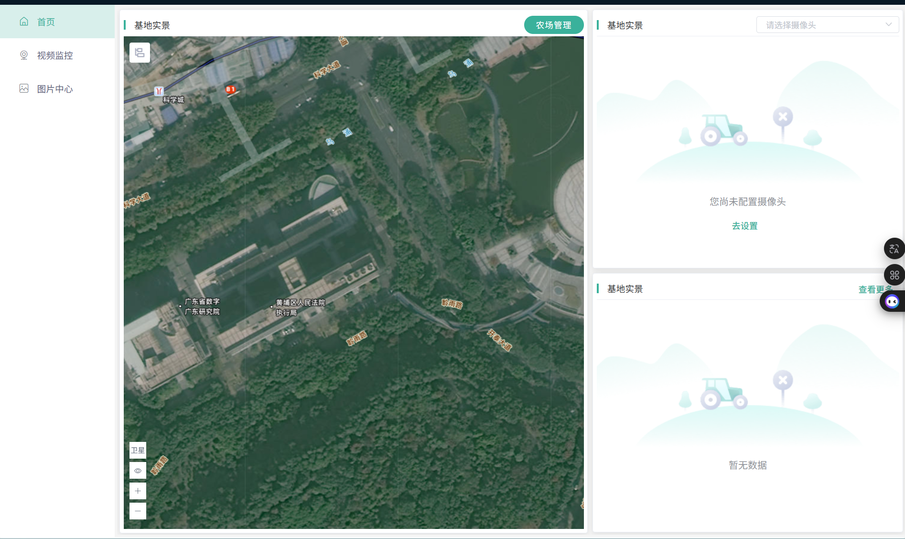

# 水产管理系统

[技术实现计划交付文档](https://agent.qianwen.com/mos/c1403b800ebb4e71b5d5638635dff14b/f7c7c9af5bf2bb6ea98c7e1a78ff954c)

目标对像 : 老板

**PC端不是用来录入流水账的，是用来**看大局、管风险、算细账的

**核心价值不再是“方便记录”，而是** **“集中管控”** **和** **“数据决策”**

1. **P0 (最高级)：基础档案与库存管理** **（建立池塘、品种、饲料药品库）。**
2. **P0 (最高级)：远程批量录入** **（代替工人记录投喂、用药、捕捞）。**
3. **P1 (核心)：合规性风控** **（休药期自动计算与拦截）。**
4. **P1 (核心)：经营报表** **（成本、利润、饵料系数分析）。**
5. **P2 (进阶)：可视化大屏** **（地图展示、水质曲线，需对接硬件）。**

注意  PC端只是辅助，真正的战场在移动端（手机）

# 水产监测(Dashboard)

## 基地分布

**GIS“一张图”管理**

* **功能：** **基于地图（如高德/百度地图API）展示所有养殖基地的分布**。
* **状态颜色：**
  * **🟢** **绿色：** **正常（今日已投喂，水质正常）。**
  * **🔴** **红色：** **报警（溶解氧低于3mg/L，或休药期违规预警）。**
  * **🟡** **黄色：** **待办（超过12小时未记录投喂）。**
* **专家理由：** **老板通常管多个基地，地图模式能让他迅速定位哪个塘口出了问题，而不是去翻Excel表格**。

参考

## **水质监控**

* **功能：** **如果接入了物联网设备（传感器），PC端是展示曲线图的最佳位置**。
* **展示：** **24小时溶解氧变化曲线、水温趋势。**
* **专家理由：** **手机端屏幕太小，看不清长周期的水质变化趋势。PC端大屏能帮技术员分析“为什么昨晚鱼浮头了”（比如看到凌晨4点溶氧骤降）**

## **生产计划**

## 经营分析

**这是文档里完全没有的，但却是PC端存在的唯一理由。**

**功能：**

1. **成本核算表** **：**

* 自动算出：**每斤鱼的成本** **= (饲料费 + 药费 + 电费 + 苗种费) / 总产量。**

1. **利润排行榜** **：**

* **排出哪个塘口赚得最多，哪个技术员/工人搞砸了。**

1. **库存预警** **：**

* **饲料仓库还剩多少吨？如果下周要喂鱼，是不是该下单买饲料了？**

# 预警中心

## 综合预警

## 预警记录

# **气象监测**

## 实时气象与潮汐

**不要直接调用手机自带的天气接口，要做** **“场景化翻译”** **。**

* **普通预报** **：明天大风8级。**
* **养殖预报** ：明天8级大风,***不适合**出海/换水，**建议**加固渔排。

---

文档中提到的“水温预测”和“最佳换水窗口”在实际技术实现上难度很大。

页面一：养殖气象看板（独立页）

 **定位** **：一眼看清“能不能干活”。**

顶部：当前状态卡片

* **核心数据** **：温度、风力（阵风/持续风）、降雨概率。**
* **潮汐状态** **：当前是“涨潮”还是“退潮”，以及** **“最佳换水窗口期”** **倒计时（例如：距离下次满潮还有2小时，适合纳水）。**

中部：未来3天养殖建议（场景化）

* **台风/暴雨预警** **：如果有台风，直接红色高亮，显示“预计24小时后影响我区，建议提前降低水位”。**
* **作业指数** **：**
* **出海指数** **：⭐⭐⭐⭐（适宜）**
* **换水指数** **：⭐⭐（不宜，温差大）**
* **投喂指数** **：⭐⭐⭐（正常）**

底部：景观与特殊预报（参考石狮模式）

* **日出日落** **：方便安排早晚巡塘。**
* **水温预测** **：预测未来3天表层水温变化（对鲍鱼、对虾很重要）。**

🌊 潮汐专项模块（关键功能）

* **福建省“知天气”APP** **：福建气象局有专门针对鲍鱼、渔业的接口，数据非常精准。**
* **本地潮汐表** **：接入厦门港的潮汐数据。**
* **本地化改造** **：**
* **术语本地化** **：界面显示“初一十五流”、“大潮汛”等本地渔民熟悉的术语。**
* **结合养殖作业** **：在潮汐曲线上，直接标记出“** **适宜排污** **”（退潮时）、“** **适宜纳水** **”（涨潮时）的时间段。**
* **可视化** **：用****曲线图**展示24小时潮位变化，高低潮时间点用醒目的图标标出。

🚨 灾害预警与联动

* **分级预警** **：**
* **蓝色/黄色预警** **：APP内弹窗，推送“注意大风，请加固设施”。**
* **橙色/红色预警** **：** **短信 + APP强提醒** **，甚至可以结合语音播报。“台风红色预警！请立即撤离人员上岸！”**
* **闭环管理** **：**
* **管理者端** **：对于红色预警，系统强制推送到管理员端，要求管理员确认“养殖户是否已收到通知”。**
* **一键导航** **：在预警页面直接挂载“避风港导航”或“最近撤离点”，与“信息导航”模块打通。**

**核心批评：数据源的不确定性与算法的复杂性。**

**通用的气象局数据只能提供大气温度，无法提供“池塘水温”。池塘水温受水深、遮阴、水流影响巨大。如果系统预测“适合换水”，结果用户换了水导致鱼应激死亡，系统的权威性就崩塌了。**

## 台风/灾害预警 (地图路径、风险评估)

## 历史气象查询 (数据分析)

# 生产管理

## 日志记录

**目标：** **解决工人不会用、不想用的问题，由办公室文员或技术员代劳。**

1. **“代填模式” (远程投喂/用药记录)**

   * **功能：** **办公室文员通过电话/微信语音询问现场工人：“1号塘喂了多少？”然后由文员在PC端批量录入**。
   * **批量操作：** **勾选1-10号塘，统一设置为“投喂50kg”，一键保存**。
   * **专家理由：** **承认现场工人的素质现状。PC端批量录入比让10个工人分别用手机填表要快得多，且数据更规范**
2. **合规性审核 (风控中心)**

   * **功能：** **专门展示“休药期”状态**。
   * **逻辑：** **列表显示所有即将上市（捕捞）的塘口。如果有用药记录且未过休药期，系统自动锁定**该塘口的“合格证打印”权限，并标红警示。
   * **专家理由：** **这是PC端作为“管理层工具”的核心价值——防止食品安全事故。**

### 投喂

### 用药

## **塘口档案库**

## 投入记录

记录饲料、药品、增氧机等投入品的采购、使用、库存，关联到具体塘口

# 信息导航

## 行情推送

**水产养殖最大的痛点之一就是** **“信息不对称”** **。养殖户最关心的就是“我的鱼现在能卖多少钱”、“什么时候卖最划算”。如果系统能解决这个问题，用户粘性会大大提升。**

**但关键在于，怎么推？推什么？**

**功能设计：只推用户关心的品种和区域**

* **个性化订阅** **：允许用户订阅自己关注的品种（如：草鱼、鲫鱼、加州鲈）和区域（如：广东佛山、江苏苏州）。**
* **实时更新** **：对接专业的水产行情数据接口（如：水产门户、专业报价平台），自动抓取，确保数据实时性。**
* **波动提醒** **：当价格波动超过5%时，通过**微信消息推送**或**系统内消息通知用户，而不是让用户自己去翻列表

数据来源：专业接口 + 人工校验

* **专业接口** **：对接第三方专业水产行情数据平台，确保数据权威性和实时性。**
* **人工校验** **：安排专人每天对重点品种、重点区域的价格进行人工校验，确保数据准确。**

价值体现：帮用户赚钱

* **卖鱼时机** **：当价格达到用户设定的“理想价位”时，系统自动提醒：“您的加州鲈当前价格已达到15元/斤，建议考虑出鱼。”**
* **成本对比** **：结合用户的养殖成本（饲料、药品、人工），系统可以给出建议：“当前草鱼价格12元/斤，您的成本是10元/斤，出鱼可获利2元/斤。”**

## 供应商名录

**现状狠批：** **做电商、做比价是死路，养殖户有自己的黑渠道。**
**开发策略：** **不做买卖，做“通行证”**

* **行业黑话与隐性成本** **：养殖户口中的“黑渠道”，其实往往代表着** **“赊账”** **（资金周转）和** **“熟人关系”** **（信任）。正规电商无法提供赊账服务，且物流成本（特别是大件饲料、重物药品）往往高于产品本身。**
* **技术落地难题** **：正如你所言，要实现“实时库存同步”和“比价”，需要供应商开放后台数据接口，这在分散、传统的水产供应链中几乎不可能实现。强行做只会导致数据虚假，系统变成“僵尸**

 **“收鱼贩端”** **设计是整个系统的** **“胜负手”** **。**

* **逻辑闭环** **：养殖户录入数据的动力不足，是因为“麻烦”且“没好处”。通过强制扫码**和 **数据比对** **，直接将“数据合规”与“卖鱼变现”挂钩。如果鱼中（收鱼贩）因为“数据不合规”而拒绝收购，养殖户会立刻意识到：“原来填表是为了卖鱼！”**
* **技术实现** **：这在技术上并不复杂。核心是建立一个** **“塘口合规状态”** **的实时查询接口。当鱼中小程序扫码时，调用该接口，返回** `True` **(合规) 或** `False` **(不合规)。这比做复杂的电商交易逻辑要轻量、稳定得多。**
* **分类清晰** **：饲料、鱼药、鱼苗、设备（增氧机、水泵）、渔机具。**
* **本地化** **：自动定位用户位置，优先展示附近的供应商。**
* **信息透明** **：**
* **供应商名称、地址、联系电话。**
* **主营产品、服务区域（如：覆盖佛山南海区）。**
* **用户评价（可选，增加信任度）。**

**进阶功能：一键联系与收藏**

* **一键拨号** **：点击电话号码，直接拨打电话。**
* **一键加微信** **：提供供应商的微信二维码或微信号。**
* **收藏功能** **：用户可以收藏常用的供应商，方便下次查找。**

技术落地建议与优化

**数据冷启动：爬虫+人工的“组合拳”**

* **地图API抓取** **：利用高德/百度地图API抓取周边店铺是成本最低的方式。建议设置一个** **“数据清洗”** **环节，比如通过算法自动识别“已倒闭”或“信息过期”的店铺。**
* **众包机制** **：用户的“纠错”和“爆料”是保持数据鲜活的关键。可以考虑设计一个简单的** **“悬赏机制”** **，比如用户成功纠错后获得积分，可用于兑换一些小礼品（如鱼药试用装），激励用户参与。**

供应商自荐：轻量级入驻流程

* **表单设计** **：表单字段要精简，核心只需** **“店铺名称、位置、主营产品、营业执照照片、门头照”** **。复杂的后台管理系统只会劝退供应商。**
* **审核机制** **：建议采用** **“机器初审 + 人工复审”** **。机器初审检查照片清晰度和格式，人工复审核对资质，确保“白名单”的真实性。**

系统架构：高内聚，低耦合

* **微服务架构** **：建议将“信息导航”模块独立为一个微服务。这样即使该模块出现问题，也不会影响核心的“监测”和“日志管理”功能。**
* **缓存策略** **：对于供应商列表、热门产品等不常变动的数据，应使用** **Redis缓存** **，以减轻数据库压力，提高访问速度。**

盈利可行性

1. **为未来“交易”做铺垫**
   * **先做名录，建立信任。等用户习惯在系统里找供应商后，再推出“一键采购”或“团购”功能，会更容易被接受。**
2. **为供应商提供“精准获客”**
   * **供应商愿意入驻，是因为你能给他们带来精准客户。你可以通过“名录”向供应商收取少量的“入驻费”或“推广费”，实现盈利。**
3. **数据积累**
   * **通过名录，你可以知道哪些区域的养殖户需求大，哪些产品最受欢迎，为后续的市场分析和产品优化提供数据支持**

## 内部通讯录与私密群组

* **功能** **：在系统里内置一个** **“联系人/通讯录”** **模块。**
* **对象** **：只包含该养殖场内部员工、签约的技术员、固定的饲料经销商。**
* **用途** **：方便老板给技术员发消息：“1号塘溶氧低，赶紧过来处理”，而不是发帖问大家怎么办。**
* **价值** **：提高内部沟通效率，确保信息传达准确。**

## 知识库

**品种库**

**病害**

知识问答

# **AI赋能**

| **原菜单**   | **AI升级建议**             | **价值点**                                       |
| ------------------ | -------------------------------- | ------------------------------------------------------ |
| **水产监测** | **增加“AI视频巡查” Tab** | **自动识别偷卖、违规投喂行为，解放人力。**       |
| **气象监测** | **增加“AI趋势预测”按钮** | **结合历史数据预测未来溶氧，比单纯看天气更准。** |
| **知识库**   | **增加“AI拍照识病”功能** | **上传照片秒出诊断结果，比翻书本快100倍。**      |
| **生产管理** | **增加“语音代录”入口**   | **工人动动嘴，系统自动填表，解决录入难。**       |

# 可行性

**B端监管系统最痛的痛点**——****“体外循环”****

**确实，如果养殖户想违规，他完全可以：**

1. **不用你的APP** **：偷偷下药，不记日志。**
2. **不走你的证** **：鱼熟了，直接叫鱼贩子来塘口拉走，不开合格证，现金交易。**

**面对这种“人治”的漏洞，单纯靠软件是管不住的。必须引入** **“物理手段”** **和** **“利益机制”** **来倒逼他必须进系统。**

**结合你之前提供的搜索材料（如佛山南海、常州武进等地的经验），我有以下几套** **“组合拳”** **方案，专门治这种“偷偷卖”**

| **角色**      | **你的对策**                                                                      | **目的**           |
| ------------------- | --------------------------------------------------------------------------------------- | ------------------------ |
| **养殖户**    | **给甜头** **（保险、品牌溢价）+**  **给大棒** **（飞行检查）** | **让他**想进系统   |
| **鱼中/市场** | **压责任** **（无码不收、收错担责）**                                       | **让他**帮你管     |
| **技术**      | **装天眼** **（AI监控、数据比对）**                                         | **让他***不敢*跑 |

---

这是目前国家推行力度最大的手段，也是系统最核心的抓手。

逻辑

**鱼要出塘，必须过“关卡”。这个关卡不是你在塘口守着，而是** **“鱼中（收鱼贩子）”** **和** **“市场”** **。

具体做法

1. **绑定“鱼中”端** **：**

* **你的系统不能只给养殖户用，必须给辖区内的** **收鱼经纪人（鱼中）** **开发一个简易版小程序。**
* **规则** **：鱼中来收鱼，必须在系统里录入“收购单”。录入时，系统强制要求扫描养殖户的** **“承诺达标合格证”二维码** **。**
* **拦截** **：如果养殖户的鱼还在休药期，系统****开不出合格证** **-> 鱼中扫不到码 -> 鱼中无法录入收购单 -> 鱼中不敢收（因为收了要担责）。**

1. **市场准入** **：**

联合本地最大的农批市场，规定入场必须出示系统生成的电子合格证。没有码，鱼车进不去。

效果

**养殖户想偷偷卖，但鱼中为了自保（怕被罚款），不敢收没有系统“绿码”的鱼。**

---

**这是参考了佛山南海**和**常州武进**的做法，用技术手段解决“看不见”的问题。

逻辑

**既然人会撒谎，就让摄像头说话。**

具体做法

1. **关键点位监控** **：**

* **在养殖密集区的路口、塘口主干道安装****高位监控**或 **人脸识别摄像头** **（政府出钱建）。**
* **AI识别** **：训练AI识别“收鱼车”和“装鱼动作”。**

1. **数据比对（抓现行）** **：**

* **系统逻辑：摄像头拍到了“XX塘口”有收鱼车在装鱼（时间：凌晨4点） -> 系统自动去查数据库 ->**  **发现该塘口没有“出塘备案”记录** **。**
* **报警** **：系统判定为“疑似偷卖”，立即推送给网格员（你），网格员直接去现场拦截。**

效果

**让“偷偷卖”的风险成本极高。一旦被抓，罚款可能是几万起步（参考《食品安全法》），养殖户不敢冒这个险。**

---

**这是参考了保险**和**品牌**的做法。如果进系统只有麻烦，没人愿意进；必须有好处。

逻辑

**让“合规”变成一种资产。**

具体做法

1. **优质优价（品牌化）** **：**

* **你作为管理者，打造区域公用品牌（如“厦门放心鱼”）。**
* **规则** **：只有系统里“日志齐全、休药期合规”的鱼，才能贴这个标，收购价** **每斤多5毛钱** **。鱼中为了好卖，也愿意优先收这种鱼。**

1. **保险兜底** **：**

* **联合保险公司推出“水产品质量安全险”。**
* **规则** **：只有用你的系统记录日志的养殖户，才能买这个保险。如果因为天气或意外死鱼，保险公司** **凭系统日志理赔** **。**
* **杀手锏** **：如果养殖户偷偷卖鱼被抓，或者因为药残被罚款，保险公司拒赔。**

效果

**养殖户为了那“5毛钱”差价和“保险理赔”，会主动把数据录入系统。**

---

**这是参考了**湖南娄底**和**江苏泰兴的执法经验。

逻辑

**保持威慑力，让他不知道什么时候会查。**

具体做法

1. **红黑名单** **：**

* **系统根据日志记录情况，给养殖户打分。**
* **黑名单** **：经常不记录、或者有过违规历史的，列为重点监管对象。**

1. **突击抽检（飞行检查）** **：**

* **你（管理者）拿着手持快检设备，不打招呼直接下塘口。**
* **逻辑** **：系统随机派单 -> 你去现场 -> 要求养殖户当场开鱼、当场测。**
* **惩罚** **：一旦发现药残超标且系统里没记录（属于故意隐瞒），直接移交执法大队，** **顶格处罚** **。**

---
