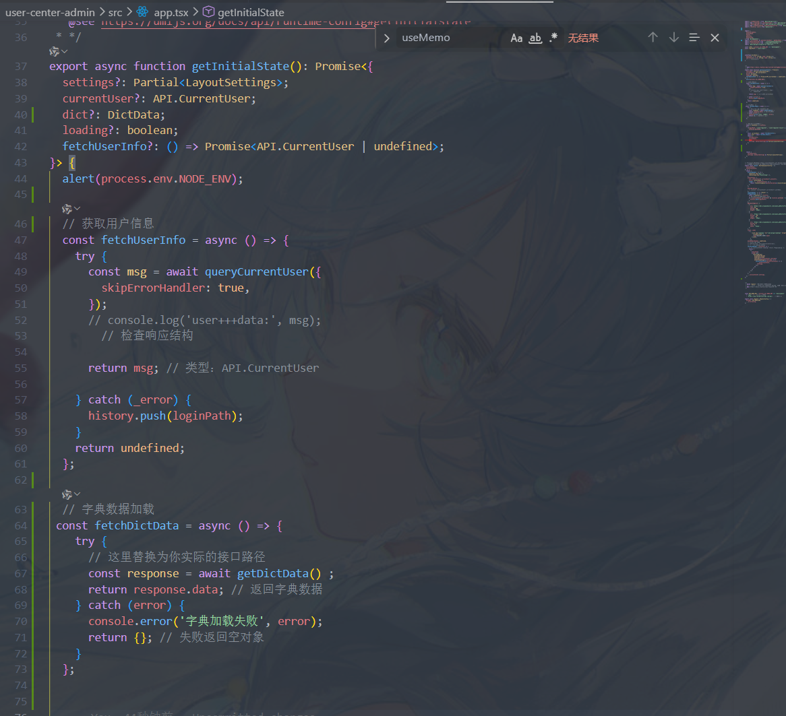

三范式

虽然教课书教的时候要求,三范式,但是查表的时候还要,查好多各表,而,VO要合并好多各表,实体还是个表对应的

但是如果要根据可拆出的表来查询的化,还是拆好的表好查(三范式)!

| **场景**                             | **推荐方案**                                                       | **理由**                                                                                                                                                  |
| ------------------------------------------ | ------------------------------------------------------------------------ | --------------------------------------------------------------------------------------------------------------------------------------------------------------- |
| **教**科**书**要**求**   | **三**范**式**                                               | **减**少**冗**余、**保**证**一**致**性**、**避**免**更**新**异**常                                              |
| **实**际**查**询               | **反**范**式**化（**适**度）                           | **避**免**多**表**J**O**I**N、**提**升**查**询**性**能、**简**化**V**O**组**装                      |
| **高**频**访**问**数**据 | **冗**余**存**储（**如**订**单**快**照**） | **用**空**间**换**时**间，**避**免**关**联**历**史表                                                                        |
| **多**值**字**段               | **拆**子**表**（**三**范**式**）                 | **查**询**时**用**J**O**I**N**或**O**R**M**预**加**载**，**业**务**代**码**组**装V**O** |

---

**多值字段** → 拆子表（三范式），查询时用 JOIN 或 ORM 的预加载，业务代码中组装 VO 即可

N + 1问题 就是在循环中不断查询,然后合并数据

**N + 1 -循环中逐个查询（**`SELECT * FROM table WHERE id = ?`）

**批量加载 - 使用IN语句一次性查询（**`SELECT * FROM table WHERE id IN (?, ?, ?, ...)`） + 内存组装

**预加载 - join  (**`SELECT u FROM User u JOIN FETCH u.orders` **)  + **嵌套结果映射 `<resultMap>` 的 `<collection>`****

分批查询- **大ID数组拆分成多个小批次-批量加载**

---

**高频冗余** （如订单表存商品快照）→ 可以反范式，避免关联历史表。

**反范式化**就是 **故意不遵循三范式** ，在表中冗余存储一些本应通过关联查询才能得到的数据，目的是 **用空间换时间** ，提升查询性能或简化复杂查询。

---

**视图或封装层** ：可以创建数据库视图或服务层聚合，让查询更方便

stream 和for 方法,额虽然for挺直观的,但还是stream简洁

**用户列表、商品管理、日志查询等** **结构化数据 CRUD**

**✅**  **ProTable + request + services**

**地图分布、数据大屏、流程编排等** **非表格可视化页面**

**✅**  **PageContainer + 自定义布局 + useRequest** **（第二段需改造）**

---

axiox 和 fecth和await

后端数据不多,就一次性获取完,然后在前端过滤吧

* **全量加载** **：**`useEffect` **->** `getBaseList()` **-> 拿到所有数据。**
* **本地筛选** **：**`filteredBases` **-> 在内存里过滤。**

**后端搜索 + 防抖**

用户输入关键词 -> 前端防抖（等待用户输完） -> 调用接口传关键词 -> 后端返回匹配结果 -> 前端展示

方案一 (原生防抖)

**方案二 (ahooks)**

**方案三 (分页)**

url暴露或key暴露?

1. **后端返回 Key** **：保持现有代码不变，接口正常返回 Key。**
2. **后端做“代理转发”**
3. **设置白名单** **：去地图平台（高德/百度）控制台，将该 Key 绑定你的** **域名** 。

---

在父组件（PondArchives/index.tsx）中获取数据 ,在各自组件中获取数据
?

| **层级**     | **职责**                         | **数据来源**                      |
| ------------------ | -------------------------------------- | --------------------------------------- |
| **父组件**   | **业务逻辑、API调用、状态管理**  | **调用services层**                |
| **子组件**   | **纯UI展示**                     | **接收Props，不关心数据来源**     |
| **独立组件** | **自查数据（如字典、用户头像）** | `useModel('global')` **或缓存** |

**架构逻辑：**

* **父组件 (Page/Container)** **：负责“** **逻辑** **”。处理业务逻辑、调用 API、状态管理（Redux/Context）、处理错误和加载状态。**
* **子组件 (PondSummaryStats)** **：负责“** **外观** **”。只接收 Props，根据 Props 的值来决定怎么画 UI，不关心数据从哪里来。**

**子组件自己查数据是合理的：**

1. **完全独立的微前端/微组件** **：组件是独立部署的，父页面只是一个容器，完全不知道组件内部逻辑。**
2. **非业务相关的公共组件** **：**

* **用户头像组件** **：接收** `userId`，自己去查用户信息并缓存
* **字典翻译组件** **：接收** `dictCode`，自己去查字典表（通常配合缓存使用，避免重复请求）
* **实时时间组件** **：自己维护** `setInterval`

---

**接口设计的颗粒度** **。**

**一次性获取全部数据” vs “按需通过接口分次获取** **”**

**“高频访问、低变更”的数据 → 前端缓存**
**“低频访问、高实时”的数据 → 按需请求**

* **筛选/统计/列表** **：用** `getPondList`（后端算，前端只管展示）。
* **下拉框选项** **：用** `getDictOptions`（全局缓存，只请求 1 次）。

```
{
  "data": {
    "base": [{"label": "海宁基地", "value": "1"}],
    "species": [{"label": "对虾", "value": "shrimp"}],
    "status": [{"label": "养殖中", "value": "breeding"}]
  }
}

```

---

全局缓存 + 自动刷新策略

局部刷新（按需调用）

事件驱动刷新

* **中小型项目** **：推荐**  **全局缓存 + 自动刷新** **，在数据更新操作后手动调用** `refreshDict`，简单高效。
* **大型项目** **：推荐**  **事件驱动刷新** **，通过事件总线实现组件间的解耦和数据同步。**

---

子组件自取

* **数据源** **：直接通过** `useModel('global')` **读取全局字典缓存。**
* **数据处理** **：在组件内部** `useEffect` **或渲染时，将原始数据映射为** `label/value` **格式。**
* **接口定义** **：删除** `baseOptions` **等 Props，保持组件接口清爽。**

**根据 UmiJS 的规范，**`src/app.ts` **是运行时配置文件。它在 React 组件渲染之前执行，专门用来处理：**

1. **`getInitialState`** **: 获取全局数据（如用户信息、字典）**
2. **`layout`** **: 根据全局数据动态配置页面布局（如菜单、头像）**

`getInitialState` **返回的数据默认挂载在** **`@@initialState`** **这个特殊的模型**

```
// 从特殊的 @@initialState 模型中取数据
const { initialState, loading, setInitialState } = useModel('@@initialState');
```



* **React** **：**
* **简单的全局配置、字典数据 → 用** `getInitialState` **+** `@@initialState`。
* **复杂的业务逻辑、频繁更新的状态 → 用** `src/models/` **(Dva/Umi) 或** `useContext` **+** `useReducer`。
* **Vue** **：**
* **统一使用**  **Pinia** **。它是 Vue 3 的官方状态管理库，语法简洁，与 Composition API (setup 语法) 配合得天衣无缝。**

**无论用哪种框架**“把数据放在一个所有组件都能访问到的地方，并确保数据变化时视图能自动更新”**就是全局数据管理的核心**

---

timeLine组件

[时间轴 Timeline - Ant Design](https://ant-design.antgroup.com/components/timeline-cn?locale=zh-CN)

要用 特定的字段哦!

---

类型定义的位置

* **后端给什么数据？** **→ 定义在** **service 层**
* **组件需要什么参数？** **→ 定义在** **组件层**

**总结：类型放 `types/api/`，服务放 `services/api/`，名字对齐，功能对应，干净清晰！**

**原始接口类型放 `types/api/`，前端业务模型放 `models/`，API 调用逻辑放 `services/api/`，三者一一对应、职责分离。**

`types/api/user.ts` **—— 后端返回的原始数据结构（契约）**

`models/User.ts` **—— 前端自己用的理想模型**

`services/api/user.ts` **—— 封装 API 调用 + 类型转换**

**✅ 组件里** **完全不用关心后端字段名** **，只和** `User` **模型打交道！**

这样写，未来无论后端怎么变，你的 UI 层都稳如泰山 ✅

| **风格**                    | **特点**                                                                        | **适用场景**                    |
| --------------------------------- | ------------------------------------------------------------------------------------- | ------------------------------------- |
| **1. 基础直通式**           | **直接调用** `request(url)`，无类型/转换                                      | **快速原型、小 demo**           |
| **2. 契约分离式（推荐）**   | `types/api/`：后端原始类型 `models/`：前端理想模型 `services/api/`：调用 + 转换 | **绝大多数中大型项目**          |
| **3. 框架快捷式（如 Umi）** | **使用** `@umijs/max` **自动生成 API，但****建议手动加转换层**          | **Ant Design Pro 等脚手架项目** |

UmiJS 提供了请求工具，而契约分离提供了架构规范——两者搭配，才是企业级前端 API 封装的正确姿势。

---

**基础封装（Flat Style）**

> **适合小型项目或快速原型**

```
// services/user.ts
import{ request }from'@/utils/request';

exportconstgetUser=(id:number)=>
  request.get(`/user/${id}`);
```

**✅ 优点：简单直接**
❌ 缺点：无类型转换、无分层、难维护

**契约分离式（Recommended）**

> **中大型项目标准做法，**
>
> ******强烈推荐**目录结构：

```
src/
├── types/
│   └── api/        // 后端原始接口类型（DTO）
├── models/         // 前端业务模型（Entity）
├── services/
│   └── api/        // API 调用 + 数据转换
```

特点：

* `types/api/`：和 Swagger/OpenAPI **严格对齐**
* `models/`：前端理想数据结构（驼峰、Date 对象、默认值等）
* `services/api/`： **调用 + 转换** **，返回** `models` **类型**

**✅ 优势：**

* **后端改字段？→ 只改** `types/api/` **+ 转换函数**
* **组件永远用干净的** `User` **模型，不感知后端命名**

**UmiJS / Ant Design Pro 风格**

> **基于** `@umijs/max` **的快捷封装，但****仍建议加转换层**

```
// ❌ 原生写法（不推荐）
exportasyncfunctiongetBaseList(){
returnrequest<API.BaseItem[]>('/base/list');
}

// ✅ 改进写法（推荐）
exportasyncfunctiongetBaseList():Promise<BaseItem[]>{
const res =awaitrequest<{ data:BaseItemFromAPI[]}>('/base/list');
return res.data.map(transformBase);// ← 关键：转换
}
```

> **💡 即使使用** `openapi-generator` **自动生成代码，也应在服务层做二次封装转换**

1. **类型管理** **：**

* `types/api/`：后端原始接口类型（契约）
* `models/`：前端业务模型（理想结构）
* `services/api/`：API调用 + 数据转换

---

**面向前端的页面数据获取，推荐使用聚合接口；而面向系统的能力开放，则推荐使用职责分离的独立接口**

* **面向用户界面** **：推荐聚合接口。前端只调一次就能拿全数据，页面加载快，不用自己拼数据。**
* **面向系统服务** **：推荐分开接口。每个接口只干一件事，独立稳定，其他系统也能灵活调用。**

1. **聚合接口** **：在开发前端页面时，优先考虑使用聚合接口（如** `getPondDetail`）。这能让你的页面逻辑更简单，用户体验更好
2. **原子接口作为补充** **：当页面上的某个模块需要独立刷新（如水质数据每5秒更新一次），或者需要在多个页面复用时，再单独调用原子接口**
3. **后端聚合层** **：聚合接口的逻辑通常放在后端的“API网关”或“聚合服务”中。它不处理核心业务逻辑，只负责调用下游的原子服务并将结果组装。**

---

中小型项目

| **目标**             | **工具**                                                                                           |
| -------------------------- | -------------------------------------------------------------------------------------------------------- |
| **需求 → 数据模型** | **ChatGPT / Claude / 通义千问** **+**  **dbdiagram.io** **（可视化 ER 图）**     |
| **API 契约管理**     | **Apifox** **（支持 AI 生成 + Mock + 前后端共享）**                                          |
| **前端生成**         | **V0.dev** **（AI 生成 React 代码）、****DhiWise**                                           |
| **后端生成**         | **GitHub Copilot** **、** **Cursor** **（理解项目上下文）**                      |
| **类型同步**         | **用** **Zod** **或** **TypeScript interface** **定义 schema，前后端共享** |

梳理前端页面 & 字段需求（产品/UI 驱动） -- **Excel / 飞书文档**：简单列出“页面 - 字段 - 类型 - 来源”

反推数据库实体和字段（后端/DBA 驱动）--  [Untitled - dbdiagram.io](https://dbdiagram.io/d)

定义 API 接口（前后端对齐）--  **Swagger / Apifox / YApi**：写接口文档，字段一一对应

1. **用** **dbdiagram.io** **快速迭代数据库设计 → 导出 SQL 建表**
2. **用** **PlantUML** **画整体架构：**
   * **用户如何从前端 → API → Service → DB**
   * **微服务之间的调用关系**
3. **把 PlantUML 文件存入代码仓库** `/docs/design/`，实现“设计即代码”

---

分页

**分页的两种实现方式**

| **特性**         | **前端分页**                                         | **服务器端分页**                   |
| ---------------------- | ---------------------------------------------------------- | ---------------------------------------- |
| **实现方式**     | **一**次性加载所有数据，在浏览器中分割**显示** | **每次只请求并显示**当前页的数据   |
| **性能**影响**** | **数据量大时，首次加**载慢，客户端压力大             | **每次请求速**度快，服务器压力分散 |
| **适用场景**     | **数据量小（** **1000条）、静态数据**          | **数**据量大、动态数据             |
| **用户**体验**** | **翻页无延迟，可快速跳转**                           | **翻页有短暂请求过程，受网络影响** |

**前后端数据交互的黄金法则**

**核心原则：**

* **✅**  **后端 → 前端** **：同时提供** `id` **和** `xxxName`
* **✅**  **前端 → 后端** **：操作时必须传递** `id`，不传递名称

| **方案**           | **优点**                           | **缺点**                   | **推荐度**     |
| ------------------------ | ---------------------------------------- | -------------------------------- | -------------------- |
| **PageHelper插件** | **代码简洁、数据库无关、功能强大** | **需理解原理**             | **⭐⭐⭐⭐⭐** |
| **手动分页SQL**    | **性能可控、灵活度高**             | **代码冗余、数据库耦合**   | **⭐⭐⭐**     |
| **前端写死选项**   | **实现简单**                       | **维护困难、无法权限控制** | **⭐**         |
| **后端动态选项**   | **维护简单、支持权限、数据一致**   | **需要额外接口**           | **⭐⭐⭐⭐**   |

---

数据层：拒绝重复造轮子

1. 实体设计

* **旧思维** **：每个表都手写一遍** `id`, `createTime`，用 `int` **存删除标记。**
* **新思维** **：** **抽象基类 + 现代类型** **。**
* **提取** `BaseEntity`（包含 ID、时间、逻辑删除）。
* **逻辑删除用** `Boolean`（配合 MP 自动转换）。
* **时间用** `LocalDateTime`（线程安全、API 好用）。
* **关键点** **：数据库唯一索引要带上** `isDeleted`，防止软删除后无法重新插入。

2. 数据访问

* **旧思维** **：手写 XML，写 SQL 做增删改查。**
* **新思维** **：** **MyBatis-Plus 全家桶** **。**
* **继承** `BaseMapper<T>`，获得基础 CRUD 能力。
* **Service 层继承** `IService<T>` **和** `ServiceImpl`，获得批量操作、分页、链式查询能力。
* **原则** **：除非有复杂联表 SQL，否则不写一行 XML。**

业务层：职责单一化

1. Service 接口

* **旧思维** **：定义一堆** `save`, `getById` **方法，然后去实现它们。**
* **新思维** **：** **直接继承 `IService<T>`** **。**
* **你的接口只需要定义特有的业务方法（如** `userRegister`），通用的增删改查直接用父类的。

2. 异常处理

* **旧思维** **：Service 里到处** `try-catch`，或者返回 `-1` **表示失败。**
* **新思维** **：** **抛出异常，让上层处理** **。**
* **遇到业务错误（如余额不足、用户不存在），直接** `throw new BusinessException(...)`。
* **不要捕获它！把它抛给 Controller，再由全局异常处理器统一兜底。**

控制层：声明式编程

**这是变化最大的地方，核心是** **“把控制权交给框架”** **。**

| **关注点**   | **旧写法 (过程式)**             | **新写法 (声明式/现代化)**                              | **优势**                                        |
| ------------------ | ------------------------------------- | ------------------------------------------------------------- | ----------------------------------------------------- |
| **参数校验** | `if (name == null) return error`    | **`@Validated` **+ JSR-303 注解****             | **代码少，自动拦截，统一报错**                  |
| **权限校验** | `if (session.role != ADMIN)...`     | **自定义注解 + AOP 切面**                               | **业务代码干净，权限逻辑解耦**                  |
| **用户获取** | `request.getSession().getAttribute` | **拦截器 + `@RequestAttribute`**                      | **方法签名清爽，不用传** `HttpServletRequest` |
| **URL 设计** | `/delete?id=1` **(POST)**     | **RESTful (`@DeleteMapping("/{id}")`)**               | **语义清晰，符合行业标准**                      |
| **异常处理** | **每个方法写** `try-catch`    | **`@RestControllerAdvice`**                           | **全局统一格式，不再污染业务代码**              |
| **依赖注入** | `@Autowired` **(字段注入)**   | **`@RequiredArgsConstructor` **(构造器注入)**** | **推荐 final 字段，方便测试，避免空指针**       |

---

🛡️ 四、基础设施：隐形的守护者

**要实现上面的“清爽代码”，你需要先搭建好以下三个“基础设施”：**

1. **全局异常处理器** **：**

* **负责捕获所有** `Exception`，将其包装成统一的 JSON 格式（`Result<T>`）返回给前端。

1. **登录拦截器** **：**

* **负责检查 Session/Token。**
* **如果登录了，把 User 对象放入** `request.setAttribute`，这样 Controller 就能直接拿到了。

1. **权限切面** **：**

* **负责解析** `@RequireAdmin` **等注解，在方法执行前进行“放行”或“阻断”。**

检查数据

| **维度**                   | **Controller 层校验**                                                   | **Service 层校验**                                                                                       |
| -------------------------------- | ----------------------------------------------------------------------------- | -------------------------------------------------------------------------------------------------------------- |
| **核**心**职**责**** | **参数**格式**校验** **(S**yn**ta**x**)**             | **业**务**规则**校验**** **(Seman**ti**cs**)                                           |
| **关**注**点**       | **数据**长**什么样？是否**必填？格**式对**不对**？**        | **数**据能**不能**用？状态对不**对？权**限够不**够？**                                 |
| **常用手**段****           | **JSR-303 注解 (**`@Validated`, `@NotNull`)                         | **编程式逻辑 (**`if-else`) **或** **数**据库**查询**                                 |
| **典**型例子****           | **“**邮箱格**式不对**”、**“密码**长度不**够”**    | **“用户名**已存**在”、**“余**额不**足”**、“商品已下架**”                         |
| **失**败后**果**     | **返回** **HTT**P **40**0 (Bad **Req**ue**st)** | **抛出业务异常 (如** `BusinessException`)                                                              |
| **复**用性****             | **低** **(通常只**针对特**定接**口)                         | **高** **(S**erv**ic**e 方法可能**被其他** **Ser**vic**e** **调用)** |

**在规范的架构中，有三个铁律：**

* **Controller 不能直接返回 DO（实体类）** **：数据库表结构是内部机密，不能直接暴露给前端（比如密码字段、逻辑删除字段）。**
* **Controller 不能直接用 DO 接收参数** **：前端传来的参数往往和数据库字段不一致（比如前端传** `confirmPassword`，数据库里没有）。
* **Service 方法签名要干净** **：不要为了迁就 Controller 而在 Service 里传入** `HttpServletRequest` **或** `HttpSession`。

**为了解决这些问题，我们需要引入** **VO** **和**  **DTO** **。**

**流程** **：前端 JSON ->** **DTO** **-> (校验) ->** **DO** **-> 数据库**

**流程** **：数据库 ->** **DO** **-> (脱敏转换) ->** **VO** **-> 前端 JSON**

优雅地做对象转换？

MapStruct（推荐，编译期生成代码）

方案 A：Spring BeanUtils（简单，但有性能损耗）

```
UserVO vo =newUserVO();
BeanUtils.copyProperties(user, vo);// 只要字段名一样，自动拷过去
```

* *缺点* **：反射操作，性能稍差；无法处理字段名不一致的情况（如** `userName` **->** `nickname`）。

方案 B：MapStrct（推荐，编译期生成代码）

**这是目前大厂的主流做法。它会在编译时自动生成** `implements` **代码，性能等同于手写 setter。**

```
@Mapper(componentModel ="spring")
publicinterfaceUserConvert{
UserConvert INSTANCE =Mappers.getMapper(UserConvert.class);

// 自动根据名字映射
UserVOtoVO(User user);
  
// 字段名不一样时，用 @Mapping 指定
@Mapping(source ="userName", target ="nickname")
UserVOtoVOCustom(User user);
}
```

**能链式，不分行；有逻辑，再 IF。**

| **你的需求**                             | **推荐写法**                            | **理由**                             |
| ---------------------------------------------- | --------------------------------------------- | ------------------------------------------ |
| **普通的判空查询**``(name不为空则查name) | **`wrapper.eq(name!=null, ...)`**     | **简洁，少写代码，看着爽。**         |
| **固定的过滤条件**``(只查未删除的数据)   | **`wrapper.eq(User::getDeleted, 0)`** | **不需要判断，直接拼。**             |
| **互斥条件**``(要么查A，要么查B)         | **`if (...) { ... } else { ... }`**   | **逻辑清晰，避免 SQL 冲突。**        |
| **复杂嵌套**``(多层括号套娃)             | **`if (...) { wrapper.and(...) }`**   | **防止代码变成“面条”，方便调试。** |
| **带副作用**``(查之前要记日志)           | **`if (...) { log...; wrapper... }`** | **业务需要，不得不写。**             |

**后端接口写在一起（统一入口 + 策略分发），前端页面分开写（用户体验 + 业务隔离）**

**硬编码路由**

**工厂 + 策略 + Spring 注入**


* **继承父类** **：是为了省去写 Controller 中那些千篇一律的** `save`、`delete` **方法的时间。（解决的是****CRUD模板代码**问题）
* **策略模式** **：是为了解决 Service 层中不同业务实体的** **核心逻辑差异** **。（解决的是****业务复杂度**问题）
