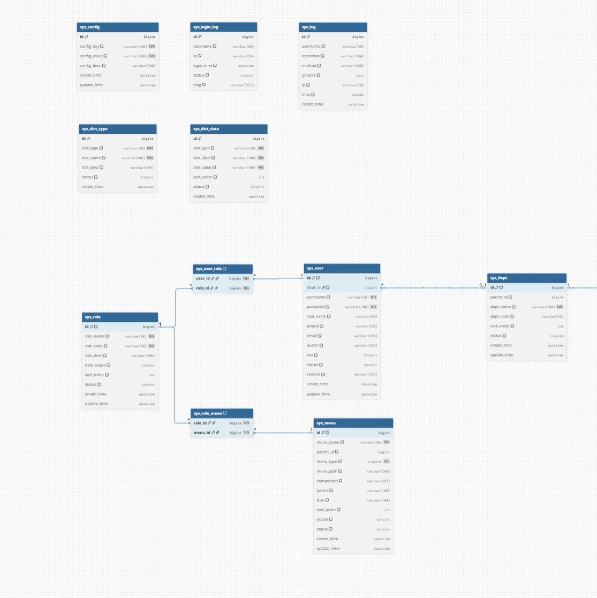
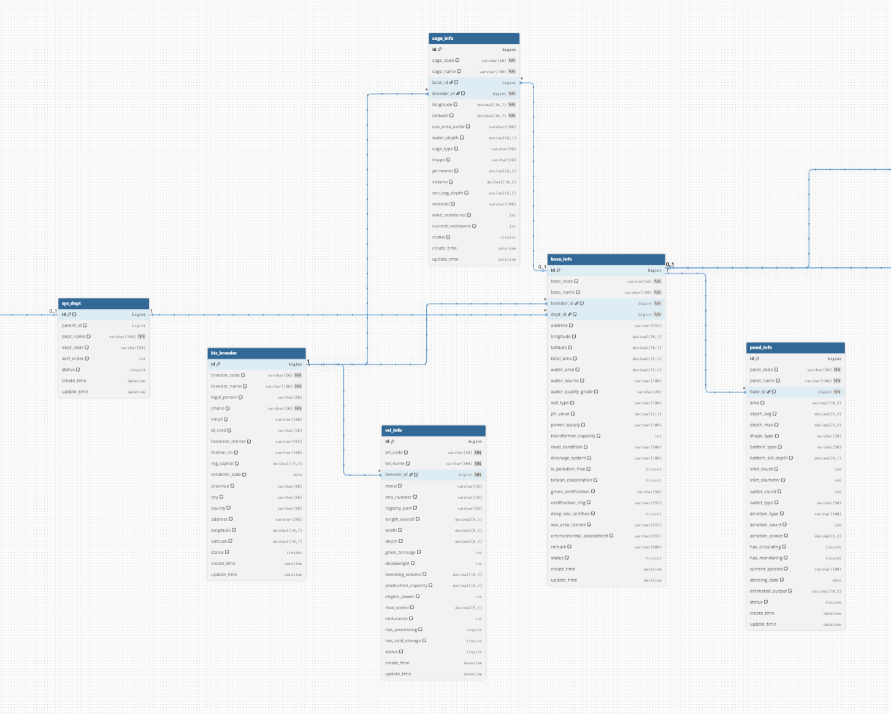
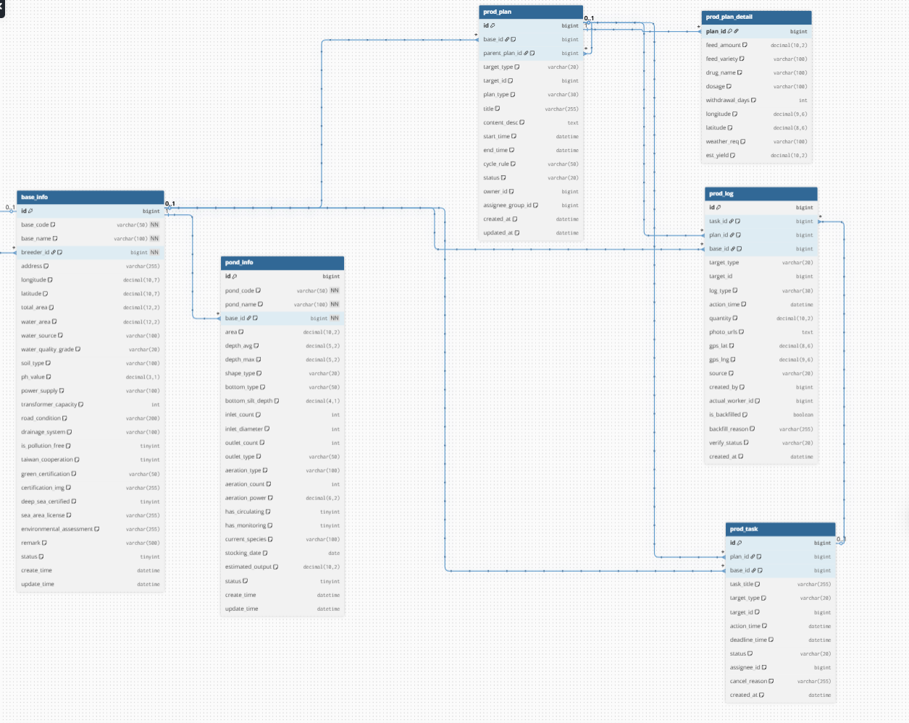
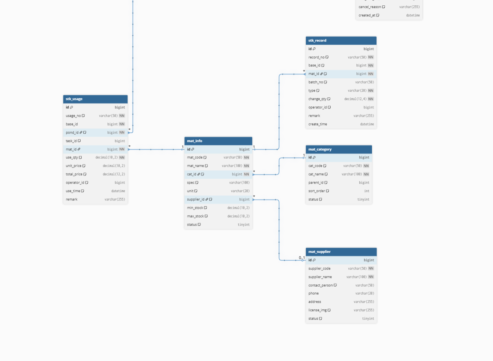
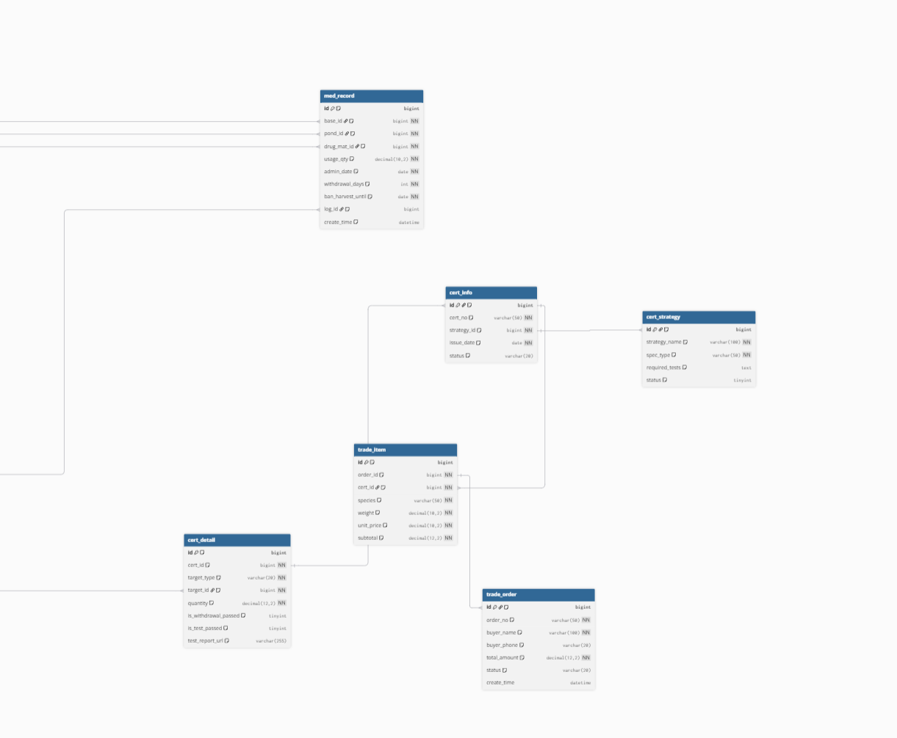
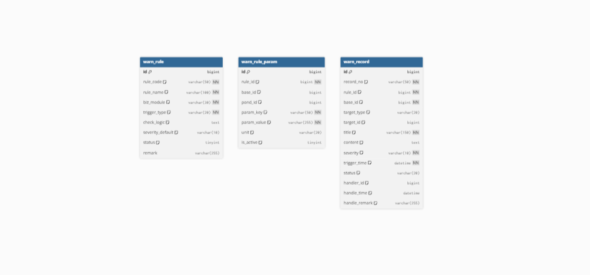
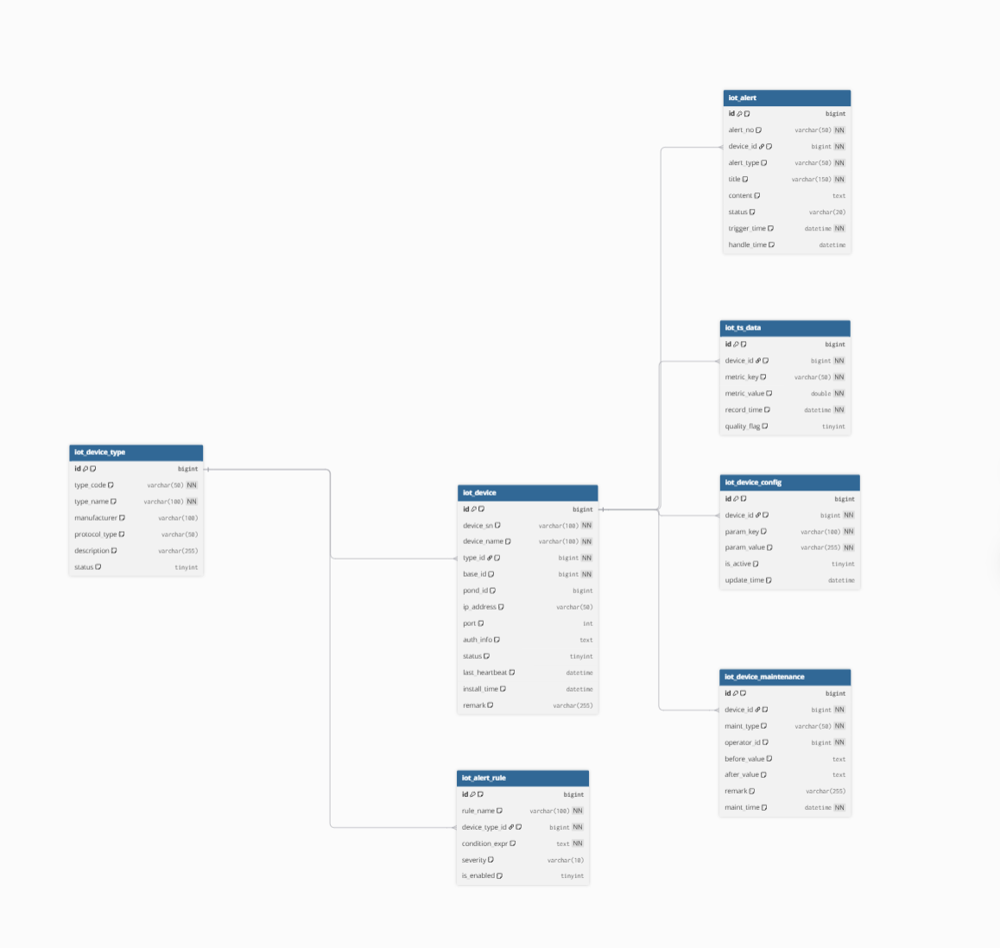
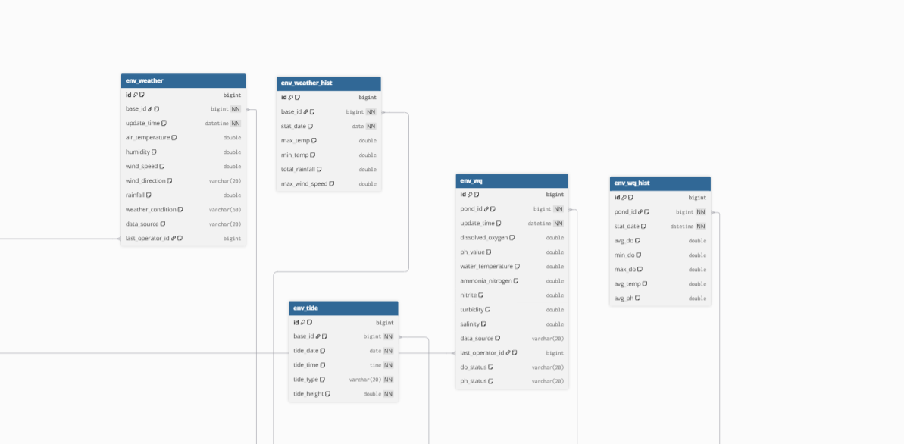
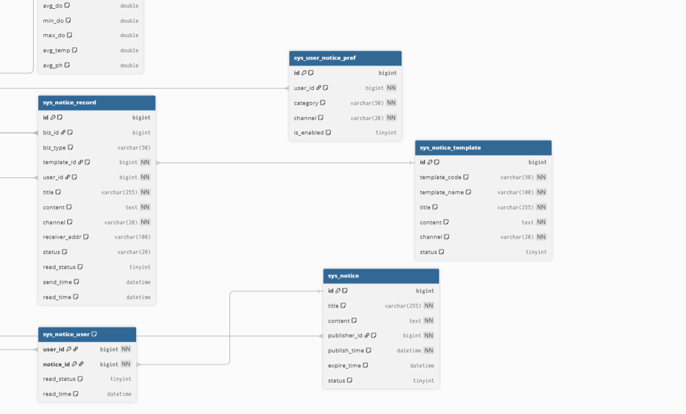
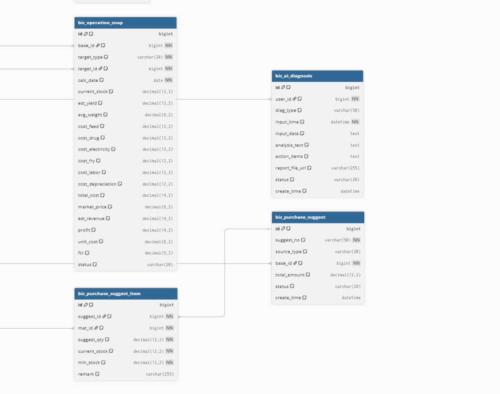

# 数字化水产管理系统：数据库字段设计文档 (修订版)

本文档定义了系统核心业务实体的数据库字段，旨在确保前后端数据契约的一致

## **数据库表清单（63张表）- 最终精简版**

| **模块**       | **表名**             | **说明**                      |
| -------------------- | -------------------------- | ----------------------------------- |
| **系统权限**   | `sys_user`               | **系统用户账号**              |
|                      | `sys_role`               | **角色定义**                  |
|                      | `sys_permission`         | **权限定义**                  |
|                      | `sys_user_role`          | **用户角色关联**              |
|                      | `sys_role_permission`    | **角色权限关联**              |
| **系统日志**   | `sys_login_log`          | **登录日志**                  |
|                      |                            |                                     |
|                      |                            |                                     |
|                      |                            |                                     |
| **数据字典**   | `sys_dict`               | **数据字典主表**              |
|                      | `sys_dict_item`          | **数据字典项**                |
|                      |                            |                                     |
| **养殖主体**   | `biz_breeder`            | **养殖企业备案**              |
| **基础信息**   | `base_info`              | **养殖基地信息**              |
|                      | `base_ext`               | **基地扩展信息**              |
|                      | `pond_info`              | **塘口信息**                  |
|                      | `pond_ext`               | **塘口扩展信息**              |
|                      | `base_pond_rel`          | **基地-塘口关联**             |
| **生产管理**   | `prod_plan`              | **生产计划**                  |
|                      | `prod_task`              | **生产任务**                  |
|                      | `prod_log`               | **操作日志**                  |
|                      | `harv_reg`               | **出塘申报**                  |
| **物资供应链** | `mat_category`           | **物资分类**                  |
|                      | `mat_info`               | **物资档案**                  |
|                      | `mat_supplier`           | **供应商信息**                |
|                      | `stk_record`             | **库存流水**                  |
|                      | `stk_usage`              | **投入品使用记录**            |
| **政府监管**   | `med_record`             | **用药监管记录**              |
|                      | `cert_test_report`       | **检测报告**                  |
|                      | `cert_info`              | **电子合格证**                |
| **物联网**     | `iot_device`             | **IoT设备主表（含状态字段）** |
|                      | `iot_device_type`        | **设备类型定义**              |
|                      | `iot_device_config`      | **配置参数（含阈值）**        |
|                      | `iot_ts_data`            | **时序数据主表（按月分区）**  |
|                      | `iot_alert`              | **告警记录**                  |
|                      | `iot_alert_rule`         | **告警规则**                  |
|                      | `iot_device_maintenance` | **维护记录（含校准）**        |
| **环境监测**   | `env_wq`                 | **水质快照**                  |
|                      | `env_weather`            | **气象快照**                  |
|                      | `env_wq_hist`            | **水质历史**                  |
|                      | `env_weather_hist`       | **气象历史**                  |
|                      | `env_tide`               | **潮汐数据**                  |
| **预警中心**   | `warn_rule`              | **预警规则**                  |
|                      | `warn_rule_param`        | **规则参数**                  |
|                      | `warn_record`            | **预警记录**                  |
| **信息导航**   | `mkt_quote`              | **市场行情**                  |
|                      | `cont_info`              | **通讯录**                    |
|                      | `kb_article`             | **知识库文章**                |
| **深远海装备** | `vsl_info`               | **养殖工船**                  |
|                      | `vsl_ext`                | **工船扩展**                  |
|                      | `cage_info`              | **智能网箱**                  |
|                      | `op_log`                 | **作业日志**                  |
|                      | `cost_main`              | **成本核算主表**              |
|                      | `cost_item`              | **成本明细**                  |
|                      | `sub_info`               | **补贴申报**                  |
| **两岸协同**   | `cs_enterprise`          | **台资企业备案**              |
|                      | `cs_seed`                | **台湾种苗引进**              |
|                      | `cs_tech`                | **两岸技术交流**              |
|                      | `cs_market`              | **台湾市场对接**              |

**数据流转总结**

| **数据类型**   | **来源**       | **存储表**           | **用途**                   |
| -------------------- | -------------------- | -------------------------- | -------------------------------- |
| **设备元数据** | **设备注册**   | `iot_device`             | **管理设备基本信息**       |
| **实时状态**   | **心跳包**     | `iot_device.status`      | **设备在线状态监控**       |
| **时序数据**   | **传感器上报** | `iot_ts_data`            | **历史数据查询、曲线展示** |
| **告警数据**   | **规则引擎**   | `iot_alert`              | **告警推送、处理跟踪**     |
| **配置数据**   | **后台设置**   | `iot_device_config`      | **阈值、采样间隔等**       |
| **维护记录**   | **人工录入**   | `iot_device_maintenance` | **校准、维修记录**         |

**这种设计确保了数据的完整性和可追溯性！**

---

## 系统基础模块

 `sys_user`**系统用户账号**

 `sys_role`**角色定义**

`sys_permission`**权限定义**

`sys_user_role`**用户角色关联**

 `sys_role_permission`**角色权限关联**

 `sys_login_log `登录日志

`sys_dict`**数据字典主表**

 `sys_dict_item`**数据字典项**

`sys_config `系统配置



## 养殖基础信息模块

| **表名 (英文)**                                         | **表名 (中文)**                    | **核心功能描述**                                                                                                                                                                                                                                 |
| ------------------------------------------------------------- | ---------------------------------------- | ------------------------------------------------------------------------------------------------------------------------------------------------------------------------------------------------------------------------------------------------------ |
| **b**iz_**b**r**e**e**d**e**r** | **养**殖**主**体**表** | **顶**层**节**点 **。**管**理**企**业**/**农**户**的**资**质**、**法**人**信**息**及**行**政**区**域**。                                                                |
| **b**a**s**e_**i**n**f**o             | **养**殖**基**地**表** | **二**级**节**点（**陆**地**锚**点）。**合**并了扩展表，**包**含基地的环境参数（**水**源/**土**质）**和**行**政**管**辖**范**围**。                                            |
| **p**o**n**d_**i**n**f**o             | **塘**口/单**元**表****      | **末**端**节**点（**近**岸/**陆**基） **。**合**并**了**扩**展**表**，**包**含**传**统**塘**口**的**工**程**参**数**（**进**排**水**/**增**氧） |
| **c**a**g**e_**i**n**f**o             | **深**水**网**箱**表** | **末**端**节**点（**深**远**海**-静）。 **独立坐标** **。管理深海网箱的物理规格及抗风浪等级，通过** `base_id` **挂**靠**后**勤                                                                      |
| **v**s**l**_**i**n**f**o              | **养**殖**工**船**表** | **末**端**节**点（**深**远**海**-动）*。****移**动**坐标*** **。**管**理**工船的船舶属性（吨位**/**航**速**）**及**加**工**能**力**。*                                  |



## 计划与任务&&日志

| **序号** | **表名 (Code)**          | **中文名**         | **核心作用与设计亮点**                                                                                                                                                                                                                                 |
| -------------- | ------------------------------ | ------------------------ | ------------------------------------------------------------------------------------------------------------------------------------------------------------------------------------------------------------------------------------------------------------ |
| **1**    | **`prod_plan`**        | **生产计划主表**   | **“大脑”** **：存储管理层的意图** <br />``•  多态关联：通过 `target_type`+`target_id`*适配塘口、网箱、工船等不同目标``<br />•  **循环规则** **：支持设置“每周/每月”等周期性计划模板。**                                        |
| **2**    | **`prod_plan_detail`** | **生产计划详情表** | **“百变口袋”** **：存储具体的差异化参数。**<br />•  **JSON扩展** **：使用** `ext_params` **字段存储投喂量、药名或经纬度，解决字段差异大和空值多的问题，无需频繁改表结构。**                                               |
| **3**    | **`prod_task`**        | **生产任务表**     | **“桥梁”** **：连接计划与执行的快照** ``•  关键冗余：复制了 `base_id`、`title` 等字段。即使原计划被修改或删除，已生成的任务依然保持独立，不受影响。``<br /><br />•  **状态机** **：管理待办、进行中、已完成、跳过等生命周期。**  |
| **4**    | **`prod_log`**         | **生产日志表**     | **“事实记录”** **：不可篡改的作业凭证** <br />``•  全链路冗余：同时拥有 `task_id`（关联任务）、`plan_id`（关联源头）和 `base_id`（用于快速统计）。``<br /><br />•  **防作弊** **：记录打卡时的 GPS 坐标、照片 URL 和录入来源。** |
| **5**    | **`base_info`**        | **基地信息表**     | **“基石”** **：(模拟的基础表)**``• 作为所有业务数据的归属根节点，用于权限隔离和数据统计。                                                                                                                                                     |



## 物资&&供应

| **表名**             | **中文名**       | **关键字段**                  | **逻辑说明**                                                      |
| -------------------------- | ---------------------- | ----------------------------------- | ----------------------------------------------------------------------- |
| **`mat_category`** | **物资分类表**   | `id`, `cat_name`                | **定义物资类型（饲料、药品、设备）。**                            |
| **`mat_supplier`** | **供应商表**     | `id`, `supplier_name`           | **记录供货商信息，用于溯源。**                                    |
| **`mat_info`**     | **物资档案表**   | `id`, `cat_id`, `supplier_id` | **物资的“户口本”，定义规格、单位。**                            |
| **`stk_record`**   | **库存流水表**   | `id`, `mat_id`, `base_id`     | **管“进”** **。记录采购入库、盘点，计算当前库存总量。**   |
| **`stk_usage`**    | **投入品使用表** | `id`, `task_id`, `pond_id`    | **管“出”** **。关联生产任务，记录哪个塘口用了多少物资。** |



## 休药期 + 合格证 + 交易

| **表名**                  | **中文名**         | **核心字段**                                                                                            | **逻辑说明**                                                                                                                                            |
| ------------------------------- | ------------------------ | ------------------------------------------------------------------------------------------------------------- | ------------------------------------------------------------------------------------------------------------------------------------------------------------- |
| **`med_record`**        | **用药记录表**     | `id`, `pond_id`, `drug_id`, `dosage`, `use_time`, `end_time` **(休药期结**束时间)           | **风控源头** **。记录每次用药。**`end_time` **= 用药时间 + 药品**休药期。系统根据此表判断是否“**锁证”**                           |
| **`cfg_fish_strategy`** | **鱼种合规策略表** | `fish_type`, `need_test`, `withdraw_days`                                                               | **规则**配置 **。定义某种鱼（如鲈鱼）**是否需要强制检测，以及默认休药期**规**则                                                            |
| **`cert_test_report`**  | **检测报告表**     | `id`, `pond_id`, `report_url`, `status`, `expire_time`                                              | **合规凭证** **。存储第三方或快检报告。B类合格证必**须关联此表的有效记录。                                                                        |
| **`cert_info`**         | **电子合格证表**   | `id`, `pond_id`, `cert_type` **(A/B类),** `status`, `code`                                    | **最终产出** **。生成合格证。A类基于自控，**B**类基于检测。**                                                                               |
| **`trx_order`**         | **交易订单表**     | `id`, `code` **(6位**交易码), `pond_id`, `buyer`, `weight`, `price`, `total`, `cert_id` | **交**易闭**环** **。**记录**卖鱼**行为。生**成订**单时**校验**风控，通**过后**自动**关联**合格**证。** |



## 预警

* `warn_rule`：预警规则定义表
* `warn_rule_param`：预警规则参数配置表
* `warn_record`：预警记录表



## 物连网



## 环境监测模块 (Environment Business)

> **职责** **：读取 IoT 的原始数据，结合业务场景，生成“水质报告”、“气象日报”。**



## 通知



## 经营分析



## **规范总结**

| **规范**     | **示例**                                                                                           |
| ------------------ | -------------------------------------------------------------------------------------------------------- |
| **表名格式** | `模块_业务_后缀`（`sys_user`、`prod_log`、`iot_node`）                                           |
| **后缀含义** | `_info`主表、`_ext`扩展表、`_record`流水、`_log`日志、`_hist`历史、`_type`类型、`_rel`关联 |
| **字段命名** | **全小写 + 下划线，禁止拼音、无意义缩写**                                                          |
| **分表策略** | **历史数据按月分表（如** `iot_sensor_data_202604`）                                              |

---

强制字段规范

规范：**状态 / 类型用 TINYINT 枚举**

所有表必须包含：

```sql
id          BIGINT      PRIMARY KEY  -- 主键
create_time DATETIME    DEFAULT CURRENT_TIMESTAMP  -- 创建时间
update_time DATETIME    DEFAULT CURRENT_TIMESTAMP ON UPDATE CURRENT_TIMESTAMP  -- 更新时间
is_deleted  TINYINT     DEFAULT 0  -- 逻辑删除
```

索引规范

* 高频查询：`(业务ID + 时间)` 联合索引
* 枚举字段：建立索引（状态、类型）
* 外键字段：必须建立索引

---

* 水质 / 传感器 / 日志按月分表，但**未建强制联合索引**
* 必须：`(pond_id, collect_time)` / `(node_id, collect_time)`
* 后果：物联网海量数据查询超时，图表渲染卡死

---

分表规范

* 时序数据（日志、传感器、水质）：**按月分表** `表名_YYYYMM`
* 分表字段：`collect_time`/`create_time`

| **缩写** | **全称**               | **用途**                                                                   |
| -------------- | ---------------------------- | -------------------------------------------------------------------------------- |
| `sys`        | **System**             | **系统相关（用户、日志、配置）**                                           |
| `biz`        | **Business**           | **业务主体（养殖户、企业）**                                               |
| `base`       | **Base**               | **基础信息（基地、场所）**                                                 |
| `pond`       | **Pond**               | **塘口/养殖单元**                                                          |
| `prod`       | **Production**         | **生产（任务、日志）**                                                     |
| `harv`       | **Harvest**            | **收获/出塘**                                                              |
| `reg`        | **Registration**       | **登记、报备**                                                             |
| `mat`        | **Material**           | **物资（饲料、药品、设备）**                                               |
| `stk`        | **Stock**              | **库存**                                                                   |
| `med`        | **Medicine**           | **药品**                                                                   |
| `cert`       | **Certificate**        | **合格证、证书**                                                           |
| `iot`        | **Internet of Things** | **物联网设备**                                                             |
| `env`        | **Environment**        | **环境（水质、气象）**                                                     |
| `tide`       | **Tide**               | **潮汐**                                                                   |
| `warn`       | **Warning**            | **预警**                                                                   |
| `kb`         | **Knowledge Base**     | **知识库**                                                                 |
| `cont`       | **Contact**            | **通讯录**                                                                 |
| `mkt`        | **Market**             | **市场行情**                                                               |
| `vsl`        | **Vessel**             | **养殖工船（**`vsl_info` **比** `vessel_info` **更紧凑）** |
| `cage`       | **Cage**               | **智能网箱**                                                               |
| `op`         | **Operation**          | **作业、操作**                                                             |
| `cost`       | **Cost**               | **成本**                                                                   |
| `sub`        | **Subsidy**            | **补贴**                                                                   |
| `cs`         | **Cross-Strait**       | **两岸协同（替代** `tw`）                                                |

|                       |                                      |                                                   |
| --------------------- | ------------------------------------ | ------------------------------------------------- |
| 后缀                  | 含义                                 | 示例                                              |
| `_info`             | 实体主表，存储核心属性               | `base_info`, `pond_info`, `vessel_info`     |
| `_ext`              | 扩展表，垂直拆分，存大字段或低频字段 | `pond_ext`, `vessel_ext`                      |
| `_record`           | 流水/记录表，通常是日志型或历史型    | `stock_record`, `warn_record`, `med_record` |
| `_log`              | 操作日志                             | `prod_log`, `op_log`, `sys_log`             |
| `_task`             | 任务/计划表                          | `prod_task`                                     |
| `_category`         | 分类/字典表                          | `mat_category`                                  |
| `_quote`            | 行情/报价                            | `market_quote`                                  |
| `_main` / `_item` | 主从表结构（主表 + 明细表）          | `cost_main`, `cost_item`                      |
| `_reg`              | 登记/报备                            | `harvest_reg`                                   |
| `_usage`            | 使用记录                             | `stock_usage`                                   |
| `_node`             | 节点/设备                            | `iot_node`                                      |
| `_monitor`          | 实时监测数据                         | `env_monitor`                                   |
| `_history`          | 历史数据（通常用于时序）             | `env_history`                                   |
| `_data`             | 原始数据                             | `tide_data`                                     |
| `_article`          | 文章/内容                            | `kb_article`                                    |
| `_enterprise`       | 企业主体                             | `tw_enterprise`                                 |
| `_seed`             | 种苗                                 | `tw_seed`                                       |

**表类型划分**

| **类型**   | **命名特征**                | **作用**           | **示例**                        |
| ---------------- | --------------------------------- | ------------------------ | ------------------------------------- |
| **主表**   | `_info` **/ 无后缀**      | **核心实体**       | `pond_info`, `vsl_info`           |
| **扩展表** | `_ext`                          | **大字段垂直拆分** | `base_ext`, `pond_ext`            |
| **关联表** | `_rel`                          | **多对多关系**     | `base_pond_rel`                     |
| **记录表** | `_log` **/** `_record`  | **流水账**         | `prod_log`, `stk_record`          |
| **配置表** | `_config` **/** `_rule` | **规则配置**       | `iot_sensor_config`, `warn_rule`  |
| **快照表** | **无特殊后缀**              | **最新状态**       | `env_wq`, `env_weather`           |
| **历史表** | `_hist`                         | **历史数据**       | `env_wq_hist`, `env_weather_hist` |

| **优化策略**  | **应用场景**          | **示例**                          |
| ------------------- | --------------------------- | --------------------------------------- |
| **垂直拆分**  | **大字段、低频访问**  | `base_ext`, `pond_ext`, `vsl_ext` |
| **快照+历史** | **高频查询+历史追溯** | `env_wq` **+** `env_wq_hist`  |
| **按月分表**  | **大数据量**          | **iot_sensor_data_202604**        |

---

1. 塘口管理 (垂直拆分示例)

* **`pond_info`** **: ID, 基地ID, 名称, 面积, 状态, 类型, 更新时间**
* **`pond_ext`** **: 塘口ID (PK), 描述, 监测设备清单 (JSON/TEXT)**

2. 环境监测 (时序分表示例)

* **`env_history_202604`** **: ID, 塘口ID, 时间戳, pH, 溶解氧, 温度, 盐度, 氨氮...**

3. 成本管理 (EAV模型)

* **`cost_main`** **: ID, 业务ID, 周期, 总金额, 状态**
* **`cost_item`** **: 主表ID, 成本项Key, 成本值, 备注**

4. 系统日志 (时序分表)

* **`sys_log_202604`** **: ID, 用户ID, 操作模块, 描述, 状态, 创建时间**

5. 养殖工船

* **`vessel_info`** **: ID, 船号, 吨位, 所属基地, 状态, 经纬度**
* **`vessel_ext`** **: 工船ID (PK), 保险信息, 维护记录**

6. 智能网箱

* **`cage_info`** **: ID, 网箱号, 所属基地, 水深, 抗风浪等级, 状态**

7. 投入品与库存

* **`material`** **: 物资ID, 分类, 名称, 规格, 库存, 状态**
* **`input_record`** **: 记录ID, 塘口ID, 物资ID, 数量, 类型(in/out), 时间**

8. 用户与权限

* **`sys_user`** **: 用户ID, 账号, 密码, 角色, 状态**
* **`breeder_info`** **: 养殖户ID, 用户ID, 企业名称, 资质状态**

9. 两岸合作 (特色模块)

* **`taiwan_enterprise`** **: 企业ID, 台湾注册号, 联系人, 状态**
* **`taiwan_seed`** **: 种苗ID, 企业ID, 品种, 引进数量, 检疫结果**

10. 预警中心

* **`warning_record`** **: 预警ID, 塘口ID, 级别, 类型, 内容, 状态, 时间**

---

* 垂直拆分：`info`（核心高频）+`ext`（大字段 / 低频），解决宽表查询慢问题
* 时序分表：水质 / 传感器 / 系统日志 **按月分表** ，应对物联网海量数据
* EAV 模型：深远海成本项灵活扩展，适配多变的养殖成本核算
* 字段瘦身：状态 / 类型用 `TINYINT`枚举，主键统一规范

### **通用设计原则**

#### **第三范式（3NF）原则**

| **范式** | **要求**                             | **目的**         |
| -------------- | ------------------------------------------ | ---------------------- |
| **1N**F  | **原子性**，字段不可再分             | **消除重复组**   |
| **2NF**  | **非主键**字段完全依赖主**键** | **消除部**分依赖 |
| **3N**F  | **非主键字段不**传递依赖             | **消除传递依赖** |

#### **实体-关系映射原则**

| **业务概念** | **数据库映射**                    | **说明**       |
| ------------------ | --------------------------------------- | -------------------- |
| **实体**     | **表**（Table）                   | **人、事、物** |
| **属性**     | **字段（Colum**n）                | **实体的特征** |
| **标识**     | **主键（Pr**imary Ke**y）** | **唯一标**识   |
| **关系**     | **外**键（Forei**gn Key）** | **实体间**关联 |
| **多对多**   | **关联表（Joi**n Table）          | **中间表**     |

#### **命名规范原则**

| **对象**     | **命名规则**                      | **示例**              |
| ------------------ | --------------------------------------- | --------------------------- |
| **表名**     | **小写 + 下划线**，复数或集合名词 | `users`, `order_items`  |
| **字段名**   | **小写 + 下划**线，单数           | `user_id`, `created_at` |
| **主键**     | `id` **或** `{表名}_id`       | `id`, `user_id`         |
| **外键**     | `{关联表名}_id`                       | `dept_id`, `user_id`    |
| **索**引     | `idx_{表名}_{字段名}`                 | `idx_user_email`          |
| **唯一索引** | `uk_{表名}_{字段名}`                  | `uk_user_phone`           |
| **关联表**   | **按字母顺序组合**                | `role_permission`         |

#### **字段设计原则**

| **字段类型** | **选择原则**                | **示例**                                      |
| ------------------ | --------------------------------- | --------------------------------------------------- |
| **主键**     | **自增INT/BIGINT 或 UUID**  | `id BIGINT AUTO_INCREMENT`                        |
| **状态**     | **TINYINT + 枚举注释**      | `status TINYINT COMMENT '0-待审核,1-通过,2-拒绝'` |
| **金额**     | **DECIMAL(10,2)**           | `amount DECIMAL(10,2)`                            |
| **时间**     | **DATETIME 或 TIMESTAMP**   | `created_at DATETIME`                             |
| **文本**     | **VARCHAR(长度) 或 TEXT**   | `name VARCHAR(100)`, `content TEXT`             |
| **布尔**     | **TINYINT(1) 或 BOOLEAN**   | `is_deleted TINYINT(1) DEFAULT 0`                 |
| **JSON**     | **JSON 类型（MySQL 5.7+）** | `config JSON`                                     |

---

### **表类型通用分类**

#### **1. 主数据表（Master Data）**

**特点：** **相对稳定，变化频率低，作为其他表的参照**

```sql
-- 示例：用户表、商品表、部门表
CREATETABLEuser(
    id BIGINTPRIMARYKEYAUTO_INCREMENT,
    username VARCHAR(50)UNIQUENOTNULL,
    password VARCHAR(100)NOTNULL,
    email VARCHAR(100),
    phone VARCHAR(20),
statusTINYINTDEFAULT1,
    created_at DATETIMEDEFAULTCURRENT_TIMESTAMP,
    updated_at DATETIMEDEFAULTCURRENT_TIMESTAMPONUPDATECURRENT_TIMESTAMP
);
```

**通用字段：**

* `id` **- 主键**
* **业务唯一字段（如** `username`, `code`）
* **状态字段（**`status`）
* **时间字段（**`created_at`, `updated_at`）
* **软删除字段（**`is_deleted`）

---

#### **2. 事务表（Transaction Data）**

**特点：** **频繁增删改，记录业务操作流水**

```sql
-- 示例：订单表、日志表、流水表
CREATETABLEorder(
    id BIGINTPRIMARYKEYAUTO_INCREMENT,
    order_no VARCHAR(50)UNIQUENOTNULL,-- 订单号
    user_id BIGINTNOTNULL,-- 外键
    amount DECIMAL(10,2)NOTNULL,
statusTINYINTDEFAULT0,
    created_at DATETIMEDEFAULTCURRENT_TIMESTAMP,
FOREIGNKEY(user_id)REFERENCESuser(id)
);
```

**通用字段：**

* `id` **- 主键**
* **业务编号（**`order_no`, `transaction_no`）
* **关联主表外键**
* **金额/数量等业务字段**
* **状态字段**
* **时间字段**

---

#### **3. 关联表（Relationship Table）**

**特点：** **解决多对多关系**

```sql
-- 示例：用户角色关联、标签关联
CREATETABLE user_role (
    user_id BIGINTNOTNULL,
    role_id BIGINTNOTNULL,
PRIMARYKEY(user_id, role_id),
FOREIGNKEY(user_id)REFERENCESuser(id),
FOREIGNKEY(role_id)REFERENCES role(id)
);
```

**通用字段：**

* **两个外键字段**
* **联合主键**
* **可选：额外属性字段（如** `created_at`）

---

#### **4. 配置表（Configuration Table）**

**特点：** **存储系统配置、规则、参数**

```sql
-- 示例：系统配置、业务规则
CREATETABLE sys_config (
    id BIGINTPRIMARYKEYAUTO_INCREMENT,
    config_key VARCHAR(100)UNIQUENOTNULL,
    config_value VARCHAR(500),
    config_desc VARCHAR(200),
    created_at DATETIMEDEFAULTCURRENT_TIMESTAMP
);

-- 或使用键值对形式
CREATETABLE app_config (
    id BIGINTPRIMARYKEYAUTO_INCREMENT,
    category VARCHAR(50),-- 配置分类
    config_key VARCHAR(100),
    config_value TEXT,
UNIQUEKEY uk_category_key (category, config_key)
);
```

---

#### **5. 日志表（Log Table）**

**特点：** **只增不改，记录操作痕迹**

```sql
-- 示例：操作日志、访问日志
CREATETABLE operation_log (
    id BIGINTPRIMARYKEYAUTO_INCREMENT,
    user_id BIGINT,
    operation VARCHAR(100),-- 操作类型
    module VARCHAR(50),-- 模块
    content TEXT,-- 操作内容
    ip VARCHAR(50),-- IP地址
    created_at DATETIMEDEFAULTCURRENT_TIMESTAMP,
INDEX idx_user_id (user_id),
INDEX idx_created_at (created_at)
);
```

**通用字段：**

* **操作人（**`user_id`）
* **操作类型（**`operation`）
* **模块（**`module`）
* **操作内容（**`content`）
* **IP地址（**`ip`）
* **时间（**`created_at`）
* **索引优化（按用户、时间查询）**

---

#### **6. 快照表（Snapshot Table）**

**特点：** **记录某个时间点的状态，用于查询优化**

```sql
-- 示例：用户余额快照、库存快照
CREATETABLE user_balance_snapshot (
    id BIGINTPRIMARYKEYAUTO_INCREMENT,
    user_id BIGINTUNIQUENOTNULL,-- 用户唯一
    balance DECIMAL(10,2)DEFAULT0,
    updated_at DATETIMEDEFAULTCURRENT_TIMESTAMPONUPDATECURRENT_TIMESTAMP
);
```

**通用字段：**

* **关联主表外键（通常唯一）**
* **快照字段**
* **更新时间**

---

#### **7. 历史表（History Table）**

**特点：** **按时间分表存储历史数据，用于追溯**

```sql
-- 示例：订单历史、交易历史
CREATETABLE order_history_202604 (
    id BIGINTPRIMARYKEYAUTO_INCREMENT,
    order_id BIGINTNOTNULL,
    status_before TINYINT,
    status_after TINYINT,
    operator VARCHAR(50),
    remark VARCHAR(200),
    created_at DATETIMEDEFAULTCURRENT_TIMESTAMP
);
```

**通用字段：**

* **关联主表外键**
* **变更前状态**
* **变更后状态**
* **操作人**
* **备注**
* **时间**
