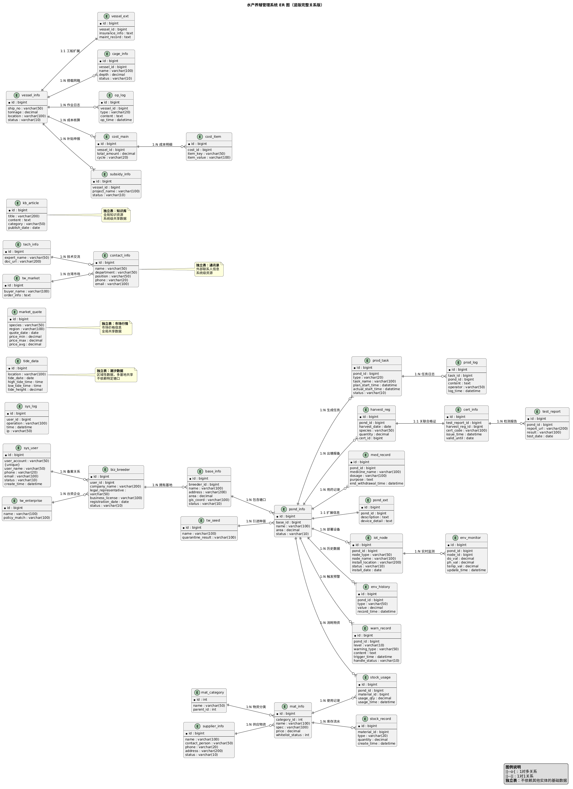

# 数字化水产管理系统：数据库字段设计文档 (修订版)

本文档定义了系统核心业务实体的数据库字段，旨在确保前后端数据契约的一致




## **数据库表清单（共40张表）**

| **模块**       | **表名**       | **说明**                                                                                                      |
| -------------------- | -------------------- | ------------------------------------------------------------------------------------------------------------------- |
| **系统权限**   | `sys_user`         | **系统用户账号管理，支持养殖户、管理员、财务等多角色及权限分配。**                                            |
| **养殖主体**   | `biz_breeder`      | **养殖企业/合作社备案信息，包含统一社会信用代码、法人、资质文件等。**                                         |
| **基础信息**   | `base_info`        | **养殖基地核心信息：名称、地理位置（经纬度）、总面积、状态、类型等。**                                        |
|                      | `base_ext`         | **基地扩展信息表，垂直拆分存储描述、证书、图片等大字段（TEXT/BLOB）。**                                       |
|                      | `pond_info`        | **塘口主表，存储高频查询字段：名称、面积、水深、类型、状态等，保障列表性能。**                                |
|                      | `pond_ext`         | **塘口扩展表，存储低频大字段：设备清单、水源描述、深海参数、GPS坐标等。**                                     |
| **生产管理**   | `prod_task`        | **生产任务计划表，管理投喂、换水、收获等周期性或一次性任务及责任人。**                                        |
|                      | `prod_log`         | **生产操作日志，记录实际执行的投喂、用药、巡塘等行为，关联任务ID。**                                          |
|                      | `gov_harv_reg`     | **出塘申报记录，用于向监管部门提前72小时报备，作为合格证开具前置条件。**                                      |
| **物资供应链** | `mat_category`     | **物资分类体系，支持饲料、药品、设备等多级分类（树形结构）。**                                                |
|                      | `mat_info`         | **物资档案库，管理SKU、规格、价格、白名单状态及安全使用规范。**                                               |
|                      | `mat_supplier`     | **供应商信息管理，含资质、联系人、供应品类、合作评分等。**                                                    |
|                      | `stk_record`       | **库存流水账，记录入库、出库、调拨、盘点等操作，实时计算可用库存。**                                          |
|                      | `stk_usage`        | **投入品使用记录，追踪各塘口物资消耗，确保符合白名单与用量监管要求。**                                        |
| **政府监管**   | `gov_med_record`   | **用药监管记录，重点监控禁用药物、休药期起止时间及用药剂量。**                                                |
|                      | `gov_test_report`  | **第三方检测报告存档，作为产品质量溯源与合格证发放依据。**                                                    |
|                      | `gov_cert_info`    | **电子合格证信息表，生成“承诺达标合格证”，关联合格检测与出塘申报。**                                        |
| **物联网**     | `iot_node`         | **物联网设备节点主表，管理传感器、摄像头、控制器的序列号、在线状态、位置。**                                  |
|                      | `iot_node_ext`     | **设备扩展信息表，存储安装细节、维护周期、防护等级等低频配置。**                                              |
|                      | `iot_sensor_data`  | **传感器数据逻辑表，按** `data_type`（如溶氧、pH）区分指标，物理按月分表（如 `iot_sensor_data_202604`）。 |
| **环境监测**   | `env_wq`           | **水质快照表，每个塘口最新一条水质数据（单行缓存），用于首页/地图展示。**                                     |
|                      | `env_weather`      | **气象快照表，每个基地最新气象数据（温度、风速、降雨等）。**                                                  |
|                      | `env_wq_hist`      | **水质历史数据表，按月分表存储（如** `env_wq_hist_202604`），支持趋势分析。                                 |
|                      | `env_weather_hist` | **气象历史数据表，按月分表存储，用于气候影响回溯。**                                                          |
|                      | `env_tide`         | **潮汐基础数据表，沿海基地专用，辅助进排水与作业窗口决策。**                                                  |
| **预警中心**   | `warn_record`      | **预警事件记录表，涵盖水质超标、设备离线、异常操作等，跟踪处理状态与闭环。**                                  |
| **信息导航**   | `mkt_quote`        | **市场行情数据，记录各养殖品种价格、涨跌幅、成交量，辅助销售定价。**                                          |
|                      | `cont_info`        | **通讯录管理，整合专家、技术员、管理人员及外部合作方联系方式。**                                              |
|                      | `kb_article`       | **养殖知识库，存储病害防治指南、技术规程、FAQ等结构化文章。**                                                 |
| **深远海装备** | `vsl_info`         | **养殖工船主表，存储船号、吨位、定位、状态等核心索引字段。**                                                  |
|                      | `vsl_ext`          | **工船扩展表，存储保险单、年检记录、维修日志等大字段信息。**                                                  |
|                      | `cage_info`        | **智能网箱信息表，管理编号、部署水深、抗风浪等级、实时运行状态。**                                            |
|                      | `op_log`           | **深远海作业日志，记录捕捞、网衣清洗、设备检修等专项操作。**                                                  |
|                      | `cost_main`        | **成本核算主表，记录核算周期、总成本、关联工船/网箱ID。**                                                     |
|                      | `cost_item`        | **成本明细表，以键值对形式存储燃油、人工、折旧等可扩展成本项。**                                              |
|                      | `sub_info`         | **补贴申报管理，跟踪深远海项目政策对接、材料提交与审批进度。**                                                |
| **两岸协同**   | `cs_enterprise`    | **台资企业备案库，记录台资背景、合作模式及适用优惠政策。**                                                    |
|                      | `cs_seed`          | **台湾种苗引进记录，含品种、检疫结果、适应性评估与试养报告。**                                                |
|                      | `cs_tech`          | **两岸技术交流平台，管理专家库、技术文档、培训与合作活动记录。**                                              |
|                      | `cs_market`        | **台湾市场对接表，管理台方收购商、订单意向、出口规格与物流信息。**                                            |


* 表名：`模块_业务_后缀`（`sys_user`、`prod_log`、`iot_node`）
* 后缀：`_info`主表、`_ext`扩展表、`_record`流水、`_log`日志、`_hist`历史
* 字段：全小写 + 下划线，禁止拼音、无意义缩写

强制字段规范

规范：**状态 / 类型用 TINYINT 枚举**

所有表必须包含：

```sql
id          BIGINT      PRIMARY KEY  -- 主键
create_time DATETIME    DEFAULT CURRENT_TIMESTAMP  -- 创建时间
update_time DATETIME    DEFAULT CURRENT_TIMESTAMP ON UPDATE CURRENT_TIMESTAMP  -- 更新时间
is_deleted  TINYINT     DEFAULT 0  -- 逻辑删除
```

索引规范

* 高频查询：`(业务ID + 时间)` 联合索引
* 枚举字段：建立索引（状态、类型）
* 外键字段：必须建立索引

---

* 水质 / 传感器 / 日志按月分表，但**未建强制联合索引**
* 必须：`(pond_id, collect_time)` / `(node_id, collect_time)`
* 后果：物联网海量数据查询超时，图表渲染卡死

---

分表规范

* 时序数据（日志、传感器、水质）：**按月分表** `表名_YYYYMM`
* 分表字段：`collect_time`/`create_time`

| **缩写** | **全称**               | **用途**                                                                   |
| -------------- | ---------------------------- | -------------------------------------------------------------------------------- |
| `sys`        | **System**             | **系统相关（用户、日志、配置）**                                           |
| `biz`        | **Business**           | **业务主体（养殖户、企业）**                                               |
| `base`       | **Base**               | **基础信息（基地、场所）**                                                 |
| `pond`       | **Pond**               | **塘口/养殖单元**                                                          |
| `prod`       | **Production**         | **生产（任务、日志）**                                                     |
| `harv`       | **Harvest**            | **收获/出塘**                                                              |
| `reg`        | **Registration**       | **登记、报备**                                                             |
| `mat`        | **Material**           | **物资（饲料、药品、设备）**                                               |
| `stk`        | **Stock**              | **库存**                                                                   |
| `med`        | **Medicine**           | **药品**                                                                   |
| `cert`       | **Certificate**        | **合格证、证书**                                                           |
| `iot`        | **Internet of Things** | **物联网设备**                                                             |
| `env`        | **Environment**        | **环境（水质、气象）**                                                     |
| `tide`       | **Tide**               | **潮汐**                                                                   |
| `warn`       | **Warning**            | **预警**                                                                   |
| `kb`         | **Knowledge Base**     | **知识库**                                                                 |
| `cont`       | **Contact**            | **通讯录**                                                                 |
| `mkt`        | **Market**             | **市场行情**                                                               |
| `vsl`        | **Vessel**             | **养殖工船（**`vsl_info` **比** `vessel_info` **更紧凑）** |
| `cage`       | **Cage**               | **智能网箱**                                                               |
| `op`         | **Operation**          | **作业、操作**                                                             |
| `cost`       | **Cost**               | **成本**                                                                   |
| `sub`        | **Subsidy**            | **补贴**                                                                   |
| `cs`         | **Cross-Strait**       | **两岸协同（替代** `tw`）                                                |

|                       |                                      |                                                   |
| --------------------- | ------------------------------------ | ------------------------------------------------- |
| 后缀                  | 含义                                 | 示例                                              |
| `_info`             | 实体主表，存储核心属性               | `base_info`, `pond_info`, `vessel_info`     |
| `_ext`              | 扩展表，垂直拆分，存大字段或低频字段 | `pond_ext`, `vessel_ext`                      |
| `_record`           | 流水/记录表，通常是日志型或历史型    | `stock_record`, `warn_record`, `med_record` |
| `_log`              | 操作日志                             | `prod_log`, `op_log`, `sys_log`             |
| `_task`             | 任务/计划表                          | `prod_task`                                     |
| `_category`         | 分类/字典表                          | `mat_category`                                  |
| `_quote`            | 行情/报价                            | `market_quote`                                  |
| `_main` / `_item` | 主从表结构（主表 + 明细表）          | `cost_main`, `cost_item`                      |
| `_reg`              | 登记/报备                            | `harvest_reg`                                   |
| `_usage`            | 使用记录                             | `stock_usage`                                   |
| `_node`             | 节点/设备                            | `iot_node`                                      |
| `_monitor`          | 实时监测数据                         | `env_monitor`                                   |
| `_history`          | 历史数据（通常用于时序）             | `env_history`                                   |
| `_data`             | 原始数据                             | `tide_data`                                     |
| `_article`          | 文章/内容                            | `kb_article`                                    |
| `_enterprise`       | 企业主体                             | `tw_enterprise`                                 |
| `_seed`             | 种苗                                 | `tw_seed`                                       |

---

1. 塘口管理 (垂直拆分示例)

* **`pond_info`** **: ID, 基地ID, 名称, 面积, 状态, 类型, 更新时间**
* **`pond_ext`** **: 塘口ID (PK), 描述, 监测设备清单 (JSON/TEXT)**

2. 环境监测 (时序分表示例)

* **`env_history_202604`** **: ID, 塘口ID, 时间戳, pH, 溶解氧, 温度, 盐度, 氨氮...**

3. 成本管理 (EAV模型)

* **`cost_main`** **: ID, 业务ID, 周期, 总金额, 状态**
* **`cost_item`** **: 主表ID, 成本项Key, 成本值, 备注**

4. 系统日志 (时序分表)

* **`sys_log_202604`** **: ID, 用户ID, 操作模块, 描述, 状态, 创建时间**

5. 养殖工船

* **`vessel_info`** **: ID, 船号, 吨位, 所属基地, 状态, 经纬度**
* **`vessel_ext`** **: 工船ID (PK), 保险信息, 维护记录**

6. 智能网箱

* **`cage_info`** **: ID, 网箱号, 所属基地, 水深, 抗风浪等级, 状态**

7. 投入品与库存

* **`material`** **: 物资ID, 分类, 名称, 规格, 库存, 状态**
* **`input_record`** **: 记录ID, 塘口ID, 物资ID, 数量, 类型(in/out), 时间**

8. 用户与权限

* **`sys_user`** **: 用户ID, 账号, 密码, 角色, 状态**
* **`breeder_info`** **: 养殖户ID, 用户ID, 企业名称, 资质状态**

9. 两岸合作 (特色模块)

* **`taiwan_enterprise`** **: 企业ID, 台湾注册号, 联系人, 状态**
* **`taiwan_seed`** **: 种苗ID, 企业ID, 品种, 引进数量, 检疫结果**

10. 预警中心

* **`warning_record`** **: 预警ID, 塘口ID, 级别, 类型, 内容, 状态, 时间**

---

* 垂直拆分：`info`（核心高频）+`ext`（大字段 / 低频），解决宽表查询慢问题
* 时序分表：水质 / 传感器 / 系统日志 **按月分表** ，应对物联网海量数据
* EAV 模型：深远海成本项灵活扩展，适配多变的养殖成本核算
* 字段瘦身：状态 / 类型用 `TINYINT`枚举，主键统一规范

## 一、用户权限模块 **(`sys_`)**

### 1. `user` **- 系统用户表**

| **字段名**          | **类型**     | **长度** | **允许空** | **默认值**            | **主键** | **外键** | **索引** | **说明**         |
| ------------------------- | ------------------ | -------------- | ---------------- | --------------------------- | -------------- | -------------- | -------------- | ---------------------- |
| **id**              | **BIGINT**   | **-**    | **NO**     | **-**                 | **✅**   | **-**    | **-**    | **用户ID**       |
| **user_account**    | **VARCHAR**  | **50**   | **NO**     | **-**                 | **-**    | **-**    | **✅**   | **用户账号**     |
| **user_name**       | **VARCHAR**  | **50**   | **NO**     | **-**                 | **-**    | **-**    | **-**    | **用户姓名**     |
| **password**        | **VARCHAR**  | **100**  | **NO**     | **-**                 | **-**    | **-**    | **-**    | **密码（加密）** |
| **phone**           | **VARCHAR**  | **20**   | **YES**    | **-**                 | **-**    | **-**    | **✅**   | **联系电话**     |
| **email**           | **VARCHAR**  | **100**  | **YES**    | **-**                 | **-**    | **-**    | **✅**   | **电子邮箱**     |
| **avatar**          | **VARCHAR**  | **255**  | **YES**    | **-**                 | **-**    | **-**    | **-**    | **头像地址**     |
| **status**          | TINYINT            | **10**   | **YES**    | **active**            | **-**    | **-**    | **-**    | **状态**         |
| **role**            | **VARCHAR**  | **20**   | **YES**    | **user**              | **-**    | **-**    | **-**    | **角色**         |
| **create_time**     | **DATETIME** | **-**    | **YES**    | **CURRENT_TIMESTAMP** | **-**    | **-**    | **-**    | **创建时间**     |
| **update_time**     | **DATETIME** | **-**    | **YES**    | **CURRENT_TIMESTAMP** | **-**    | **-**    | **-**    | **更新时间**     |
| **last_login_time** | **DATETIME** | **-**    | **YES**    | **-**                 | **-**    | **-**    | **-**    | **最后登录时间** |

 **索引** **：**

* `idx_user_account` **(user_account)**
* `idx_phone` **(phone)**
* `idx_email` **(email)**

 **约束** **：**

* `user_account` **唯一约束**

---

### 2. `biz_breeder` **- 养殖户备案表**

| **字段名**                 | **类型**     | **长度** | **允许空** | **默认值**            | **主键** | **外键**       | **索引** | **说明**                                    |
| -------------------------------- | ------------------ | -------------- | ---------------- | --------------------------- | -------------- | -------------------- | -------------- | ------------------------------------------------- |
| **id**                     | BIGINT             | **32**   | **NO**     | **-**                 | **✅**   | **-**          | **-**    | **备案编号**                                |
| **user_id**                | **BIGINT**   | **-**    | **NO**     | **-**                 | **-**    | **✅ user.id** | **✅**   | **关联用户ID**                              |
| **company_name**           | **VARCHAR**  | **200**  | **NO**     | **-**                 | **-**    | **-**          | **✅**   | **企业/合作社名称**                         |
| **legal_representative**   | **VARCHAR**  | **50**   | **NO**     | **-**                 | **-**    | **-**          | **-**    | **法定代表人**                              |
| **business_license**       | **VARCHAR**  | **100**  | **NO**     | **-**                 | **-**    | **-**          | **-**    | **营业执照编号**                            |
| **business_license_image** | **VARCHAR**  | **255**  | **YES**    | **-**                 | **-**    | **-**          | **-**    | **营业**执照图片                            |
| **registration_date**      | **DATE**     | **-**    | **NO**     | **-**                 | **-**    | **-**          | **-**    | **备案日期**                                |
| **address**                | **VARCHAR**  | **20**0  | **YES**    | **-**                 | **-**    | **-**          | **-**    | **详细地址**                                |
| **busines**s_scope         | **TEXT**     | **-**    | **YES**    | **-**                 | **-**    | **-**          | **-**    | **经**营范围                                |
| **breeding_type**          | **VARCHAR**  | **50**   | **YES**    | **nearsho**re         | **-**    | **-**          | **✅**   | **养殖类型（nearshore/deepsea/land**based） |
| **deepsea_qualification**  | **VARCHAR**  | **100**  | **YES**    | **-**                 | **-**    | **-**          | **-**    | **深远海养殖资质**                          |
| **an**nual_production      | **DECIMAL**  | **12,2** | **YES**    | **0**                 | **-**    | **-**          | **-**    | **年产量（吨）**                            |
| **registered_capi**tal     | **DECIMAL**  | **12,2** | **YES**    | **0**                 | **-**    | **-**          | **-**    | **注册资本（万元）**                        |
| **employee_count**         | **INT**      | **-**    | **YES**    | **0**                 | **-**    | **-**          | **-**    | **员工人数**                                |
| **status**                 | TINYINT            | **10**   | **Y**ES    | **pending**           | **-**    | **-**          | **✅**   | **状态（pending/appro**ved/rejected）       |
| **audit_time**             | **DATETIME** | **-**    | **YES**    | **-**                 | **-**    | **-**          | **-**    | **审核时间**                                |
| **audit_u**ser_id          | **BIGINT**   | **-**    | **YES**    | **-**                 | **-**    | **✅ user.**id       | **-**    | **审核人ID**                                |
| **audit_remark**           | **TEXT**     | **-**    | **YES**    | **-**                 | **-**    | **-**          | **-**    | **审核备注**                                |
| **create_time**            | **DATETIME** | **-**    | **YES**    | **CURRENT_TIMESTAMP** | **-**    | **-**          | **-**    | **创建时间**                                |
| **update_time**            | **DATETIME** | **-**    | **Y**ES    | **CURRENT_TIMESTAMP** | **-**    | **-**          | **-**    | **更新时间**                                |

---

## 二、基础信息模块

### 3. `base` **- 养殖基地表**

| 字段名                             | 类型                                  | 长度          | 允许空                            | 默认值                      | 主键        | 外键        | 索引         | 说明                                    |
| ---------------------------------- | ------------------------------------- | ------------- | --------------------------------- | --------------------------- | ----------- | ----------- | ------------ | --------------------------------------- |
| id                                 | BIGINT                                | 32            | NO                                | -                           | ✅          | -           | -            | 基地编号                                |
| name                               | VARCHAR                               | 100           | NO                                | -                           | -           | -           | ✅           | 基地名称                                |
| address                            | VARCHAR                               | 200           | NO                                | -                           | -           | -           | -            | 详细地址                                |
| area                               | DECIMAL                               | 10,2          | NO                                | -                           | -           | -           | -            | 占地面积（亩）                          |
| manager                            | VARCHAR                               | 50            | NO                                | -                           | -           | -           | ✅           | 负责人                                  |
| phone                              | VARCHAR                               | 20            | NO                                | -                           | -           | -           | -            | 联系电话                                |
| latitude                           | DECIMAL                               | 10,6          | YES                               | -                           | -           | -           | -            | 纬度                                    |
| longitude                          | DECIMAL                               | 10,6          | YES                               | -                           | -           | -           | -            | 经度                                    |
| description                        | TEXT                                  | -             | YES                               | -                           | -           | -           | -            | 基地描述                                |
| base_type                          | VARCHAR                               | 20            | NO                                | -                           | -           | -           | ✅           | 基地类型（nearshore/deepsea/landbased） |
| water_source                       | VARCHAR                               | 50            | YES                               | -                           | -           | -           | -            | 水源类型                                |
| water_quality_standard             | VARCHAR                               | 50            | YES                               | -                           | -           | -           | -            | 水质标准                                |
| taiwan_cooperation                 | TINYINT                               | 1             | YES                               | 0                           | -           | -           | -            | 是否有台资合作（0=否，1=是）**          |
| green_certification                | **VARCHAR**                     | **50**  | **YES**                     | **-**                 | **-** | **-** | **-**  | **绿色认证等级**                  |
| **deepsea_depth**            | **DECIMAL**                     | **5**,2 | **YES**                     | **-**                 | **-** | **-** | **-**  | **深远海水深（米）**              |
| **wind_wave_level**          | **VARCHAR**                     | **20**  | **YES**                     | **-**                 | **-** | **-** | **-**  | **风浪等级**                      |
| **gps_coordinates**          | **VARCHAR**                     | **100** | **YES**                     | **-**                 | **-** | **-** | **-**  | **GPS坐标范围**                   |
| sea_area_license                   | **VARCHAR**                     | **255** | **YES**                     | **-**                 | **-** | **-** | **-**  | **海域使用权证**                  |
| **environmental_assessment** | **V**ARCHAR                     | **255** | **YES**                     | **-**                 | **-** | **-** | **-**  | **环评报告**                      |
| **status**                   | TINYINT                               | **10**  | **YES**                     | **active**            | **-** | **-** | **✅** | **状态（active/inactive）**       |
| **create_time**              | **DATETIME**                    | **-**   | **YES**                     | **CURRENT_TIMESTAMP** | **-** | **-** | **-**  | **创建时间**                      |
| **update_time**              | **DATETIME**                    | **-**   | **YES**                     | **CURRENT_TIMESTAMP** | **-** | **-** | **-**  | **更新时间**                      |
| **deep_sea_certified**       | ******TINYINT****** |               | ******YES****** |                             |             |             |              | **是否深远海认证基地**            |

#### 3.1 `base_info` **(基地核心表)**

* **拆分逻辑** **：保留高频查询、非空的核心字段（ID、名称、负责人、状态等）。**
* **索引优化** **：**`idx_type_status` **(base_type, status) 用于快速筛选基地类型和状态。**

**表格**

| **字段名**      | **类型**     | **长度** | **允许空** | **默认值** | **主键** | **说明**                                     |
| --------------------- | ------------------ | -------------- | ---------------- | ---------------- | -------------- | -------------------------------------------------- |
| **id**          | BIGINT             | **32**   | **NO**     | **-**      | **✅**   | **基地ID (业务主键)**                        |
| **name**        | **VARCHAR**  | **100**  | **NO**     | **-**      | **-**    | **基地名称**                                 |
| **base_type**   | **TINYINT**  | **1**    | **NO**     | **1**      | **-**    | **类型 (1:nearshore 2:deepsea 3:landbased)** |
| **manager**     | **VARCHAR**  | **50**   | **NO**     | **-**      | **-**    | **负责人**                                   |
| **phone**       | **VARCHAR**  | **20**   | **NO**     | **-**      | **-**    | **联系电话**                                 |
| **area**        | **DECIMAL**  | **10,2** | **NO**     | **-**      | **-**    | **占地面积(亩)**                             |
| **status**      | **TINYINT**  | **1**    | **NO**     | **1**      | **-**    | **状态 (1:active 2:inactive)**               |
| **create_time** | **DATETIME** | **-**    | **YES**    | **-**      | **-**    | **创建时间**                                 |
| **update_time** | **DATETIME** | **-**    | **YES**    | **-**      | **-**    | **更新时间**                                 |

**索引：**

* `idx_name` **(name)**
* `idx_manager` **(manager)**
* `idx_status` **(status)**
* `idx_base_type` **(base_type)**

#### 3.2 `base_ext` **(基地扩展表)**

* **拆分逻辑** **：存放地理坐标、大文本描述、证书文件路径等低频访问的** `TEXT` **或** `VARCHAR(255)` **字段。**
* **主键** **：**`base_id` **既是主键，也是关联** `base_info` **的外键。**

| **字段名**                   | **类型**    | **长度** | **允许空** | **默认值** | **主键** | **说明**               |
| ---------------------------------- | ----------------- | -------------- | ---------------- | ---------------- | -------------- | ---------------------------- |
| **base_id**                  | BIGINT            | **32**   | **NO**     | **-**      | **✅**   | **关联基地ID**         |
| **address**                  | **VARCHAR** | **200**  | **YES**    | **-**      | **-**    | **详细地址**           |
| **latitude**                 | **DECIMAL** | **10,6** | **YES**    | **-**      | **-**    | **纬度**               |
| **longitude**                | **DECIMAL** | **10,6** | **YES**    | **-**      | **-**    | **经度**               |
| **description**              | **TEXT**    | **-**    | **YES**    | **-**      | **-**    | **基地描述**           |
| **water_source**             | **VARCHAR** | **50**   | **YES**    | **-**      | **-**    | **水源类型**           |
| **water_quality_standard**   | **VARCHAR** | **50**   | **YES**    | **-**      | **-**    | **水质标准**           |
| **taiwan_cooperation**       | **TINYINT** | **1**    | **YES**    | **0**      | **-**    | **是否台资合作(0/1)**  |
| **green_certification**      | **VARCHAR** | **50**   | **YES**    | **-**      | **-**    | **绿色认证等级**       |
| **deep_sea_certified**       | **TINYINT** | **1**    | **YES**    | **0**      | **-**    | **是否深远海认证基地** |
| **deepsea_depth**            | **DECIMAL** | **5,2**  | **YES**    | **-**      | **-**    | **深远海水深(米)**     |
| **wind_wave_level**          | **VARCHAR** | **20**   | **YES**    | **-**      | **-**    | **风浪等级**           |
| **gps_coordinates**          | **VARCHAR** | **100**  | **YES**    | **-**      | **-**    | **GPS坐标范围**        |
| **sea_area_license**         | **VARCHAR** | **255**  | **YES**    | **-**      | **-**    | **海域使用权证**       |
| **environmental_assessment** | **VARCHAR** | **255**  | **YES**    | **-**      | **-**    | **环评报告**           |

---

### 4. **`pond` **- 塘口/养殖单元信息****

#### 4.1 `pond_info` **(塘口核心表)**

* **拆分逻辑** **：仅保留基础属性和高频查询字段。**
* **索引优化** **：**`uk_base_name` **(base_id, name) 确保同一个基地下塘口名称唯一；**`idx_base_status` **用于基地概览筛选。**

| **字段名**           | **类型**     | **长度** | **允许空** | **默认值**            | **主键** | **说明**                                     |
| -------------------------- | ------------------ | -------------- | ---------------- | --------------------------- | -------------- | -------------------------------------------------- |
| **id**               | BIGINT             | **32**   | **NO**     | **-**                 | **✅**   | **塘口ID**                                   |
| **base_id**          | BIGINT             | **32**   | **NO**     | **-**                 | **-**    | **所属基地ID**                               |
| **name**             | **VARCHAR**  | **100**  | **NO**     | **-**                 | **-**    | **塘口名称**                                 |
| **area**             | **DECIMAL**  | **10,2** | **NO**     | **-**                 | **-**    | **面积(亩)**                                 |
| **depth**            | **DECIMAL**  | **5,2**  | **YES**    | **-**                 | **-**    | **平均水深(米)**                             |
| **shape**            | **VARCHAR**  | **20**   | **YES**    | **-**                 | **-**    | **塘口形状**                                 |
| **bottom_type**      | **VARCHAR**  | **20**   | **YES**    | **-**                 | **-**    | **塘底类型**                                 |
| **pond_type**        | **TINYINT**  | **1**    | **NO**     | **1**                 | **-**    | **类型 (1:traditional 2:cage 3:vessel)**     |
| **ecological_index** | **DECIMAL**  | **5,2**  | **YES**    | **-**                 | **-**    | **生态健康指数**                             |
| **carbon_footprint** | **DECIMAL**  | **10,2** | **YES**    | **-**                 | **-**    | **碳足迹（吨/年）**                          |
| **status**           | **TINYINT**  | **1**    | **NO**     | **1**                 | **-**    | **状态 (1:active 2:inactive 3:maintenance)** |
| **create_time**      | **DATETIME** | **-**    | **YES**    | **CURRENT_TIMESTAMP** | **-**    | **创建时间**                                 |
| **update_time**      | **DATETIME** | **-**    | **YES**    | **CURRENT_TIMESTAMP** | **-**    | **更新时间**                                 |

**索引：**

* `idx_base_id` **(base_id)**
* `idx_name` **(name)**
* `idx_status` **(status)**
* `idx_pond_type` **(pond_type)**

#### 4.2 `pond_ext` **(塘口扩展表)**

* **拆分逻辑** **：存放深海专用参数、设备清单、以及关联智能网箱和工船的外键。**
* **外键约束** **：**`cage_id` **关联** `smart_cage.id`，`vessel_id` **关联** `deepsea_vessel.id`

| **字段名**               | **类型**    | **长度**           | **允许空** | **默认值** | **主键** | **说明**                    |
| ------------------------------ | ----------------- | ------------------------ | ---------------- | ---------------- | -------------- | --------------------------------- |
| **pond_id**              | BIGINT            | **32**             | **NO**     | **-**      | **✅**   | **塘口ID (外键)**           |
| **water_source**         | **VARCHAR** | **50**             | **YES**    | **-**      | **-**    | **水源类型**                |
| **stocking_capacity**    | **DECIMAL** | **10,2**           | **YES**    | **-**      | **-**    | **放养容量(尾/亩)**         |
|                                |                   |                          |                  |                  |                |                                   |
| **description**          | **TEXT**    | **-**              | **YES**    | **-**      | **-**    | **塘口描述**                |
| **cage_id**              | BIGINT            | **32**             | **YES**    | **-**      | **-**    | **智能网箱编号 (深海专用)** |
| **vessel_id**            | BIGINT            | **32**             | **YES**    | **-**      | **-**    | **养殖工船编号 (深海专用)** |
| **deepsea_water_depth**  | **DECIMAL** | **5,2**            | **YES**    | **-**      | **-**    | **深远海水深(米)**          |
| **anti_wave_level**      | **VARCHAR** | **20**             | **YES**    | **-**      | **-**    | **抗风浪等级**              |
|                                |                   |                          |                  |                  |                |                                   |
| **monitoring_equipment** | **TEXT**    | **-**              | **YES**    | **-**      | **-**    | **监测设备清单 (JSON)**     |
| latitude                       | **DECIMAL** | **10**,**7** |                  |                  |                | GPS定位坐标 维度                  |
| longitude                      | **DECIMAL** | **10**,**7** |                  |                  |                | GPS定位坐标 经度                  |

### 5. `env_wq_hist_YYYYMM` **- 水质历史数据表**

| **字段名**                    | **类型**     | **长度** | **允许空** | **默认值**            | **主键** | **外键**       | **索引** | **说明**                        |
| ----------------------------------- | ------------------ | -------------- | ---------------- | --------------------------- | -------------- | -------------------- | -------------- | ------------------------------------- |
| **id**                        | BIGINT             | **-**    | **NO**     | **-**                 | **✅**   | **-**          | **-**    | **记录编号**                    |
| **pond_id**                   | BIGINT             | **32**   | **NO**     | **-**                 | **-**    | **✅ pond.id** | **✅**   | **塘口编号**                    |
| **timestamp**                 | **DATETIME** | **-**    | **NO**     | **-**                 | **-**    | **-**          | **✅**   | **记录时间**                    |
| **ph**                        | **DECIMAL**  | **4,2**  | **YES**    | **-**                 | **-**    | **-**          | **-**    | **pH值（6.5-8.5）**             |
| **do**                        | **DECIMAL**  | **5,2**  | **YES**    | **-**                 | **-**    | **-**          | **-**    | **溶解氧（mg/L）**              |
| **temperature**               | **DECIMAL**  | **5,2**  | **YES**    | **-**                 | **-**    | **-**          | **-**    | **水温（℃）**                  |
| **nh3_n**                     | **DECIMAL**  | **5,2**  | **YES**    | **-**                 | **-**    | **-**          | **-**    | **氨氮（mg/L）**                |
| **no2_n**                     | **DECIMAL**  | **5,2**  | **YES**    | **-**                 | **-**    | **-**          | **-**    | **亚硝酸盐（mg/L）**            |
| **no3_n**                     | **DECIMAL**  | **5,2**  | **YES**    | **-**                 | **-**    | **-**          | **-**    | **硝酸盐（mg/L）**              |
| **cod**                       | **DECIMAL**  | **5,2**  | **YES**    | **-**                 | **-**    | **-**          | **-**    | **化学需氧量（mg/L）**          |
| **turbidity**                 | **DECIMAL**  | **5,2**  | **YES**    | **-**                 | **-**    | **-**          | **-**    | **浊度（NTU）**                 |
| **salinity**                  | **DECIMAL**  | **5,2**  | **YES**    | **-**                 | **-**    | **-**          | **-**    | **盐度（‰）**                  |
| **alkalinity**                | **DECIMAL**  | **5,2**  | **YES**    | **-**                 | **-**    | **-**          | **-**    | **碱度（mg/L）**                |
| **hardness**                  | **DECIMAL**  | **5,2**  | **YES**    | **-**                 | **-**    | **-**          | **-**    | **硬度（mg/L）**                |
| **deepsea_current_speed**     | **DECIMAL**  | **5,2**  | **YES**    | **-**                 | **-**    | **-**          | **-**    | **海流速度（m/s）**             |
| **deepsea_current_direction** | **VARCHAR**  | **20**   | **YES**    | **-**                 | **-**    | **-**          | **-**    | **海流方向**                    |
| **data_source**               | **VARCHAR**  | **20**   | **YES**    | **manual**            | **-**    | **-**          | **-**    | **数据来源（manual/auto/api）** |
| **operator**                  | **VARCHAR**  | **50**   | **YES**    | **-**                 | **-**    | **-**          | **-**    | **记录人**                      |
| **create_time**               | **DATETIME** | **-**    | **YES**    | **CURRENT_TIMESTAMP** | **-**    | **-**          | **-**    | **创建时间**                    |

 **索引** **：**

* `idx_pond_id` **(pond_id)**
* `idx_timestamp` **(timestamp)**
* `idx_phtimestamp` **(pond_id, timestamp)**

---

### 6. `env_wq` **- 水质实时监测表**

| **字段名**                    | **类型**     | **长度** | **允许空** | **默认值**            | **主键** | **外键**       | **索引** | **说明**                             |
| ----------------------------------- | ------------------ | -------------- | ---------------- | --------------------------- | -------------- | -------------------- | -------------- | ------------------------------------------ |
| **id**                        | **BIGINT**   | **-**    | **NO**     | **-**                 | **✅**   | **-**          | **-**    | **监测编号**                         |
| **pond_id**                   | BIGINT             | **32**   | **NO**     | **-**                 | **-**    | **✅ pond.id** | **✅**   | **塘口编号**                         |
| **monitor_time**              | **DATETIME** | **-**    | **NO**     | **-**                 | **-**    | **-**          | **✅**   | **监测时间**                         |
| **ph**                        | **DECIMAL**  | **4,2**  | **YES**    | **-**                 | **-**    | **-**          | **-**    | **pH值**                             |
| **do**                        | **DECIMAL**  | **5,2**  | **YES**    | **-**                 | **-**    | **-**          | **-**    | **溶解氧（mg/L）**                   |
| **temperature**               | **DECIMAL**  | **5,2**  | **YES**    | **-**                 | **-**    | **-**          | **-**    | **水温（℃）**                       |
| **nh3_n**                     | **DECIMAL**  | **5,2**  | **YES**    | **-**                 | **-**    | **-**          | **-**    | **氨氮（mg/L）**                     |
| **no2_n**                     | **DECIMAL**  | **5,2**  | **YES**    | **-**                 | **-**    | **-**          | **-**    | **亚硝酸盐（mg/L）**                 |
| **no3_n**                     | **DECIMAL**  | **5,2**  | **YES**    | **-**                 | **-**    | **-**          | **-**    | **硝酸盐（mg/L）**                   |
| **cod**                       | **DECIMAL**  | **5,2**  | **YES**    | **-**                 | **-**    | **-**          | **-**    | **化学需氧量（mg/L）**               |
| **turbidity**                 | **DECIMAL**  | **5,2**  | **YES**    | **-**                 | **-**    | **-**          | **-**    | **浊度（NTU）**                      |
| **salinity**                  | **DECIMAL**  | **5,2**  | **YES**    | **-**                 | **-**    | **-**          | **-**    | **盐度（‰）**                       |
| **deepsea_current_speed**     | **DECIMAL**  | **5,2**  | **YES**    | **-**                 | **-**    | **-**          | **-**    | **海流速度（m/s）**                  |
| **deepsea_current_direction** | **VARCHAR**  | **20**   | **YES**    | **-**                 | **-**    | **-**          | **-**    | **海流方向**                         |
| **alarm_status**              | **VARCHAR**  | **10**   | **YES**    | **normal**            | **-**    | **-**          | **✅**   | **报警状态（normal/warning/alarm）** |
| **alarm_reason**              | **TEXT**     | **-**    | **YES**    | **-**                 | **-**    | **-**          | **-**    | **报警原因**                         |
| **status**                    | **VARCHAR**  | **10**   | **YES**    | **active**            | **-**    | **-**          | **✅**   | **状态（active/inactive）**          |
| **create_time**               | **DATETIME** | **-**    | **YES**    | **CURRENT_TIMESTAMP** | **-**    | **-**          | **-**    | **创建时间**                         |
| **update_time**               | **DATETIME** | **-**    | **YES**    | **CURRENT_TIMESTAMP** | **-**    | **-**          | **-**    | **更新时间**                         |

 **索引** **：**

* `idx_pond_id` **(pond_id)**
* `idx_monitor_time` **(monitor_time)**
* `idx_alarm_status` **(alarm_status)**

---

### 7.`env_weather` **- 气象历史数据表**

| **字段名**            | **类型**     | **长度** | **允许空** | **默认值**            | **主键** | **外键**       | **索引** | **说明**                     |
| --------------------------- | ------------------ | -------------- | ---------------- | --------------------------- | -------------- | -------------------- | -------------- | ---------------------------------- |
| **id**                | BIGINT             | **32**   | **NO**     | **-**                 | **✅**   | **-**          | **-**    | **记录编号**                 |
| **base_id**           | BIGINT             | **32**   | **NO**     | **-**                 | **-**    | **✅ base.id** | **✅**   | **基地编号**                 |
| **log_time**          | **DATETIME** | **-**    | **NO**     | **-**                 | **-**    | **-**          | **✅**   | **记录时间**                 |
| **temperature**       | **DECIMAL**  | **5,2**  | **YES**    | **-**                 | **-**    | **-**          | **-**    | **气温（℃）**               |
| **humidity**          | **DECIMAL**  | **5,2**  | **YES**    | **-**                 | **-**    | **-**          | **-**    | **湿度（%）**                |
| **wind_speed**        | **DECIMAL**  | **5,2**  | **YES**    | **-**                 | **-**    | **-**          | **-**    | **风速（m/s）**              |
| **wind_direction**    | **VARCHAR**  | **20**   | **YES**    | **-**                 | **-**    | **-**          | **-**    | **风向**                     |
| **weather_condition** | **VARCHAR**  | **50**   | **YES**    | **-**                 | **-**    | **-**          | **-**    | **天气状况**                 |
| **rainfall**          | **DECIMAL**  | **6,2**  | **YES**    | **-**                 | **-**    | **-**          | **-**    | **降水量（mm）**             |
| **air_pressure**      | **DECIMAL**  | **6,2**  | **YES**    | **-**                 | **-**    | **-**          | **-**    | **气压（hPa）**              |
| **uv_index**          | **DECIMAL**  | **3,1**  | **YES**    | **-**                 | **-**    | **-**          | **-**    | **紫外线指数**               |
| **wave_height**       | **DECIMAL**  | **5,2**  | **YES**    | **-**                 | **-**    | **-**          | **-**    | **浪高（米，深远海专用）**   |
| **wave_period**       | **DECIMAL**  | **5,2**  | **YES**    | **-**                 | **-**    | **-**          | **-**    | **浪周期（秒，深远海专用）** |
| **data_source**       | **VARCHAR**  | **20**   | **YES**    | **api**               | **-**    | **-**          | **-**    | **数据来源（api/manual）**   |
| **create_time**       | **DATETIME** | **-**    | **YES**    | **CURRENT_TIMESTAMP** | **-**    | **-**          | **-**    | **创建时间**                 |

 **索引** **：**

* `idx_base_id` **(base_id)**
* `idx_log_time` **(log_time)**

---

### 8. `env_tide` **- 潮汐数据表**

| **字段名**           | **类型**     | **长度** | **允许空** | **默认值**            | **主键** | **外键** | **索引** | **说明**           |
| -------------------------- | ------------------ | -------------- | ---------------- | --------------------------- | -------------- | -------------- | -------------- | ------------------------ |
| **id**               | **BIGINT**   | **-**    | **NO**     | **-**                 | **✅**   | **-**    | **-**    | **记录编号**       |
| **location**         | **VARCHAR**  | **100**  | **NO**     | **-**                 | **-**    | **-**    | **-**    | **地点名称**       |
| **tide_date**        | **DATE**     | **-**    | **NO**     | **-**                 | **-**    | **-**    | **✅**   | **日期**           |
| **high_tide_time**   | **TIME**     | **-**    | **YES**    | **-**                 | **-**    | **-**    | **-**    | **高潮时间**       |
| **high_tide_height** | **DECIMAL**  | **5,2**  | **YES**    | **-**                 | **-**    | **-**    | **-**    | **高潮高度（米）** |
| **low_tide_time**    | **TIME**     | **-**    | **YES**    | **-**                 | **-**    | **-**    | **-**    | **低潮时间**       |
| **low_tide_height**  | **DECIMAL**  | **5,2**  | **YES**    | **-**                 | **-**    | **-**    | **-**    | **低潮高度（米）** |
| **tide_range**       | **DECIMAL**  | **5,2**  | **YES**    | **-**                 | **-**    | **-**    | **-**    | **潮差（米）**     |
| **data_source**      | **VARCHAR**  | **50**   | **YES**    | **-**                 | **-**    | **-**    | **-**    | **数据来源**       |
| **create_time**      | **DATETIME** | **-**    | **YES**    | **CURRENT_TIMESTAMP** | **-**    | **-**    | **-**    | **创建时间**       |

 **索引** **：**

* `uk_location_date` **(location, tide_date) 唯一索引**
* `idx_tide_date` **(tide_date)**

---

## 四、物联网模块 **(`iot_`)**

### 9. `iot_node` **- IoT节点表**

| **字段名**                       | **类型**     | **长度** | **允许空** | **默认值**            | **主键** | **外键**       | **索引** | **说明**                                 |
| -------------------------------------- | ------------------ | -------------- | ---------------- | --------------------------- | -------------- | -------------------- | -------------- | ---------------------------------------------- |
| **id**                           | BIGINT             | **32**   | **NO**     | **-**                 | **✅**   | **-**          | **-**    | **节点编号**                             |
| **pond_id**                      | BIGINT             | **32**   | **NO**     | **-**                 | **-**    | **✅ pond.id** | **✅**   | **所属塘口编号**                         |
| **node_type**                    | **VARCHAR**  | **50**   | **NO**     | **-**                 | **-**    | **-**          | **✅**   | **节点类型（sensor/camera/controller）** |
| **node_name**                    | **VARCHAR**  | **100**  | **NO**     | **-**                 | **-**    | **-**          | **-**    | **节点名称**                             |
| **install_location**             | **VARCHAR**  | **200**  | **YES**    | **-**                 | **-**    | **-**          | **-**    | **安装位置**                             |
| **device_id**                    | **VARCHAR**  | **100**  | **YES**    | **-**                 | **-**    | **-**          | **-**    | **设备ID**                               |
| **ip_address**                   | **VARCHAR**  | **50**   | **YES**    | **-**                 | **-**    | **-**          | **-**    | **IP地址**                               |
| **mac_address**                  | **VARCHAR**  | **50**   | **YES**    | **-**                 | **-**    | **-**          | **-**    | **MAC地址**                              |
| **status**                       | TINYINT            | **10**   | **YES**    | **online**            | **-**    | **-**          | **✅**   | **状态（online/offline/maintenance）**   |
| **install_date**                 | **DATE**     | **-**    | **YES**    | **-**                 | **-**    | **-**          | **-**    | **安装日期**                             |
| **last_maintenance_date**        | **DATE**     | **-**    | **YES**    | **-**                 | **-**    | **-**          | **-**    | **最后维护日期**                         |
| **next_maintenance_date**        | **DATE**     | **-**    | **YES**    | **-**                 | **-**    | **-**          | **-**    | **下次维护日期**                         |
| **deepsea_waterproof_rating**    | **VARCHAR**  | **20**   | **YES**    | **-**                 | **-**    | **-**          | **-**    | **防水等级（深远海专用）**               |
| **deepsea_corrosion_resistance** | **VARCHAR**  | **20**   | **YES**    | **-**                 | **-**    | **-**          | **-**    | **防腐蚀等级（深远海专用）**             |
| **description**                  | **TEXT**     | **-**    | **YES**    | **-**                 | **-**    | **-**          | **-**    | **节点描述**                             |
| **create_time**                  | **DATETIME** | **-**    | **YES**    | **CURRENT_TIMESTAMP** | **-**    | **-**          | **-**    | **创建时间**                             |
| **update_time**                  | **DATETIME** | **-**    | **YES**    | **CURRENT_TIMESTAMP** | **-**    | **-**          | **-**    | **更新时间**                             |

 **索引** **：**

* `idx_pond_id` **(pond_id)**
* `idx_node_type` **(node_type)**
* `idx_status` **(status)**

---

#### 9.1 `iot_node` **(设备节点核心表)**

* **拆分逻辑** **：保留设备的基础身份信息、网络信息和状态。**
* **索引优化** **：**`idx_pond_status` **(pond_id, status) 用于快速筛选某塘口下的在线设备。**

**表格**

| **字段名**       | **类型**     | **长度** | **允许空** | **默认值**            | **主键** | **说明**                                    |
| ---------------------- | ------------------ | -------------- | ---------------- | --------------------------- | -------------- | ------------------------------------------------- |
| **id**           | BIGINT             | **32**   | **NO**     | **-**                 | **✅**   | **节点ID**                                  |
| **pond_id**      | BIGINT             | **32**   | **NO**     | **-**                 | **-**    | **所属塘口ID**                              |
| **node_type**    | **TINYINT**  | **1**    | **NO**     | **1**                 | **-**    | **类型 (1:sensor 2:camera 3:controller)**   |
| **node_name**    | **VARCHAR**  | **100**  | **NO**     | **-**                 | **-**    | **节点名称**                                |
| **device_id**    | **VARCHAR**  | **100**  | **YES**    | **-**                 | **-**    | **设备物理ID/序列号**                       |
| **ip_address**   | **VARCHAR**  | **50**   | **YES**    | **-**                 | **-**    | **IP地址**                                  |
| **mac_address**  | **VARCHAR**  | **50**   | **YES**    | **-**                 | **-**    | **MAC地址**                                 |
| **status**       | **TINYINT**  | **1**    | **NO**     | **1**                 | **-**    | **状态 (1:online 2:offline 3:maintenance)** |
| **install_date** | **DATE**     | **-**    | **YES**    | **-**                 | **-**    | **安装日期**                                |
| **create_time**  | **DATETIME** | **-**    | **YES**    | **CURRENT_TIMESTAMP** | **-**    | **创建时间**                                |
| **update_time**  | **DATETIME** | **-**    | **YES**    | **CURRENT_TIMESTAMP** | **-**    | **更新时间**                                |

#### 9.2 `iot_node_ext` **(设备节点扩展表)**

* **拆分逻辑** **：存放安装位置描述、维护周期记录以及深远海专用的防护等级参数，避免拖慢核心列表查询。**

**表格**

| **字段名**                       | **类型**    | **长度** | **允许空** | **默认值** | **主键** | **说明**              |
| -------------------------------------- | ----------------- | -------------- | ---------------- | ---------------- | -------------- | --------------------------- |
| **node_id**                      | BIGINT            | **32**   | **NO**     | **-**      | **✅**   | **节点ID (外键)**     |
| **install_location**             | **VARCHAR** | **200**  | **YES**    | **-**      | **-**    | **安装位置描述**      |
| **last_maintenance_date**        | **DATE**    | **-**    | **YES**    | **-**      | **-**    | **最后维护日期**      |
| **next_maintenance_date**        | **DATE**    | **-**    | **YES**    | **-**      | **-**    | **下次维护日期**      |
| **deepsea_waterproof_rating**    | **VARCHAR** | **20**   | **YES**    | **-**      | **-**    | **防水等级 (如IP68)** |
| **deepsea_corrosion_resistance** | **VARCHAR** | **20**   | **YES**    | **-**      | **-**    | **防腐蚀等级**        |
| **description**                  | **TEXT**    | **-**    | **YES**    | **-**      | **-**    | **节点详细描述**      |

### 10. `sensor_data` **- 传感器数据表**

| **字段名**       | **类型**     | **长度** | **允许空** | **默认值**            | **主键** | **外键**           | **索引** | **说明**                              |
| ---------------------- | ------------------ | -------------- | ---------------- | --------------------------- | -------------- | ------------------------ | -------------- | ------------------------------------------- |
| **id**           | **BIGINT**   | **-**    | **NO**     | **-**                 | **✅**   | **-**              | **-**    | **数据编号**                          |
| **node_id**      | BIGINT             | **32**   | **NO**     | **-**                 | **-**    | **✅ iot_node.id** | **✅**   | **节点编号**                          |
| **data_type**    | **VARCHAR**  | **50**   | **NO**     | **-**                 | **-**    | **-**              | **✅**   | **数据类型（temperature/ph/do/...）** |
| **data_value**   | **DECIMAL**  | **10,3** | **NO**     | **-**                 | **-**    | **-**              | **-**    | **数据值**                            |
| **collect_time** | **DATETIME** | **-**    | **NO**     | **-**                 | **-**    | **-**              | **✅**   | **采集时间**                          |
| **unit**         | **VARCHAR**  | **20**   | **YES**    | **-**                 | **-**    | **-**              | **-**    | **单位**                              |
| **status**       | TINYINT            | **1**    | **YES**    | **normal**            | **-**    | **-**              | **-**    | **状态（normal/abnormal）**           |
| **alarm_flag**   | **TINYINT**  | **1**    | **YES**    | **0**                 | **-**    | **-**              | **-**    | **是否报警（0=否，1=是）**                  |
| **create_time**  | **DATETIME** | **-**    | **YES**    | **CURRENT_TIMESTAMP** | **-**    | **-**              | **-**    | **创建时间**                          |

 **索引** **：**

* `idx_node_id` **(node_id)**
* `idx_collect_time` **(collect_time)**
* `idx_data_type` **(data_type)**

#### 10.1 `iot_sensor_data_YYYYMM` **(传感器数据 - 月度分表)**

* **策略** **：每月自动创建新表（如** `sensor_data_202605`）。
* **字段瘦身** **：**`data_type` **和** `status` **建议使用枚举或短字符串，**`alarm_flag` **使用 TINYINT。**
* **索引优化** **：**`idx_node_time` **(node_id, collect_time) 是核心索引，用于绘制趋势图。**

**表格**

| **字段名**       | **类型**     | **长度** | **允许空** | **默认值**            | **主键** | **说明**                         |
| ---------------------- | ------------------ | -------------- | ---------------- | --------------------------- | -------------- | -------------------------------------- |
| **id**           | **BIGINT**   | **-**    | **NO**     | **-**                 | **✅**   | **数据ID (自增或雪花算法)**      |
| **node_id**      | BIGINT             | **32**   | **NO**     | **-**                 | **-**    | **节点ID**                       |
| **data_type**    | **VARCHAR**  | **50**   | **NO**     | **-**                 | **-**    | **数据类型 (temperature/ph/do)** |
| **data_value**   | **DECIMAL**  | **10,3** | **NO**     | **-**                 | **-**    | **数据值**                       |
| **unit**         | **VARCHAR**  | **20**   | **YES**    | **-**                 | **-**    | **单位 (℃, mg/L)**              |
| **collect_time** | **DATETIME** | **-**    | **NO**     | **-**                 | **-**    | **采集时间**                     |
| **status**       | **TINYINT**  | **1**    | **YES**    | **1**                 | **-**    | **状态 (1:normal 2:abnormal)**   |
| **alarm_flag**   | **TINYINT**  | **1**    | **YES**    | **0**                 | **-**    | **是否报警 (0:否 1:是)**         |
| **create_time**  | **DATETIME** | **-**    | **YES**    | **CURRENT_TIMESTAMP** | **-**    | **入库时间**                     |

## 五、预警中心模块

### 11. `warning_record` **- 预警记录表**

| **字段名**                 | **类型**     | **长度** | **允许空** | **默认值**            | **主键** | **外键**       | **索引** | **说明**                                    |
| -------------------------------- | ------------------ | -------------- | ---------------- | --------------------------- | -------------- | -------------------- | -------------- | ------------------------------------------------- |
| **id**                     | BIGINT             | **32**   | **NO**     | **-**                 | **✅**   | **-**          | **-**    | **预警编号**                                |
| **pond_id**                | BIGINT             | **32**   | **YES**    | **-**                 | **-**    | **✅ pond.id** | **✅**   | **塘口编号**                                |
| **base_id**                | BIGINT             | **32**   | **YES**    | **-**                 | **-**    | **✅ base.id** | **✅**   | **基地编号**                                |
| **level**                  | **VARCHAR**  | **10**   | **NO**     | **-**                 | **-**    | **-**          | **✅**   | **预警级别（low/medium/high/critical）**    |
| **warning_type**           | **VARCHAR**  | **50**   | **NO**     | **-**                 | **-**    | **-**          | **✅**   | **预警类型（水质/设备/环境/...）**          |
| **content**                | **TEXT**     | **-**    | **NO**     | **-**                 | **-**    | **-**          | **-**    | **预警内容**                                |
| **trigger_time**           | **DATETIME** | **-**    | **NO**     | **-**                 | **-**    | **-**          | **✅**   | **触发时间**                                |
| **trigger_condition**      | **TEXT**     | **-**    | **YES**    | **-**                 | **-**    | **-**          | **-**    | **触发条件**                                |
| **handle_status**          | **VARCHAR**  | **10**   | **YES**    | **pending**           | **-**    | **-**          | **✅**   | **处理状态（pending/processing/resolved）** |
| **handle_time**            | **DATETIME** | **-**    | **YES**    | **-**                 | **-**    | **-**          | **-**    | **处理时间**                                |
| **handler**                | **VARCHAR**  | **50**   | **YES**    | **-**                 | **-**    | **-**          | **-**    | **处理人**                                  |
| **handle_result**          | **TEXT**     | **-**    | **YES**    | **-**                 | **-**    | **-**          | **-**    | **处理结果**                                |
| **deepsea_emergency_plan** | **TEXT**     | **-**    | **YES**    | **-**                 | **-**    | **-**          | **-**    | **深远海应急预案**                          |
| **create_time**            | **DATETIME** | **-**    | **YES**    | **CURRENT_TIMESTAMP** | **-**    | **-**          | **-**    | **创建时间**                                |
| **update_time**            | **DATETIME** | **-**    | **YES**    | **CURRENT_TIMESTAMP** | **-**    | **-**          | **-**    | **更新时间**                                |

 **索引** **：**

* `idx_pond_id` **(pond_id)**
* `idx_base_id` **(base_id)**
* `idx_level` **(level)**
* `idx_warning_type` **(warning_type)**
* `idx_handle_status` **(handle_status)**
* `idx_trigger_time` **(trigger_time)**

---

## 六、生产管理模块

### 12. `prod_log` **- 生产日志表**

| **字段名**            | **类型**     | **长度** | **允许空** | **默认值**            | **主键** | **外键**       | **索引** | **说明**                                      |
| --------------------------- | ------------------ | -------------- | ---------------- | --------------------------- | -------------- | -------------------- | -------------- | --------------------------------------------------- |
| **id**                | BIGINT             | **32**   | **NO**     | **-**                 | **✅**   | **-**          | **-**    | **日志编号**                                  |
| **pond_id**           | BIGINT             | **32**   | **NO**     | **-**                 | **-**    | **✅ pond.id** | **✅**   | **塘口编号**                                  |
| **type**              | **VARCHAR**  | **20**   | **NO**     | **-**                 | **-**    | **-**          | **✅**   | **日志类型（feeding/medication/patrol/...）** |
| **content**           | **TEXT**     | **-**    | **NO**     | **-**                 | **-**    | **-**          | **-**    | **日志内容**                                  |
| **log_date**          | **DATE**     | **-**    | **NO**     | **-**                 | **-**    | **-**          | **✅**   | **记录日期**                                  |
| **operator**          | **VARCHAR**  | **50**   | **NO**     | **-**                 | **-**    | **-**          | **✅**   | **操作人**                                    |
| **attachment**        | **VARCHAR**  | **255**  | **YES**    | **-**                 | **-**    | **-**          | **-**    | **附件地址**                                  |
| **weather_condition** | **VARCHAR**  | **50**   | **YES**    | **-**                 | **-**    | **-**          | **-**    | **天气状况（深远海专用）**                    |
| **sea_condition**     | **VARCHAR**  | **50**   | **YES**    | **-**                 | **-**    | **-**          | **-**    | **海况（深远海专用）**                        |
| **remark**            | **TEXT**     | **-**    | **YES**    | **-**                 | **-**    | **-**          | **-**    | **备注**                                      |
| **create_time**       | **DATETIME** | **-**    | **YES**    | **CURRENT_TIMESTAMP** | **-**    | **-**          | **-**    | **创建时间**                                  |
| **update_time**       | **DATETIME** | **-**    | **YES**    | **CURRENT_TIMESTAMP** | **-**    | **-**          | **-**    | **更新时间**                                  |

 **索引** **：**

* `idx_pond_id` **(pond_id)**
* `idx_type` **(type)**
* `idx_log_date` **(log_date)**
* `idx_operator` **(operator)**

---

### 13. `prod_task` **- 任务计划表**

| **字段名**                    | **类型**     | **长度** | **允许空** | **默认值**            | **主键** | **外键**       | **索引** | **说明**                                                |
| ----------------------------------- | ------------------ | -------------- | ---------------- | --------------------------- | -------------- | -------------------- | -------------- | ------------------------------------------------------------- |
| **id**                        | BIGINT             | **32**   | **NO**     | **-**                 | **✅**   | **-**          | **-**    | **任务编号**                                            |
| **pond_id**                   | BIGINT             | **32**   | **NO**     | **-**                 | **-**    | **✅ pond.id** | **✅**   | **塘口编号**                                            |
| **type**                      | **VARCHAR**  | **20**   | **NO**     | **-**                 | **-**    | **-**          | **-**    | **任务类型（feeding/medication/water_change/harvest）** |
| **task_name**                 | **VARCHAR**  | **100**  | **NO**     | **-**                 | **-**    | **-**          | **-**    | **任务名称**                                            |
| **task_content**              | **TEXT**     | **-**    | **NO**     | **-**                 | **-**    | **-**          | **-**    | **任务内容**                                            |
| **plan_start_time**           | **DATETIME** | **-**    | **NO**     | **-**                 | **-**    | **-**          | **✅**   | **计划开始时间**                                        |
| **plan_end_time**             | **DATETIME** | **-**    | **NO**     | **-**                 | **-**    | **-**          | **-**    | **计划结束时间**                                        |
| **actual_start_time**         | **DATETIME** | **-**    | **YES**    | **-**                 | **-**    | **-**          | **-**    | **实际开始时间**                                        |
| **actual_end_time**           | **DATETIME** | **-**    | **YES**    | **-**                 | **-**    | **-**          | **-**    | **实际结束时间**                                        |
| **status**                    | TINYINT            | **10**   | **YES**    | **pending**           | **-**    | **-**          | **✅**   | **状态（pending/processing/completed/cancelled）**      |
| **assignee**                  | **VARCHAR**  | **50**   | **NO**     | **-**                 | **-**    | **-**          | **✅**   | **指派人**                                              |
| **executor**                  | **VARCHAR**  | **50**   | **YES**    | **-**                 | **-**    | **-**          | **-**    | **执行人**                                              |
| **priority**                  | **INT**      | **-**    | **YES**    | **3**                 | **-**    | **-**          | **-**    | **优先级（1-5，1最高）**                                |
| **completion_rate**           | **DECIMAL**  | **5,2**  | **YES**    | **0**                 | **-**    | **-**          | **-**    | **完成率（%）**                                         |
| **weather_restriction**       | **VARCHAR**  | **100**  | **YES**    | **-**                 | **-**    | **-**          | **-**    | **天气限制条件（深远海专用）**                          |
| **sea_condition_restriction** | **VARCHAR**  | **100**  | **YES**    | **-**                 | **-**    | **-**          | **-**    | **海况限制条件（深远海专用）**                          |
| **remark**                    | **TEXT**     | **-**    | **YES**    | **-**                 | **-**    | **-**          | **-**    | **备注**                                                |
| **create_time**               | **DATETIME** | **-**    | **YES**    | **CURRENT_TIMESTAMP** | **-**    | **-**          | **-**    | **创建时间**                                            |
| **update_time**               | **DATETIME** | **-**    | **YES**    | **CURRENT_TIMESTAMP** | **-**    | **-**          | **-**    | **更新时间**                                            |

 **索引** **：**

* `idx_pond_id` **(pond_id)**
* `idx_status` **(status)**
* `idx_assignee` **(assignee)**
* `idx_plan_start_time` **(plan_start_time)**

---

## 供应链

### 14. `stk_record` **- 投入品记录表**

| **字段名**           | **类型**     | **长度** | **允许空** | **默认值**            | **主键** | **外键**           | **索引** | **说明**               |
| -------------------------- | ------------------ | -------------- | ---------------- | --------------------------- | -------------- | ------------------------ | -------------- | ---------------------------- |
| **id**               | BIGINT             | **32**   | **NO**     | **-**                 | **✅**   | **-**              | **-**    | **记录编号**           |
| **pond_id**          | BIGINT             | **32**   | **NO**     | **-**                 | **-**    | **✅ pond.id**     | **✅**   | **塘口编号**           |
| **material_id**      | **VARCHAR**  | **32**   | **NO**     | **-**                 | **-**    | **✅ material.id** | **✅**   | **物资编号**           |
| **record_date**      | **DATE**     | **-**    | **NO**     | **-**                 | **-**    | **-**              | **✅**   | **记录日期**           |
| **type**             | **VARCHAR**  | **10**   | **NO**     | **-**                 | **-**    | **-**              | **✅**   | **记录类型（in/out）** |
| **quantity**         | **DECIMAL**  | **10,2** | **NO**     | **-**                 | **-**    | **-**              | **-**    | **数量**               |
| **unit**             | **VARCHAR**  | **20**   | **NO**     | **-**                 | **-**    | **-**              | **-**    | **单位**               |
| **operator**         | **VARCHAR**  | **50**   | **NO**     | **-**                 | **-**    | **-**              | **-**    | **操作人**             |
| **storage_location** | **VARCHAR**  | **100**  | **YES**    | **-**                 | **-**    | **-**              | **-**    | **存储位置**           |
| **remark**           | **TEXT**     | **-**    | **YES**    | **-**                 | **-**    | **-**              | **-**    | **备注**               |
| **create_time**      | **DATETIME** | **-**    | **YES**    | **CURRENT_TIMESTAMP** | **-**    | **-**              | **-**    | **创建时间**           |
| **update_time**      | **DATETIME** | **-**    | **YES**    | **CURRENT_TIMESTAMP** | **-**    | **-**              | **-**    | **更新时间**           |

 **索引** **：**

* `idx_pond_id` **(pond_id)**
* `idx_material_id` **(material_id)**
* `idx_record_date` **(record_date)**
* `idx_type` **(type)**

---

### 15. `stk_usage` **- 投入品使用表**

| **字段名**                      | **类型**     | **长度** | **允许空** | **默认值**            | **主键** | **外键**       | **索引** | **说明**                                  |
| ------------------------------------- | ------------------ | -------------- | ---------------- | --------------------------- | -------------- | -------------------- | -------------- | ----------------------------------------------- |
| **id**                          | BIGINT             | **32**   | **NO**     | **-**                 | **✅**   | **-**          | **-**    | **使用编号**                              |
| **pond_id**                     | BIGINT             | **32**   | **NO**     | **-**                 | **-**    | **✅ pond.id** | **✅**   | **塘口编号**                              |
| **input_type**                  | **VARCHAR**  | **20**   | **NO**     | **-**                 | **-**    | **-**          | **✅**   | **投入品类型（feed/medicine/equipment）** |
| **material_name**               | **VARCHAR**  | **100**  | **NO**     | **-**                 | **-**    | **-**          | **-**    | **物资名称**                              |
| **usage_date**                  | **DATE**     | **-**    | **NO**     | **-**                 | **-**    | **-**          | **✅**   | **使用日期**                              |
| **quantity**                    | **DECIMAL**  | **10,2** | **NO**     | **-**                 | **-**    | **-**          | **-**    | **使用数量**                              |
| **unit**                        | **VARCHAR**  | **20**   | **NO**     | **-**                 | **-**    | **-**          | **-**    | **单位**                                  |
| **purpose**                     | **TEXT**     | **-**    | **YES**    | **-**                 | **-**    | **-**          | **-**    | **使用目的**                              |
| **operator**                    | **VARCHAR**  | **50**   | **NO**     | **-**                 | **-**    | **-**          | **✅**   | **操作人**                                |
| **batch_no**                    | **VARCHAR**  | **100**  | **YES**    | **-**                 | **-**    | **-**          | **-**    | **批次号**                                |
| **drug_withdrawal_days**        | **INT**      | **-**    | **YES**    | **0**                 | **-**    | **-**          | **-**    | **休药期天数（药品专用）**                |
| **withdrawal_end_date**         | **DATE**     | **-**    | **YES**    | **-**                 | **-**    | **-**          | **-**    | **休药期结束日期**                        |
| **deepsea_special_requirement** | **TEXT**     | **-**    | **YES**    | **-**                 | **-**    | **-**          | **-**    | **深远海特殊要求**                        |
| **remark**                      | **TEXT**     | **-**    | **YES**    | **-**                 | **-**    | **-**          | **-**    | **备注**                                  |
| **create_time**                 | **DATETIME** | **-**    | **YES**    | **CURRENT_TIMESTAMP** | **-**    | **-**          | **-**    | **创建时间**                              |
| **update_time**                 | **DATETIME** | **-**    | **YES**    | **CURRENT_TIMESTAMP** | **-**    | **-**          | **-**    | **更新时间**                              |

 **索引** **：**

* `idx_pond_id` **(pond_id)**
* `idx_input_type` **(input_type)**
* `idx_usage_date` **(usage_date)**
* `idx_operator` **(operator)**

---

### 16.  `mat_info`**- 物资信息表**

| **字段名**                | **类型**     | **长度** | **允许空** | **默认值**            | **主键** | **外键**                    | **索引** | **说明**                       |
| ------------------------------- | ------------------ | -------------- | ---------------- | --------------------------- | -------------- | --------------------------------- | -------------- | ------------------------------------ |
| **id**                    | BIGINT             | **32**   | **NO**     | **-**                 | **✅**   | **-**                       | **-**    | **物资编号**                   |
| **category_id**           | **INT**      | **-**    | **NO**     | **-**                 | **-**    | **✅ material_category.id** | **✅**   | **分类编号**                   |
| **supplier_id**           | BIGINT             | **32**   | **YES**    | **-**                 | **-**    | **✅ supplier.id**          | **✅**   | **供应商编号**                 |
| **name**                  | **VARCHAR**  | **100**  | **NO**     | **-**                 | **-**    | **-**                       | **✅**   | **物资名称**                   |
| **specification**         | **VARCHAR**  | **100**  | **YES**    | **-**                 | **-**    | **-**                       | **-**    | **规格型号**                   |
| **unit**                  | **VARCHAR**  | **20**   | **NO**     | **-**                 | **-**    | **-**                       | **-**    | **单位**                       |
| **stock_quantity**        | **DECIMAL**  | **10,2** | **YES**    | **0**                 | **-**    | **-**                       | **-**    | **库存数量**                   |
| **min_stock**             | **DECIMAL**  | **10,2** | **YES**    | **0**                 | **-**    | **-**                       | **-**    | **最低库存**                   |
| **max_stock**             | **DECIMAL**  | **10,2** | **YES**    | **0**                 | **-**    | **-**                       | **-**    | **最高库存**                   |
| **purchase_price**        | **DECIMAL**  | **10,2** | **YES**    | **-**                 | **-**    | **-**                       | **-**    | **采购价格**                   |
| **retail_price**          | **DECIMAL**  | **10,2** | **YES**    | **-**                 | **-**    | **-**                       | **-**    | **零售价格**                   |
| **brand**                 | **VARCHAR**  | **100**  | **YES**    | **-**                 | **-**    | **-**                       | **-**    | **品牌**                       |
| **origin_region**         | **VARCHAR**  | **50**   | **YES**    | **-**                 | **-**    | **-**                       | **-**    | **来源地区（大陆/台湾/进口）** |
| **taiwan_brand**          | **VARCHAR**  | **100**  | **YES**    | **-**                 | **-**    | **-**                       | **-**    | **台湾品牌名称**               |
| **cross_strait_standard** | **VARCHAR**  | **50**   | **YES**    | **-**                 | **-**    | **-**                       | **-**    | **两岸标准互认状态**           |
| **manufacturer**          | **VARCHAR**  | **200**  | **YES**    | **-**                 | **-**    | **-**                       | **-**    | **生产厂家**                   |
| **production_date**       | **DATE**     | **-**    | **YES**    | **-**                 | **-**    | **-**                       | **-**    | **生产日期**                   |
| **expiry_date**           | **DATE**     | **-**    | **YES**    | **-**                 | **-**    | **-**                       | **-**    | **有效期至**                   |
| **approval_no**           | **VARCHAR**  | **100**  | **YES**    | **-**                 | **-**    | **-**                       | **-**    | **批准文号**                   |
| **certificate_no**        | **VARCHAR**  | **100**  | **YES**    | **-**                 | **-**    | **-**                       | **-**    | **证书编号**                   |
| **storage_condition**     | **VARCHAR**  | **100**  | **YES**    | **-**                 | **-**    | **-**                       | **-**    | **储存条件**                   |
| **description**           | **TEXT**     | **-**    | **YES**    | **-**                 | **-**    | **-**                       | **-**    | **描述**                       |
| **status**                | TINYINT            | **10**   | **YES**    | **active**            | **-**    | **-**                       | **✅**   | **状态**                       |
| **create_time**           | **DATETIME** | **-**    | **YES**    | **CURRENT_TIMESTAMP** | **-**    | **-**                       | **-**    | **创建时间**                   |
| **update_time**           | **DATETIME** | **-**    | **YES**    | **CURRENT_TIMESTAMP** | **-**    | **-**                       | **-**    | **更新时间**                   |

 **索引** **：**

* `idx_category_id` **(category_id)**
* `idx_supplier_id` **(supplier_id)**
* `idx_name` **(name)**
* `idx_status` **(status)**

---

### 17.  `mat_category`**- 物资分类表**

| **字段名**      | **类型**     | **长度** | **允许空** | **默认值**            | **主键** | **外键** | **索引** | **说明**         |
| --------------------- | ------------------ | -------------- | ---------------- | --------------------------- | -------------- | -------------- | -------------- | ---------------------- |
| **id**          | **INT**      | **-**    | **NO**     | **-**                 | **✅**   | **-**    | **-**    | **分类编号**     |
| **code**        | **VARCHAR**  | **20**   | **NO**     | **-**                 | **-**    | **-**    | **✅**   | **分类代码**     |
| **name**        | **VARCHAR**  | **50**   | **NO**     | **-**                 | **-**    | **-**    | **-**    | **分类名称**     |
| **parent_id**   | **INT**      | **-**    | **YES**    | **0**                 | **-**    | **-**    | **✅**   | **父级分类编号** |
| **level**       | **INT**      | **-**    | **YES**    | **1**                 | **-**    | **-**    | **-**    | **层级**         |
| **description** | **TEXT**     | **-**    | **YES**    | **-**                 | **-**    | **-**    | **-**    | **描述**         |
| **update_time** | **DATETIME** | **-**    | **YES**    | **CURRENT_TIMESTAMP** | **-**    | **-**    | **-**    | **更新时间**     |

 **索引** **：**

* `idx_code` **(code)**
* `idx_parent_id` **(parent_id)**
* `idx_status` **(status)**

---

## 七、政府监管模块

### 18. `gov_cert_info` **- 产品合格证表**

| **字段名**                   | **类型**     | **长度** | **允许空** | **默认值**            | **主键** | **外键**       | **索引**      | **说明**              |
| ---------------------------------- | ------------------ | -------------- | ---------------- | --------------------------- | -------------- | -------------------- | ------------------- | --------------------------- |
| **id**                       | BIGINT             | **32**   | **NO**     | **-**                 | **✅**   | **-**          | **-**         | **合格证编号**        |
| **pond_id**                  | BIGINT             | **32**   | **NO**     | **-**                 | **-**    | **✅ pond.id** | **✅**        | **塘口编号**          |
| **issue_time**               | **DATETIME** | **-**    | **NO**     | **-**                 | **-**    | **-**          | **-**         | **发证时间**          |
| **certificate_no**           | **VARCHAR**  | **100**  | **NO**     | **-**                 | **-**    | **-**          | **✅ (唯一)** | **合格证编号**        |
| **product_name**             | **VARCHAR**  | **100**  | **NO**     | **-**                 | **-**    | **-**          | **-**         | **产品名称**          |
| **species**                  | **VARCHAR**  | **50**   | **YES**    | **-**                 | **-**    | **-**          | **✅**        | **品种**              |
| **quantity**                 | **DECIMAL**  | **10,2** | **YES**    | **-**                 | **-**    | **-**          | **-**         | **数量**              |
| **unit**                     | **VARCHAR**  | **20**   | **YES**    | **-**                 | **-**    | **-**          | **-**         | **单位**              |
| **weight**                   | **DECIMAL**  | **10,2** | **YES**    | **-**                 | **-**    | **-**          | **-**         | **重量（kg）**        |
| **quality_level**            | **VARCHAR**  | **20**   | **YES**    | **-**                 | **-**    | **-**          | **-**         | **质量等级**          |
| **production_date**          | **DATE**     | **-**    | **YES**    | **-**                 | **-**    | **-**          | **-**         | **生产日期**          |
| **valid_until**              | **DATE**     | **-**    | **YES**    | **-**                 | **-**    | **-**          | **-**         | **有效期至**          |
| **producer**                 | **VARCHAR**  | **100**  | **YES**    | **-**                 | **-**    | **-**          | **-**         | **生产者**            |
| **inspector**                | **VARCHAR**  | **50**   | **YES**    | **-**                 | **-**    | **-**          | **-**         | **检验员**            |
| **green_certification**      | **VARCHAR**  | **50**   | **YES**    | **-**                 | **-**    | **-**          | **-**         | **绿色认证标识**      |
| **cross_strait_recognition** | **TINYINT**  | **1**    | **YES**    | **0**                 | **-**    | **-**          | **-**         | **两岸互认标志**      |
| **export_taiwan**            | **TINYINT**  | **1**    | **YES**    | **0**                 | **-**    | **-**          | **-**         | **是否出口台湾**      |
| **premium_price**            | **DECIMAL**  | **5,2**  | **YES**    | **-**                 | **-**    | **-**          | **-**         | **优质优价（元/斤）** |
| **deepsea_certification**    | **VARCHAR**  | **100**  | **YES**    | **-**                 | **-**    | **-**          | **-**         | **深远海认证标识**    |
| **remark**                   | **TEXT**     | **-**    | **YES**    | **-**                 | **-**    | **-**          | **-**         | **备注**              |
| **qr_code**                  | **VARCHAR**  | **255**  | **YES**    | **-**                 | **-**    | **-**          | **-**         | **二维码地址**        |
| **create_time**              | **DATETIME** | **-**    | **YES**    | **CURRENT_TIMESTAMP** | **-**    | **-**          | **-**         | **创建时间**          |
| **update_time**              | **DATETIME** | **-**    | **YES**    | **CURRENT_TIMESTAMP** | **-**    | **-**          | **-**         | **更新时间**          |

 **索引** **：**

* `idx_pond_id` **(pond_id)**
* `idx_certificate_no` **(certificate_no) 唯一索引**
* `idx_issue_time` **(issue_time)**
* `idx_species` **(species)**

---

### 19. `gov_med_record` **- 用药记录表**

| **字段名**                | **类型**     | **长度** | **允许空** | **默认值**            | **主键** | **外键**       | **索引** | **说明**           |
| ------------------------------- | ------------------ | -------------- | ---------------- | --------------------------- | -------------- | -------------------- | -------------- | ------------------------ |
| **id**                    | BIGINT             | **32**   | **NO**     | **-**                 | **✅**   | **-**          | **-**    | **记录编号**       |
| **pond_id**               | BIGINT             | **32**   | **NO**     | **-**                 | **-**    | **✅ pond.id** | **✅**   | **塘口编号**       |
| **usage_time**            | **DATETIME** | **-**    | **NO**     | **-**                 | **-**    | **-**          | **✅**   | **用药时间**       |
| **medicine_name**         | **VARCHAR**  | **100**  | **NO**     | **-**                 | **-**    | **-**          | **✅**   | **药品名称**       |
| **dosage**                | **VARCHAR**  | **100**  | **NO**     | **-**                 | **-**    | **-**          | **-**    | **用药剂量**       |
| **usage_method**          | **VARCHAR**  | **100**  | **YES**    | **-**                 | **-**    | **-**          | **-**    | **使用方法**       |
| **purpose**               | **TEXT**     | **-**    | **YES**    | **-**                 | **-**    | **-**          | **-**    | **使用目的**       |
| **operator**              | **VARCHAR**  | **50**   | **NO**     | **-**                 | **-**    | **-**          | **✅**   | **操作人**         |
| **approval_no**           | **VARCHAR**  | **100**  | **YES**    | **-**                 | **-**    | **-**          | **-**    | **批准文号**       |
| **batch_no**              | **VARCHAR**  | **100**  | **YES**    | **-**                 | **-**    | **-**          | **-**    | **批次号**         |
| **manufacturer**          | **VARCHAR**  | **200**  | **YES**    | **-**                 | **-**    | **-**          | **-**    | **生产厂家**       |
| **withdrawal_period**     | **INT**      | **-**    | **YES**    | **-**                 | **-**    | **-**          | **-**    | **休药期（天）**   |
| **deepsea_special_notes** | **TEXT**     | **-**    | **YES**    | **-**                 | **-**    | **-**          | **-**    | **深远海特殊说明** |
| **remark**                | **TEXT**     | **-**    | **YES**    | **-**                 | **-**    | **-**          | **-**    | **备注**           |
| **create_time**           | **DATETIME** | **-**    | **YES**    | **CURRENT_TIMESTAMP** | **-**    | **-**          | **-**    | **创建时间**       |
| **update_time**           | **DATETIME** | **-**    | **YES**    | **CURRENT_TIMESTAMP** | **-**    | **-**          | **-**    | **更新时间**       |

 **索引** **：**

* `idx_pond_id` **(pond_id)**
* `idx_usage_time` **(usage_time)**
* `idx_medicine_name` **(medicine_name)**
* `idx_operator` **(operator)**

---

### 20.   `gov_test_report` **- 检测报告表**

**表格**

| **字段名**         | **类型**     | **长度** | **允许空** | **默认值**            | **主键** | **外键**              | **索引** | **说明**         |
| ------------------------ | ------------------ | -------------- | ---------------- | --------------------------- | -------------- | --------------------------- | -------------- | ---------------------- |
| **id**             | BIGINT             | **32**   | **NO**     | **-**                 | **✅**   | **-**                 | **-**    | **报告编号**     |
| **pond_id**        | BIGINT             | **32**   | **NO**     | **-**                 | **-**    | **✅ pond.id**        | **✅**   | **塘口编号**     |
| **certificate_id** | **VARCHAR**  | **32**   | **YES**    | **-**                 | **-**    | **✅ certificate.id** | **✅**   | **合合格证编号** |
| **test_date**      | **DATE**     | **-**    | **NO**     | **-**                 | **-**    | **-**                 | **✅**   | **检测日期**     |
| **test_item**      | **VARCHAR**  | **100**  | **NO**     | **-**                 | **-**    | **-**                 | **-**    | **检测项目**     |
| **test_result**    | **VARCHAR**  | **100**  | **NO**     | **-**                 | **-**    | **-**                 | **-**    | **检测结果**     |
| **test_standard**  | **VARCHAR**  | **100**  | **YES**    | **-**                 | **-**    | **-**                 | **-**    | **检测标准**     |
| **testing_agency** | **VARCHAR**  | **100**  | **NO**     | **-**                 | **-**    | **-**                 | **✅**   | **检测机构**     |
| **report_no**      | **VARCHAR**  | **100**  | **NO**     | **-**                 | **-**    | **-**                 | **-**    | **报告编号**     |
| **report_file**    | **VARCHAR**  | **255**  | **YES**    | **-**                 | **-**    | **-**                 | **-**    | **报告文件地址** |
| **inspector**      | **VARCHAR**  | **50**   | **YES**    | **-**                 | **-**    | **-**                 | **-**    | **检测人员**     |
| **review_status**  | **VARCHAR**  | **10**   | **YES**    | **pending**           | **-**    | **-**                 | **✅**   | **审核状态**     |
| **review_time**    | **DATETIME** | **-**    | **YES**    | **-**                 | **-**    | **-**                 | **-**    | **审核时间**     |
| **reviewer**       | **VARCHAR**  | **50**   | **YES**    | **-**                 | **-**    | **-**                 | **-**    | **审核人**       |
| **remark**         | **TEXT**     | **-**    | **YES**    | **-**                 | **-**    | **-**                 | **-**    | **备注**         |
| **create_time**    | **DATETIME** | **-**    | **YES**    | **CURRENT_TIMESTAMP** | **-**    | **-**                 | **-**    | **创建时间**     |
| **update_time**    | **DATETIME** | **-**    | **YES**    | **CURRENT_TIMESTAMP** | **-**    | **-**                 | **-**    | **更新时间**     |

 **索引** **：**

* `idx_pond_id` **(pond_id)**
* `idx_certificate_id` **(certificate_id)**
* `idx_test_date` **(test_date)**
* `idx_testing_agency` **(testing_agency)**
* `idx_review_status` **(review_status)**

---

### 21. `gov_harv_reg` **- 出塘报备表**

| **字段名**            | **类型**     | **长度** | **允许空** | **默认值**            | **主键** | **外键**              | **索引** | **说明**         |
| --------------------------- | ------------------ | -------------- | ---------------- | --------------------------- | -------------- | --------------------------- | -------------- | ---------------------- |
| **id**                | BIGINT             | **32**   | **NO**     | **-**                 | **✅**   | **-**                 | **-**    | **报备编号**     |
| **pond_id**           | BIGINT             | **32**   | **NO**     | **-**                 | **-**    | **✅ pond.id**        | **✅**   | **塘口编号**     |
| **harvest_date**      | **DATE**     | **-**    | **NO**     | **-**                 | **-**    | **-**                 | **✅**   | **收获日期**     |
| **species**           | **VARCHAR**  | **50**   | **NO**     | **-**                 | **-**    | **-**                 | **✅**   | **品种**         |
| **quantity**          | **DECIMAL**  | **10,2** | **NO**     | **-**                 | **-**    | **-**                 | **-**    | **数量**         |
| **unit**              | **VARCHAR**  | **20**   | **NO**     | **-**                 | **-**    | **-**                 | **-**    | **单位**         |
| **weight**            | **DECIMAL**  | **10,2** | **YES**    | **-**                 | **-**    | **-**                 | **-**    | **重量（kg）**   |
| **destination**       | **VARCHAR**  | **200**  | **YES**    | **-**                 | **-**    | **-**                 | **-**    | **去向**         |
| **buyer**             | **VARCHAR**  | **100**  | **YES**    | **-**                 | **-**    | **-**                 | **-**    | **购买方**       |
| **transport_vehicle** | **VARCHAR**  | **50**   | **YES**    | **-**                 | **-**    | **-**                 | **-**    | **运输车辆**     |
| **driver**            | **VARCHAR**  | **50**   | **YES**    | **-**                 | **-**    | **-**                 | **-**    | **司机**         |
| **driver_phone**      | **VARCHAR**  | **20**   | **YES**    | **-**                 | **-**    | **-**                 | **-**    | **司机电话**     |
| **certificate_id**    | **VARCHAR**  | **32**   | **YES**    | **-**                 | **-**    | **✅ certificate.id** | **-**    | **合合格证编号** |
| **operator**          | **VARCHAR**  | **50**   | **NO**     | **-**                 | **-**    | **-**                 | **✅**   | **操作人**       |
| **remark**            | **TEXT**     | **-**    | **YES**    | **-**                 | **-**    | **-**                 | **-**    | **备注**         |
| **create_time**       | **DATETIME** | **-**    | **YES**    | **CURRENT_TIMESTAMP** | **-**    | **-**                 | **-**    | **创建时间**     |
| **update_time**       | **DATETIME** | **-**    | **YES**    | **CURRENT_TIMESTAMP** | **-**    | **-**                 | **-**    | **更新时间**     |

 **索引** **：**

* `idx_pond_id` **(pond_id)**
* `idx_harvest_date` **(harvest_date)**
* `idx_species` **(species)**
* `idx_operator` **(operator)**

---

## 八、信息导航模块

### 22. `supplier` **- 供应商表**

| **字段名**                     | **类型**     | **长度** | **允许空** | **默认值**            | **主键** | **外键** | **索引** | **说明**                        |
| ------------------------------------ | ------------------ | -------------- | ---------------- | --------------------------- | -------------- | -------------- | -------------- | ------------------------------------- |
| **id**                         | BIGINT             | **32**   | **NO**     | **-**                 | **✅**   | **-**    | **-**    | **供应商编号**                  |
| **name**                       | VARCHAR            | **100**  | **NO**     | **-**                 | **-**    | **-**    | **✅**   | **供应商名称**                  |
| **category**                   | **VARCHAR**  | **50**   | **YES**    | **-**                 | **-**    | **-**    | **✅**   | **供应商类别**                  |
| **contact_person**             | **VARCHAR**  | **50**   | **YES**    | **-**                 | **-**    | **-**    | **-**    | **联系人**                      |
| **phone**                      | **VARCHAR**  | **20**   | **YES**    | **-**                 | **-**    | **-**    | **-**    | **联系电话**                    |
| **email**                      | **VARCHAR**  | **100**  | **YES**    | **-**                 | **-**    | **-**    | **-**    | **电子邮箱**                    |
| **address**                    | **VARCHAR**  | **200**  | **YES**    | **-**                 | **-**    | **-**    | **-**    | **详细地址**                    |
| **business_license**           | **VARCHAR**  | **100**  | **YES**    | **-**                 | **-**    | **-**    | **-**    | **营业执照编号**                |
| **qualification_certificate**  | **VARCHAR**  | **255**  | **YES**    | **-**                 | **-**    | **-**    | **-**    | **资质证书**                    |
| **credit_rating**              | **VARCHAR**  | **10**   | **YES**    | **-**                 | **-**    | **-**    | **-**    | **信用等级**                    |
| **cooperation_status**         | **VARCHAR**  | **10**   | **YES**    | **active**            | **-**    | **-**    | **✅**   | **合作状态（active/inactive）** |
| **supplier_origin**            | **VARCHAR**  | **20**   | **YES**    | **大陆**              | **-**    | **-**    | **-**    | **供应商来源（大陆/台湾）**     |
| **taiwan_qualification**       | **VARCHAR**  | **255**  | **YES**    | **-**                 | **-**    | **-**    | **-**    | **台湾资质证书**                |
| **cross_strait_cooperation**   | **TINYINT**  | **1**    | **YES**    | **0**                 | **-**    | **-**    | **-**    | **是否两岸合作供应商**          |
| **insurance_discount**         | **DECIMAL**  | **5,2**  | **YES**    | **0**                 | **-**    | **-**    | **-**    | **台资企业保费优惠**            |
| **deepsea_equipment_supplier** | **TINYINT**  | **1**    | **YES**    | **0**                 | **-**    | **-**    | **-**    | **深远海装备供应商**            |
| **description**                | **TEXT**     | **-**    | **YES**    | **-**                 | **-**    | **-**    | **-**    | **描述**                        |
| **status**                     | TINYINT            | **10**   | **YES**    | **active**            | **-**    | **-**    | **✅**   | **状态（active/inactive）**     |
| **create_time**                | **DATETIME** | **-**    | **YES**    | **CURRENT_TIMESTAMP** | **-**    | **-**    | **-**    | **创建时间**                    |
| **update_time**                | **DATETIME** | **-**    | **YES**    | **CURRENT_TIMESTAMP** | **-**    | **-**    | **-**    | **更新时间**                    |

---

 **索引** **：**

* `idx_name` **(name)**
* `idx_category` **(category)**
* `idx_status` **(status)**

### 23. `kb_article` **- 知识库表**

| **字段名**            | **类型**     | **长度** | **允许空** | **默认值**            | **主键** | **外键** | **索引** | **说明**                                      |
| --------------------------- | ------------------ | -------------- | ---------------- | --------------------------- | -------------- | -------------- | -------------- | --------------------------------------------------- |
| **id**                | BIGINT             | **32**   | **NO**     | **-**                 | **✅**   | **-**    | **-**    | **知识编号**                                  |
| **type**              | **VARCHAR**  | **20**   | **NO**     | **-**                 | **-**    | **-**    | **✅**   | **知识类型（disease/species/technology/qa）** |
| **title**             | **VARCHAR**  | **200**  | **NO**     | **-**                 | **-**    | **-**    | **-**    | **标题**                                      |
| **content**           | **TEXT**     | **-**    | **NO**     | **-**                 | **-**    | **-**    | **-**    | **内容**                                      |
| **author**            | **VARCHAR**  | **50**   | **YES**    | **-**                 | **-**    | **-**    | **-**    | **作者**                                      |
| **publish_date**      | **DATE**     | **-**    | **YES**    | **-**                 | **-**    | **-**    | **✅**   | **发布日期**                                  |
| **view_count**        | **INT**      | **-**    | **YES**    | **0**                 | **-**    | **-**    | **-**    | **浏览次数**                                  |
| **like_count**        | **INT**      | **-**    | **YES**    | **0**                 | **-**    | **-**    | **-**    | **点赞次数**                                  |
| **attachment**        | **VARCHAR**  | **255**  | **YES**    | **-**                 | **-**    | **-**    | **-**    | **附件地址**                                  |
| **deepsea_knowledge** | **TINYINT**  | **1**    | **YES**    | **0**                 | **-**    | **-**    | **-**    | **深远海知识标识**                            |
| **taiwan_standard**   | **TINYINT**  | **1**    | **YES**    | **0**                 | **-**    | **-**    | **-**    | **台湾标准标识**                              |
| **status**            | TINYINT            | **10**   | **YES**    | **published**         | **-**    | **-**    | **✅**   | **状态（published/draft/deleted）**           |
| **update_time**       | **DATETIME** | **-**    | **YES**    | **CURRENT_TIMESTAMP** | **-**    | **-**    | **-**    | **更新时间**                                  |
| **索引** **：** |                    |                |                  |                             |                |                |                |                                                     |

* `idx_type` **(type)**
* `idx_publish_date` **(publish_date)**
* `idx_status` **(status)**

---

### 24. `cont_info` **- 通讯录表**

| **字段名**         | **类型**     | **长度** | **允许空** | **默认值**            | **主键** | **外键** | **索引** | **说明**                                              |
| ------------------------ | ------------------ | -------------- | ---------------- | --------------------------- | -------------- | -------------- | -------------- | ----------------------------------------------------------- |
| **id**             | BIGINT             | **32**   | **NO**     | **-**                 | **✅**   | **-**    | **-**    | **联系人编号**                                        |
| **name**           | **VARCHAR**  | **50**   | **NO**     | **-**                 | **-**    | **-**    | **✅**   | **姓名**                                              |
| **department**     | **VARCHAR**  | **50**   | **YES**    | **-**                 | **-**    | **-**    | **-**    | **部门**                                              |
| **position**       | **VARCHAR**  | **50**   | **YES**    | **-**                 | **-**    | **-**    | **-**    | **职位**                                              |
| **phone**          | **VARCHAR**  | **20**   | **YES**    | **-**                 | **-**    | **-**    | **-**    | **电话**                                              |
| **email**          | **VARCHAR**  | **100**  | **YES**    | **-**                 | **-**    | **-**    | **-**    | **邮箱**                                              |
| **address**        | **VARCHAR**  | **200**  | **YES**    | **-**                 | **-**    | **-**    | **-**    | **地址**                                              |
| **contact_type**   | **VARCHAR**  | **20**   | **YES**    | **-**                 | **-**    | **-**    | **✅**   | **联系人类型（management/technical/field/external）** |
| **deepsea_expert** | **TINYINT**  | **1**    | **YES**    | **0**                 | **-**    | **-**    | **-**    | **深远海专家标识**                                    |
| **taiwan_contact** | **TINYINT**  | **1**    | **YES**    | **0**                 | **-**    | **-**    | **-**    | **台湾联系人标识**                                    |
| **remark**         | **TEXT**     | **-**    | **YES**    | **-**                 | **-**    | **-**    | **-**    | **备注**                                              |
| **create_time**    | **DATETIME** | **-**    | **YES**    | **CURRENT_TIMESTAMP** | **-**    | **-**    | **-**    | **创建时间**                                          |
| **update_time**    | **DATETIME** | **-**    | **YES**    | **CURRENT_TIMESTAMP** | **-**    | **-**    | **-**    | **更新时间**                                          |

 **索引** **：**

* `idx_name` **(name)**
* `idx_contact_type` **(contact_type)**

---

### 25. `mkt_quote` **- 市场行情表**

| **字段名**              | **类型**     | **长度** | **允许空** | **默认值**            | **主键** | **外键** | **索引** | **说明**                       |
| ----------------------------- | ------------------ | -------------- | ---------------- | --------------------------- | -------------- | -------------- | -------------- | ------------------------------------ |
| **id**                  | BIGINT             | **32**   | **NO**     | **-**                 | **✅**   | **-**    | **-**    | **行情编号**                   |
| **species**             | **VARCHAR**  | **50**   | **NO**     | **-**                 | **-**    | **-**    | **✅**   | **品种**                       |
| **region**              | **VARCHAR**  | **100**  | **NO**     | **-**                 | **-**    | **-**    | **✅**   | **地区**                       |
| **quote_date**          | **DATE**     | **-**    | **NO**     | **-**                 | **-**    | **-**    | **✅**   | **报价日期**                   |
| **price_min**           | **DECIMAL**  | **10,2** | **YES**    | **-**                 | **-**    | **-**    | **-**    | **最低价格**                   |
| **price_max**           | **DECIMAL**  | **10,2** | **YES**    | **-**                 | **-**    | **-**    | **-**    | **最高价格**                   |
| **price_avg**           | **DECIMAL**  | **10,2** | **YES**    | **-**                 | **-**    | **-**    | **-**    | **平均价格**                   |
| **taiwan_market_price** | **DECIMAL**  | **10,2** | **YES**    | **-**                 | **-**    | **-**    | **-**    | **台湾市场价格**               |
| **export_demand**       | **VARCHAR**  | **100**  | **YES**    | **-**                 | **-**    | **-**    | **-**    | **台湾出口需求**               |
| **cross_strait_trend**  | **VARCHAR**  | **20**   | **YES**    | **-**                 | **-**    | **-**    | **-**    | **两岸价格趋势对比**           |
| **unit**                | **VARCHAR**  | **10**   | **NO**     | **-**                 | **-**    | **-**    | **-**    | **单位**                       |
| **data_source**         | **VARCHAR**  | **50**   | **YES**    | **-**                 | **-**    | **-**    | **-**    | **数据来源**                   |
| **trend**               | **VARCHAR**  | **20**   | **YES**    | **-**                 | **-**    | **-**    | **✅**   | **价格趋势（up/down/stable）** |
| **deepsea_product**     | **TINYINT**  | **1**    | **YES**    | **0**                 | **-**    | **-**    | **-**    | **深远海产品标识**             |
| **taiwan_market**       | **TINYINT**  | **1**    | **YES**    | **0**                 | **-**    | **-**    | **-**    | **台湾市场标识**               |
| **remark**              | **TEXT**     | **-**    | **YES**    | **-**                 | **-**    | **-**    | **-**    | **备注**                       |
| **create_time**         | **DATETIME** | **-**    | **YES**    | **CURRENT_TIMESTAMP** | **-**    | **-**    | **-**    | **创建时间**                   |
| **update_time**         | **DATETIME** | **-**    | **YES**    | **CURRENT_TIMESTAMP** | **-**    | **-**    | **-**    | **更新时间**                   |

 **索引** **：**

* `idx_species` **(species)**
* `idx_region` **(region)**
* `idx_quote_date` **(quote_date)**
* `idx_trend` **(trend)**

---

## **养殖工船档案**

### **26. `vsl` **- 深远海装备档案表****

| **字段名**            | **类型**    | **长度** | **允许空** | **默认值** | **主键** | **外键** | **索引**      | **说明**           |
| --------------------------- | ----------------- | -------------- | ---------------- | ---------------- | -------------- | -------------- | ------------------- | ------------------------ |
| **id**                | BIGINT            | **32**   | **NO**     | **-**      | **✅**   | **-**    | **-**         | **工船编号**       |
| **vessel_no**         | **VARCHAR** | **50**   | **NO**     | **-**      | **-**    | **-**    | **✅ (唯一)** | **船号**           |
| **vessel_name**       | **VARCHAR** | **100**  | **NO**     | **-**      | **-**    | **-**    | **-**         | **工船名称**       |
| **tonnage**           | **DECIMAL** | **10,2** | **NO**     | **-**      | **-**    | **-**    | **-**         | **吨位**           |
| **breeding_capacity** | **DECIMAL** | **10,2** | **NO**     | **-**      | **-**    | **-**    | **-**         | **养殖容量（吨）** |

#### 26.1  `vsl_info`

| 字段名            | 类型     | 长度 | 允许空 | 默认值            | 主键 | 外键            | 索引 | 说明                              |
| ----------------- | -------- | ---- | ------ | ----------------- | ---- | --------------- | ---- | --------------------------------- |
| id                | BIGINT   | 32   | NO     | -                 | ✅   | -               | -    | 工船编号                          |
| vessel_no         | VARCHAR  | 50   | NO     | -                 | -    | -               | ✅   | 船号（唯一）                      |
| vessel_name       | VARCHAR  | 100  | NO     | -                 | -    | -               | -    | 工船名称                          |
| tonnage           | DECIMAL  | 10,2 | NO     | -                 | -    | -               | -    | 吨位                              |
| breeding_capacity | DECIMAL  | 10,2 | NO     | -                 | -    | -               | -    | 养殖容量（吨）                    |
| base_id           | VARCHAR  | 32   | NO     | -                 | -    | ✅ base_info.id | ✅   | 所属基地编号                      |
| owner_company     | VARCHAR  | 200  | NO     | -                 | -    | -               | -    | 所属企业                          |
| gps_device_id     | VARCHAR  | 100  | YES    | -                 | -    | -               | -    | GPS设备ID                         |
| current_latitude  | DECIMAL  | 10,6 | YES    | -                 | -    | -               | -    | 当前纬度                          |
| current_longitude | DECIMAL  | 10,6 | YES    | -                 | -    | -               | -    | 当前经度                          |
| status            | TINYINT  | 20   | YES    | normal            | -    | -               | ✅   | 状态（normal/repairing/anchored） |
| create_time       | DATETIME | -    | YES    | CURRENT_TIMESTAMP | -    | -               | -    | 创建时间                          |
| update_time       | DATETIME | -    | YES    | CURRENT_TIMESTAMP | -    | -               | -    | 更新时间                          |

**索引：**

* `idx_vessel_no` **(vessel_no) 唯一索引**
* `idx_status` **(status)**

#### 26.2 `vsl_ext`

| **字段名**                | **类型** | **长度** | **允许空** | **默认值** | **主键** | **外键** | **索引** | **说明**         |
| ------------------------------- | -------------- | -------------- | ---------------- | ---------------- | -------------- | -------------- | -------------- | ---------------------- |
| **vessel_id**             | BIGINT         | **32**   | **NO**     | **-**      | **✅**   | **-**    | **-**    | **工船编号**     |
| **insurance_info**        | **TEXT** | **-**    | **YES**    | **-**      | **-**    | **-**    | **-**    | **保险信息**     |
| **maintenance_record**    | **TEXT** | **-**    | **YES**    | **-**      | **-**    | **-**    | **-**    | **维护记录**     |
| **last_maintenance_date** | **DATE** | **-**    | **YES**    | **-**      | **-**    | **-**    | **-**    | **最后维护日期** |
| **next_maintenance_date** | **DATE** | **-**    | **YES**    | **-**      | **-**    | **-**    | **-**    | **下次维护日期** |

### **27. `cage_info` **- 智能网箱信息****

| **字段名**            | **类型**     | **长度** | **允许空** | **默认值**            | **主键** | **外键** | **索引** | **说明**              |
| --------------------------- | ------------------ | -------------- | ---------------- | --------------------------- | -------------- | -------------- | -------------- | --------------------------- |
| **id**                | BIGINT             | **32**   | **NO**     | **-**                 | **✅**   | **-**    | **-**    | **网箱编号**          |
| **operation_content** | **TEXT**     | **-**    | **NO**     | **-**                 | **-**    | **-**    | **-**    | **作业内容**          |
| **catch_quantity**    | **DECIMAL**  | **10,2** | **YES**    | **-**                 | **-**    | **-**    | **-**    | **捕捞量（吨）**      |
| **catch_species**     | **VARCHAR**  | **100**  | **YES**    | **-**                 | **-**    | **-**    | **-**    | **捕捞品种**          |
| **weather_condition** | **VARCHAR**  | **50**   | **YES**    | **-**                 | **-**    | **-**    | **-**    | **天气状况**          |
| **sea_condition**     | **VARCHAR**  | **50**   | **YES**    | **-**                 | **-**    | **-**    | **-**    | **海况**              |
| **operator**          | **VARCHAR**  | **50**   | **NO**     | **-**                 | **-**    | **-**    | **-**    | **操作人**            |
| **supervisor**        | **VARCHAR**  | **50**   | **YES**    | **-**                 | **-**    | **-**    | **-**    | **监督人**            |
| **attachment**        | **VARCHAR**  | **255**  | **YES**    | **-**                 | **-**    | **-**    | **-**    | **附件（照片/视频）** |
| **remark**            | **TEXT**     | **-**    | **YES**    | **-**                 | **-**    | **-**    | **-**    | **备注**              |
| **create_time**       | **DATETIME** | **-**    | **YES**    | **CURRENT_TIMESTAMP** | **-**    | **-**    | **-**    | **创建时间**          |
| **update_time**       | **DATETIME** | **-**    | **YES**    | **CURRENT_TIMESTAMP** | **-**    | **-**    | **-**    | **更新时间**          |

---

**索引：**

* `idx_vessel_id` **(vessel_id)**
* `idx_cage_id` **(cage_id)**
* `idx_operation_type` **(operation_type)**
* `idx_operation_date` **(operation_date)**

#### 28.  `vsl_log ` - 深远海作业日志表

| 字段名 | 类型 | 长度 | 允许空 | 默认值 | 主键 | 外键 | 索引 | 说明 |

|------------|----------|----------|------------|------------|----------|----------|----------|----------|

| **id** | **VARCHAR(32)** | **32** | **NO** | **-** | **✅** | **-** | **-** | **记录编号** |

| **equipment_id** | **VARCHAR(32)** | **32** | **NO** | **-** | **-** | **✅ deep_sea_equipment.id** | **✅** | **装备编号** |

| **operation_type** | **VARCHAR(20)** | **20** | **NO** | **-** | **-** | **-** | **✅** | **作业类型（投喂/捕捞/维护）** |

| **start_time** | **DATETIME** | **-** | **NO** | **-** | **-** | **-** | **-** | **作业开始时间** |

| **end_time** | **DATETIME** | **-** | **YES** | **-** | **-** | **-** | **-** | **作业结束时间** |

| **catch_quantity** | **DECIMAL(10,2)** | **10,2** | **YES** | **0** | **-** | **-** | **-** | **捕捞量** |

| **fuel_consumption** | **DECIMAL(10,2)** | **10,2** | **YES** | **0** | **-** | **-** | **-** | **燃油消耗（升）** |

| **create_time** | **DATETIME** | **-** | **YES** | **CURRENT_TIMESTAMP** | **-** | **-** | **-** | **创建时间** |

**索引**：

-`idx_equipment_id` (equipment_id)

-`idx_operation_type` (operation_type)

### **29. `cost` **- 深远海成本核算****

**表格**

| **字段名**                 | **类型**     | **长度** | **允许空** | **默认值**            | **主键** | **外键**                 | **索引** | **说明**                       |
| -------------------------------- | ------------------ | -------------- | ---------------- | --------------------------- | -------------- | ------------------------------ | -------------- | ------------------------------------ |
| **id**                     | BIGINT             | **32**   | **NO**     | **-**                 | **✅**   | **-**                    | **-**    | **成本编号**                   |
| **vessel_id**              | BIGINT             | **32**   | **YES**    | **-**                 | **-**    | **✅ deepsea_vessel.id** | **✅**   | **工船编号**                   |
| **cage_id**                | BIGINT             | **32**   | **YES**    | **-**                 | **-**    | **✅ smart_cage.id**     | **✅**   | **网箱编号**                   |
| **cost_period**            | **VARCHAR**  | **20**   | **NO**     | **-**                 | **-**    | **-**                    | **✅**   | **成本周期（月度/季度/年度）** |
| **period_start**           | **DATE**     | **-**    | **NO**     | **-**                 | **-**    | **-**                    | **✅**   | **周期开始日期**               |
| **period_end**             | **DATE**     | **-**    | **NO**     | **-**                 | **-**    | **-**                    | **-**    | **周期结束日期**               |
| **fuel_cost**              | **DECIMAL**  | **12,2** | **YES**    | **0**                 | **-**    | **-**                    | **-**    | **燃油成本**                   |
| **equipment_depreciation** | **DECIMAL**  | **12,2** | **YES**    | **0**                 | **-**    | **-**                    | **-**    | **设备折旧**                   |
| **labor_cost**             | **DECIMAL**  | **12,2** | **YES**    | **0**                 | **-**    | **-**                    | **-**    | **人工成本**                   |
| **bait_cost**              | **DECIMAL**  | **12,2** | **YES**    | **0**                 | **-**    | **-**                    | **-**    | **饵料成本**                   |
| **maintenance_cost**       | **DECIMAL**  | **12,2** | **YES**    | **0**                 | **-**    | **-**                    | **-**    | **维护成本**                   |
| **insurance_cost**         | **DECIMAL**  | **12,2** | **YES**    | **0**                 | **-**    | **-**                    | **-**    | **保险成本**                   |
| **other_cost**             | **DECIMAL**  | **12,2** | **YES**    | **0**                 | **-**    | **-**                    | **-**    | **其他成本**                   |
| **total_cost**             | **DECIMAL**  | **12,2** | **YES**    | **0**                 | **-**    | **-**                    | **-**    | **总成本**                     |
| **total_output**           | **DECIMAL**  | **12,2** | **YES**    | **0**                 | **-**    | **-**                    | **-**    | **总产出（吨）**               |
| **unit_cost**              | **DECIMAL**  | **10,2** | **YES**    | **0**                 | **-**    | **-**                    | **-**    | **单位成本（元/吨）**          |
| **roi_analysis**           | **TEXT**     | **-**    | **YES**    | **-**                 | **-**    | **-**                    | **-**    | **投资回报分析**               |
| **comparison_nearshore**   | **TEXT**     | **-**    | **YES**    | **-**                 | **-**    | **-**                    | **-**    | **与近海养殖对比**             |
| **create_time**            | **DATETIME** | **-**    | **YES**    | **CURRENT_TIMESTAMP** | **-**    | **-**                    | **-**    | **创建时间**                   |
| **update_time**            | **DATETIME** | **-**    | **YES**    | **CURRENT_TIMESTAMP** | **-**    | **-**                    | **-**    | **更新时间**                   |

---

#### 29.1 `cost_main`

| **字段名**               | **类型**     | **长度** | **允许空** | **默认值**            | **主键** | **外键**            | **索引** | **说明**                       |
| ------------------------------ | ------------------ | -------------- | ---------------- | --------------------------- | -------------- | ------------------------- | -------------- | ------------------------------------ |
| **id**                   | BIGINT             | **32**   | **NO**     | **-**                 | **✅**   | **-**               | **-**    | **成本编号**                   |
| **vessel_id**            | BIGINT             | **32**   | **YES**    | **-**                 | **-**    | **✅ vsl_info.id**  | **✅**   | **工船编号**                   |
| **cage_id**              | **BIGINT**   | **32**   | **YES**    | **-**                 | **-**    | **✅ cage_info.id** | **✅**   | **网箱编号**                   |
| **cost_period**          | **VARCHAR**  | **20**   | **NO**     | **-**                 | **-**    | **-**               | **✅**   | **成本周期（月度/季度/年度）** |
| **period_start**         | **DATE**     | **-**    | **NO**     | **-**                 | **-**    | **-**               | **✅**   | **周期开始日期**               |
| **period_end**           | **DATE**     | **-**    | **NO**     | **-**                 | **-**    | **-**               | **-**    | **周期结束日期**               |
| **total_cost**           | **DECIMAL**  | **12,2** | **YES**    | **0**                 | **-**    | **-**               | **-**    | **总成本**                     |
| **total_output**         | **DECIMAL**  | **12,2** | **YES**    | **0**                 | **-**    | **-**               | **-**    | **总产出（吨）**               |
| **unit_cost**            | **DECIMAL**  | **10,2** | **YES**    | **0**                 | **-**    | **-**               | **-**    | **单位成本（元/吨）**          |
| **roi_analysis**         | **TEXT**     | **-**    | **YES**    | **-**                 | **-**    | **-**               | **-**    | **投资回报分析**               |
| **comparison_nearshore** | **TEXT**     | **-**    | **YES**    | **-**                 | **-**    | **-**               | **-**    | **与近海养殖对比**             |
| **create_time**          | **DATETIME** | **-**    | **YES**    | **CURRENT_TIMESTAMP** | **-**    | **-**               | **-**    | **创建时间**                   |
| **update_time**          | **DATETIME** | **-**    | **YES**    | **CURRENT_TIMESTAMP** | **-**    | **-**               | **-**    | **更新时间**索引：             |

* `idx_vessel_id` **(vessel_id)**
* `idx_cage_id` **(cage_id)**
* `idx_cost_period` **(cost_period)**
* `idx_period_start` **(period_start)**

#### 29.2 `cost_item`

| 字段名       | 类型     | 长度 | 允许空 | 默认值            | 主键 | 外键            | 索引 | 说明         |
| ------------ | -------- | ---- | ------ | ----------------- | ---- | --------------- | ---- | ------------ |
| id           | BIGINT   | 32   | NO     | -                 | ✅   | -               | -    | 明细编号     |
| cost_main_id | BIGINT   | 32   | NO     | -                 | -    | ✅ cost_main.id | ✅   | 成本主表编号 |
| item_key     | VARCHAR  | 50   | NO     | -                 | -    | -               | ✅   | 成本项键名   |
| item_value   | DECIMAL  | 12,2 | YES    | 0                 | -    | -               | -    | 成本项值     |
| item_unit    | VARCHAR  | 20   | YES    | -                 | -    | -               | -    | 单位         |
| remark       | TEXT     | -    | YES    | -                 | -    | -               | -    | 备注         |
| create_time  | DATETIME | -    | YES    | CURRENT_TIMESTAMP | -    | -               | -    | 创建时间     |

**索引：**

* `idx_cost_main_id` **(cost_main_id)**
* `idx_item_key` **(item_key)**

### **30. `sub_info` **- 深远海补贴申报****

**表格**

| **字段名**               | **类型**     | **长度** | **允许空** | **默认值**            | **主键** | **外键**                       | **索引** | **说明**                                  |
| ------------------------------ | ------------------ | -------------- | ---------------- | --------------------------- | -------------- | ------------------------------------ | -------------- | ----------------------------------------------- |
| **id**                   | BIGINT             | **32**   | **NO**     | **-**                 | **✅**   | **-**                          | **-**    | **申报编号**                              |
| **vessel_id**            | BIGINT             | **32**   | **YES**    | **-**                 | **-**    | **✅ deepsea_vessel.id**       | **✅**   | **工船编号**                              |
| **cage_id**              | BIGINT             | **32**   | **YES**    | **-**                 | **-**    | **✅ smart_cage.id**           | **✅**   | **网箱编号**                              |
| **enterprise_id**        | BIGINT             | **32**   | **NO**     | **-**                 | **-**    | **✅ breeder_registration.id** | **✅**   | **申报企业编号**                          |
| **subsidy_policy**       | **VARCHAR**  | **200**  | **NO**     | **-**                 | **-**    | **-**                          | **-**    | **补贴政策名称**                          |
| **apply_date**           | **DATE**     | **-**    | **NO**     | **-**                 | **-**    | **-**                          | **✅**   | **申报日期**                              |
| **subsidy_amount**       | **DECIMAL**  | **12,2** | **YES**    | **0**                 | **-**    | **-**                          | **-**    | **申报金额**                              |
| **subsidy_type**         | **VARCHAR**  | **50**   | **NO**     | **-**                 | **-**    | **-**                          | **-**    | **补贴类型（建设/运营/技术）**            |
| **application_material** | **TEXT**     | **-**    | **YES**    | **-**                 | **-**    | **-**                          | **-**    | **申报材料清单**                          |
| **material_files**       | **TEXT**     | **-**    | **YES**    | **-**                 | **-**    | **-**                          | **-**    | **材料文件地址（JSON）**                  |
| **review_status**        | **VARCHAR**  | **20**   | **YES**    | **pending**           | **-**    | **-**                          | **✅**   | **审核状态（pending/approved/rejected）** |
| **review_date**          | **DATE**     | **-**    | **YES**    | **-**                 | **-**    | **-**                          | **-**    | **审核日期**                              |
| **reviewer**             | **VARCHAR**  | **50**   | **YES**    | **-**                 | **-**    | **-**                          | **-**    | **审核人**                                |
| **review_opinion**       | **TEXT**     | **-**    | **YES**    | **-**                 | **-**    | **-**                          | **-**    | **审核意见**                              |
| **approval_amount**      | **DECIMAL**  | **12,2** | **YES**    | **0**                 | **-**    | **-**                          | **-**    | **批准金额**                              |
| **payment_status**       | **VARCHAR**  | **20**   | **YES**    | **unpaid**            | **-**    | **-**                          | **-**    | **拨付状态（unpaid/paid）**               |
| **payment_date**         | **DATE**     | **-**    | **YES**    | **-**                 | **-**    | **-**                          | **-**    | **拨付日期**                              |
| **remark**               | **TEXT**     | **-**    | **YES**    | **-**                 | **-**    | **-**                          | **-**    | **备注**                                  |
| **create_time**          | **DATETIME** | **-**    | **YES**    | **CURRENT_TIMESTAMP** | **-**    | **-**                          | **-**    | **创建时间**                              |
| **update_time**          | **DATETIME** | **-**    | **YES**    | **CURRENT_TIMESTAMP** | **-**    | **-**                          | **-**    | **更新时间**                              |

**索引：**

* `idx_vessel_id` **(vessel_id)**
* `idx_cage_id` **(cage_id)**
* `idx_enterprise_id` **(enterprise_id)**
* `idx_apply_date` **(apply_date)**
* `idx_review_status` **(review_status)**

---

## 两岸协同

### **31. `cs_enterprise` **- 台资企业备案****

**表格**

| **字段名**                    | **类型**     | **长度** | **允许空** | **默认值**            | **主键** | **外键**       | **索引**      | **说明**                              |
| ----------------------------------- | ------------------ | -------------- | ---------------- | --------------------------- | -------------- | -------------------- | ------------------- | ------------------------------------------- |
| **id**                        | BIGINT             | **32**   | **NO**     | **-**                 | **✅**   | **-**          | **-**         | **备案编号**                          |
| **enterprise_name**           | **VARCHAR**  | **200**  | **NO**     | **-**                 | **-**    | **-**          | **✅**        | **企业名称**                          |
| **taiwan_registration_no**    | **VARCHAR**  | **100**  | **NO**     | **-**                 | **-**    | **-**          | **✅ (唯一)** | **台湾注册编号**                      |
| **mainland_business_license** | **VARCHAR**  | **100**  | **YES**    | **-**                 | **-**    | **-**          | **-**         | **大陆营业执照编号**                  |
| **legal_representative**      | **VARCHAR**  | **50**   | **NO**     | **-**                 | **-**    | **-**          | **-**         | **法定代表人**                        |
| **taiwanese_id_card**         | **VARCHAR**  | **50**   | **NO**     | **-**                 | **-**    | **-**          | **-**         | **台胞证号码**                        |
| **contact_phone**             | **VARCHAR**  | **20**   | **NO**     | **-**                 | **-**    | **-**          | **-**         | **联系电话**                          |
| **contact_email**             | **VARCHAR**  | **100**  | **YES**    | **-**                 | **-**    | **-**          | **-**         | **联系邮箱**                          |
| **mainland_address**          | **VARCHAR**  | **200**  | **NO**     | **-**                 | **-**    | **-**          | **-**         | **大陆地址**                          |
| **taiwan_address**            | **VARCHAR**  | **200**  | **YES**    | **-**                 | **-**    | **-**          | **-**         | **台湾地址**                          |
| **business_scope**            | **TEXT**     | **-**    | **YES**    | **-**                 | **-**    | **-**          | **-**         | **经营范围**                          |
| **registered_capital**        | **DECIMAL**  | **12,2** | **YES**    | **0**                 | **-**    | **-**          | **-**         | **注册资本（万元）**                  |
| **cooperation_projects**      | **TEXT**     | **-**    | **YES**    | **-**                 | **-**    | **-**          | **-**         | **合作项目**                          |
| **preferential_policies**     | **TEXT**     | **-**    | **YES**    | **-**                 | **-**    | **-**          | **-**         | **享受优惠政策**                      |
| **policy_match_result**       | **TEXT**     | **-**    | **YES**    | **-**                 | **-**    | **-**          | **-**         | **政策匹配结果**                      |
| **registration_date**         | **DATE**     | **-**    | **NO**     | **-**                 | **-**    | **-**          | **✅**        | **备案日期**                          |
| **status**                    | TINYINT            | **20**   | **YES**    | **pending**           | **-**    | **-**          | **✅**        | **状态（pending/approved/rejected）** |
| **audit_time**                | **DATETIME** | **-**    | **YES**    | **-**                 | **-**    | **-**          | **-**         | **审核时间**                          |
| **audit_user_id**             | **BIGINT**   | **-**    | **YES**    | **-**                 | **-**    | **✅ user.id** | **-**         | **审核人ID**                          |
| **audit_remark**              | **TEXT**     | **-**    | **YES**    | **-**                 | **-**    | **-**          | **-**         | **审核备注**                          |
| **create_time**               | **DATETIME** | **-**    | **YES**    | **CURRENT_TIMESTAMP** | **-**    | **-**          | **-**         | **创建时间**                          |
| **update_time**               | **DATETIME** | **-**    | **YES**    | **CURRENT_TIMESTAMP** | **-**    | **-**          | **-**         | **更新时间**                          |

**索引：**

* `idx_vessel_id` **(vessel_id)**
* `idx_cage_id` **(cage_id)**
* `idx_enterprise_id` **(enterprise_id)**
* `idx_apply_date` **(apply_date)**
* `idx_review_status` **(review_status)**

---

### **32. `cs_seed` **- 台湾种苗引进****

**表格**

| **字段名**                 | **类型**     | **长度** | **允许空** | **默认值**            | **主键** | **外键**                    | **索引** | **说明**                           |
| -------------------------------- | ------------------ | -------------- | ---------------- | --------------------------- | -------------- | --------------------------------- | -------------- | ---------------------------------------- |
| **id**                     | BIGINT             | **32**   | **NO**     | **-**                 | **✅**   | **-**                       | **-**    | **引进编号**                       |
| **enterprise_id**          | BIGINT             | **32**   | **NO**     | **-**                 | **-**    | **✅ taiwan_enterprise.id** | **✅**   | **企业编号**                       |
| **species_name**           | **VARCHAR**  | **100**  | **NO**     | **-**                 | **-**    | **-**                       | **-**    | **品种名称**                       |
| **species_category**       | **VARCHAR**  | **50**   | **NO**     | **-**                 | **-**    | **-**                       | **✅**   | **品种类别（石斑鱼/鲍鱼/对虾等）** |
| **origin_taiwan**          | **VARCHAR**  | **100**  | **NO**     | **-**                 | **-**    | **-**                       | **-**    | **台湾来源地**                     |
| **supplier_name**          | **VARCHAR**  | **200**  | **NO**     | **-**                 | **-**    | **-**                       | **-**    | **台湾供应商名称**                 |
| **import_quantity**        | **DECIMAL**  | **10,2** | **NO**     | **-**                 | **-**    | **-**                       | **-**    | **引进数量**                       |
| **unit**                   | **VARCHAR**  | **20**   | **NO**     | **-**                 | **-**    | **-**                       | **-**    | **单位**                           |
| **import_date**            | **DATE**     | **-**    | **NO**     | **-**                 | **-**    | **-**                       | **✅**   | **引进日期**                       |
| **quarantine_certificate** | **VARCHAR**  | **255**  | **YES**    | **-**                 | **-**    | **-**                       | **-**    | **检疫证明文件**                   |
| **quarantine_result**      | **VARCHAR**  | **50**   | **YES**    | **-**                 | **-**    | **-**                       | **✅**   | **检疫结果**                       |
| **adaptation_assessment**  | **TEXT**     | **-**    | **YES**    | **-**                 | **-**    | **-**                       | **-**    | **适应性评估报告**                 |
| **survival_rate**          | **DECIMAL**  | **5,2**  | **YES**    | **-**                 | **-**    | **-**                       | **-**    | **存活率（%）**                    |
| **growth_performance**     | **TEXT**     | **-**    | **YES**    | **-**                 | **-**    | **-**                       | **-**    | **生长性能评估**                   |
| **cost_analysis**          | **TEXT**     | **-**    | **YES**    | **-**                 | **-**    | **-**                       | **-**    | **引进成本核算**                   |
| **expected_return**        | **TEXT**     | **-**    | **YES**    | **-**                 | **-**    | **-**                       | **-**    | **预期收益分析**                   |
| **technical_support**      | **TEXT**     | **-**    | **YES**    | **-**                 | **-**    | **-**                       | **-**    | **技术支持需求**                   |
| **remark**                 | **TEXT**     | **-**    | **YES**    | **-**                 | **-**    | **-**                       | **-**    | **备注**                           |
| **create_time**            | **DATETIME** | **-**    | **YES**    | **CURRENT_TIMESTAMP** | **-**    | **-**                       | **-**    | **创建时间**                       |
| **update_time**            | **DATETIME** | **-**    | **YES**    | **CURRENT_TIMESTAMP** | **-**    | **-**                       | **-**    | **更新时间**                       |

**索引：**

* `idx_enterprise_name` **(enterprise_name)**
* `idx_taiwan_registration_no` **(taiwan_registration_no) 唯一索引**
* `idx_registration_date` **(registration_date)**
* `idx_status` **(status)**

---

### **33. `cs_tech` **- 两岸技术交流****

**表格**

| **字段名**              | **类型**     | **长度** | **允许空** | **默认值**            | **主键** | **外键**                    | **索引** | **说明**                                    |
| ----------------------------- | ------------------ | -------------- | ---------------- | --------------------------- | -------------- | --------------------------------- | -------------- | ------------------------------------------------- |
| **id**                  | BIGINT             | **32**   | **NO**     | **-**                 | **✅**   | **-**                       | **-**    | **交流编号**                                |
| **activity_type**       | **VARCHAR**  | **50**   | **NO**     | **-**                 | **-**    | **-**                       | **✅**   | **活动类型（consultation/document/event）** |
| **title**               | **VARCHAR**  | **200**  | **NO**     | **-**                 | **-**    | **-**                       | **-**    | **标题**                                    |
| **content**             | **TEXT**     | **-**    | **NO**     | **-**                 | **-**    | **-**                       | **-**    | **内容**                                    |
| **taiwan_expert_id**    | **VARCHAR**  | **32**   | **YES**    | **-**                 | **-**    | **-**                       | **✅**   | **台湾专家编号**                            |
| **expert_name**         | **VARCHAR**  | **100**  | **YES**    | **-**                 | **-**    | **-**                       | **-**    | **专家姓名**                                |
| **expert_title**        | **VARCHAR**  | **100**  | **YES**    | **-**                 | **-**    | **-**                       | **-**    | **专家职称**                                |
| **expert_organization** | **VARCHAR**  | **200**  | **YES**    | **-**                 | **-**    | **-**                       | **-**    | **专家单位**                                |
| **consultation_method** | **VARCHAR**  | **50**   | **YES**    | **-**                 | **-**    | **-**                       | **-**    | **咨询方式（video/text/phone）**            |
| **consultation_date**   | **DATETIME** | **-**    | **YES**    | **-**                 | **-**    | **-**                       | **-**    | **咨询日期**                                |
| **document_category**   | **VARCHAR**  | **50**   | **YES**    | **-**                 | **-**    | **-**                       | **-**    | **文档类别**                                |
| **document_file**       | **VARCHAR**  | **255**  | **YES**    | **-**                 | **-**    | **-**                       | **-**    | **文档文件地址**                            |
| **event_name**          | **VARCHAR**  | **200**  | **YES**    | **-**                 | **-**    | **-**                       | **-**    | **活动名称**                                |
| **event_date**          | **DATE**     | **-**    | **YES**    | **-**                 | **-**    | **-**                       | **✅**   | **活动日期**                                |
| **event_location**      | **VARCHAR**  | **200**  | **YES**    | **-**                 | **-**    | **-**                       | **-**    | **活动地点**                                |
| **participants**        | **TEXT**     | **-**    | **YES**    | **-**                 | **-**    | **-**                       | **-**    | **参与人员**                                |
| **enterprise_id**       | **VARCHAR**  | **32**   | **YES**    | **-**                 | **-**    | **✅ taiwan_enterprise.id** | **-**    | **关联企业编号**                            |
| **status**              | TINYINT            | **20**   | **YES**    | **published**         | **-**    | **-**                       | **✅**   | **状态（published/draft/archived）**        |
| **view_count**          | **INT**      | **-**    | **YES**    | **0**                 | **-**    | **-**                       | **-**    | **浏览次数**                                |
| **create_time**         | **DATETIME** | **-**    | **YES**    | **CURRENT_TIMESTAMP** | **-**    | **-**                       | **-**    | **创建时间**                                |
| **update_time**         | **DATETIME** | **-**    | **YES**    | **CURRENT_TIMESTAMP** | **-**    | **-**                       | **-**    | **更新时间**                                |

**索引：**

* `idx_activity_type` **(activity_type)**
* `idx_event_date` **(event_date)**
* `idx_status` **(status)**

---

### **34. `cs_market` **- 台湾市场对接****

| **字段名**                      | **类型**     | **长度** | **允许空** | **默认值**            | **主键** | **外键** | **索引** | **说明**                          |
| ------------------------------------- | ------------------ | -------------- | ---------------- | --------------------------- | -------------- | -------------- | -------------- | --------------------------------------- |
| **id**                          | BIGINT             | **32**   | **NO**     | **-**                 | **✅**   | **-**    | **-**    | **对接编号**                      |
| **buyer_type**                  | **VARCHAR**  | **20**   | **NO**     | **-**                 | **-**    | **-**    | **✅**   | **买家类型（buyer/distributor）** |
| **buyer_name**                  | **VARCHAR**  | **200**  | **NO**     | **-**                 | **-**    | **-**    | **✅**   | **收购商名称**                    |
| **buyer_contact**               | **VARCHAR**  | **100**  | **YES**    | **-**                 | **-**    | **-**    | **-**    | **联系人**                        |
| **buyer_phone**                 | **VARCHAR**  | **20**   | **YES**    | **-**                 | **-**    | **-**    | **-**    | **联系电话**                      |
| **buyer_email**                 | **VARCHAR**  | **100**  | **YES**    | **-**                 | **-**    | **-**    | **-**    | **联系邮箱**                      |
| **buyer_address**               | **VARCHAR**  | **200**  | **YES**    | **-**                 | **-**    | **-**    | **-**    | **地址**                          |
| **business_scope**              | **TEXT**     | **-**    | **YES**    | **-**                 | **-**    | **-**    | **-**    | **经营范围**                      |
| **purchase_standards**          | **TEXT**     | **-**    | **YES**    | **-**                 | **-**    | **-**    | **-**    | **收购标准**                      |
| **purchase_cycle**              | **VARCHAR**  | **50**   | **YES**    | **-**                 | **-**    | **-**    | **-**    | **采购周期**                      |
| **certification_requirements**  | **TEXT**     | **-**    | **YES**    | **-**                 | **-**    | **-**    | **-**    | **认证要求**                      |
| **taiwan_food_safety_standard** | **TEXT**     | **-**    | **YES**    | **-**                 | **-**    | **-**    | **-**    | **台湾食品安全标准**              |
| **import_quarantine_standard**  | **TEXT**     | **-**    | **YES**    | **-**                 | **-**    | **-**    | **-**    | **进口检疫标准**                  |
| **order_id**                    | **VARCHAR**  | **32**   | **YES**    | **-**                 | **-**    | **-**    | **✅**   | **订单编号**                      |
| **order_date**                  | **DATE**     | **-**    | **YES**    | **-**                 | **-**    | **-**    | **✅**   | **订单日期**                      |
| **product_species**             | **VARCHAR**  | **100**  | **YES**    | **-**                 | **-**    | **-**    | **-**    | **产品品种**                      |
| **order_quantity**              | **DECIMAL**  | **10,2** | **YES**    | **-**                 | **-**    | **-**    | **-**    | **订购数量**                      |
| **unit_price**                  | **DECIMAL**  | **10,2** | **YES**    | **-**                 | **-**    | **-**    | **-**    | **单价**                          |
| **total_amount**                | **DECIMAL**  | **12,2** | **YES**    | **-**                 | **-**    | **-**    | **-**    | **总金额**                        |
| **delivery_date**               | **DATE**     | **-**    | **YES**    | **-**                 | **-**    | **-**    | **-**    | **交货日期**                      |
| **logistics_info**              | **TEXT**     | **-**    | **YES**    | **-**                 | **-**    | **-**    | **-**    | **物流信息**                      |
| **order_status**                | **VARCHAR**  | **20**   | **YES**    | **pending**           | **-**    | **-**    | **✅**   | **订单状态**                      |
| **remark**                      | **TEXT**     | **-**    | **YES**    | **-**                 | **-**    | **-**    | **-**    | **备注**                          |
| **create_time**                 | **DATETIME** | **-**    | **YES**    | **CURRENT_TIMESTAMP** | **-**    | **-**    | **-**    | **创建时间**                      |
| **update_time**                 | **DATETIME** | **-**    | **YES**    | **CURRENT_TIMESTAMP** | **-**    | **-**    | **-**    | **更新时间**                      |

**索引：**

* `idx_buyer_type` **(buyer_type)**
* `idx_buyer_name` **(buyer_name)**
* `idx_order_date` **(order_date)**
* `idx_order_status` **(order_status)**

---

## 十、系统管理模块

### 35. `sys_log` **- 系统日志表**

| **字段名**         | **类型**     | **长度** | **允许空** | **默认值**            | **主键** | **外键**       | **索引** | **说明**             |
| ------------------------ | ------------------ | -------------- | ---------------- | --------------------------- | -------------- | -------------------- | -------------- | -------------------------- |
| **id**             | **BIGINT**   | **-**    | **NO**     | **-**                 | **✅**   | **-**          | **-**    | **日志编号**         |
| **user_id**        | **BIGINT**   | **-**    | **YES**    | **-**                 | **-**    | **✅ user.id** | **✅**   | **用户ID**           |
| **operation**      | **VARCHAR**  | **100**  | **NO**     | **-**                 | **-**    | **-**          | **-**    | **操作描述**         |
| **module**         | **VARCHAR**  | **50**   | **YES**    | **-**                 | **-**    | **-**          | **✅**   | **模块名称**         |
| **ip_address**     | **VARCHAR**  | **50**   | **YES**    | **-**                 | **-**    | **-**          | **-**    | **IP地址**           |
| **user_agent**     | **VARCHAR**  | **255**  | **YES**    | **-**                 | **-**    | **-**          | **-**    | **用户代理**         |
| **request_url**    | **VARCHAR**  | **255**  | **YES**    | **-**                 | **-**    | **-**          | **-**    | **请求URL**          |
| **request_method** | **VARCHAR**  | **10**   | **YES**    | **-**                 | **-**    | **-**          | **-**    | **请求方法**         |
| **request_params** | **TEXT**     | **-**    | **YES**    | **-**                 | **-**    | **-**          | **-**    | **请求参数**         |
| **response_time**  | **BIGINT**   | **-**    | **YES**    | **-**                 | **-**    | **-**          | **-**    | **响应时间（毫秒）** |
| **status**         | TINYINT            | **10**   | **YES**    | **success**           | **-**    | **-**          | **✅**   | **状态**             |
| **error_message**  | **TEXT**     | **-**    | **YES**    | **-**                 | **-**    | **-**          | **-**    | **错误信息**         |
| **create_time**    | **DATETIME** | **-**    | **YES**    | **CURRENT_TIMESTAMP** | **-**    | **-**          | **✅**   | **创建时间**         |

 **索引** **：**

* `idx_user_id` **(user_id)**
* `idx_create_time` **(create_time)**
* `idx_module` **(module)**
* `idx_status` **(status)**

## **数据字典说明**

### **状态字段枚举值**

| **字段**                         | **枚举值**                                    | **说明**             |
| -------------------------------------- | --------------------------------------------------- | -------------------------- |
| `user.status`                        | **active, locked, deleted**                   | **用户状态**         |
| `user.role`                          | **admin, user, finance, inspector**           | **用户角色**         |
| `base.status`                        | **active, inactive**                          | **基地状态**         |
| `base.base_type`                     | **nearshore, deepsea, landbased**             | **基地类型**         |
| `pond.status`                        | **active, inactive, maintenance**             | **塘口状态**         |
| `pond.pond_type`                     | **traditional, cage, vessel**                 | **塘口类型**         |
| `material.status`                    | **active, inactive**                          | **物资状态**         |
| `supplier.status`                    | **active, inactive**                          | **供应商状态**       |
| `task.status`                        | **pending, processing, completed, cancelled** | **任务状态**         |
| `input_record.type`                  | **in, out**                                   | **记录类型**         |
| `input_usage.input_type`             | **feed, medicine, equipment**                 | **投入品类型**       |
| `water_quality_monitor.alarm_status` | **normal, warning, alarm**                    | **报警状态**         |
| `warning_record.level`               | **low, medium, high, critical**               | **预警级别**         |
| `warning_record.handle_status`       | **pending, processing, resolved**             | **处理状态**         |
| `test_report.review_status`          | **pending, approved, rejected**               | **审核状态**         |
| `breeder_registration.status`        | **pending, approved, rejected**               | **备案状态**         |
| `knowledge.status`                   | **published, draft, deleted**                 | **知识状态**         |
| `deepsea_vessel.status`              | **normal, repairing, anchored**               | **工船状态**         |
| `smart_cage.alarm_status`            | **normal, warning, alarm**                    | **网箱报警状态**     |
| `deepsea_subsidy.review_status`      | **pending, approved, rejected**               | **补贴审核状态**     |
| `deepsea_subsidy.payment_status`     | **unpaid, paid**                              | **补贴拨付状态**     |
| `taiwan_enterprise.status`           | **pending, approved, rejected**               | **台资企业备案状态** |

---

### **2. 外键关系汇总**

| 表名                      | 外键字段           | 关联表                   | 关联字段 | 说明                                                       |
| ------------------------- | ------------------ | ------------------------ | -------- | ---------------------------------------------------------- |
| `breeder_registration`  | `user_id`        | `sys_user`             | `id`   | 养殖户关联系统用户                                         |
| `breeder_registration`  | `audit_user_id`  | `sys_user`             | `id`   | 审核人                                                     |
| `base_ext`              | `base_id`        | `base_info`            | `id`   | 垂直拆分：扩展表关联核心表                                 |
| `pond`                  | `base_id`        | `base`                 | `id`   | 塘口所属基地（注意：原文档中 `base` 表未拆分，此处保留） |
| `pond`                  | `cage_id`        | `cage_info`            | `id`   | 塘口关联智能网箱（深远海）                                 |
| `pond`                  | `vessel_id`      | `vessel_info`          | `id`   | 塘口关联养殖工船（深远海）                                 |
| `pond_ext`              | `pond_id`        | `pond_info`            | `id`   | 垂直拆分：扩展表关联塘口核心表                             |
| `water_quality_history` | `pond_id`        | `pond`                 | `id`   | 水质历史记录归属塘口                                       |
| `water_quality_monitor` | `pond_id`        | `pond`                 | `id`   | 水质实时监测归属塘口                                       |
| `weather_history`       | `base_id`        | `base`                 | `id`   | 气象历史归属基地                                           |
| `iot_node`              | `pond_id`        | `pond`                 | `id`   | 物联网节点归属塘口                                         |
| `iot_node_ext`          | `node_id`        | `iot_node`             | `id`   | 垂直拆分：节点扩展关联节点核心表                           |
| `sensor_data`           | `node_id`        | `iot_node`             | `id`   | 传感器数据归属节点                                         |
| `warning_record`        | `pond_id`        | `pond`                 | `id`   | 预警归属塘口                                               |
| `warning_record`        | `base_id`        | `base`                 | `id`   | 预警归属基地                                               |
| `prod_log`              | `pond_id`        | `pond`                 | `id`   | 生产日志归属塘口                                           |
| `prod_task`             | `pond_id`        | `pond`                 | `id`   | 生产任务归属塘口                                           |
| `stock_record`          | `pond_id`        | `pond`                 | `id`   | 库存流水归属塘口                                           |
| `stock_record`          | `material_id`    | `material`             | `id`   | 库存流水关联物资                                           |
| `stock_usage`           | `pond_id`        | `pond`                 | `id`   | 投入品使用归属塘口                                         |
| `material`              | `category_id`    | `material_category`    | `id`   | 物资归属分类                                               |
| `material`              | `supplier_id`    | `supplier`             | `id`   | 物资关联供应商                                             |
| `certificate`           | `pond_id`        | `pond`                 | `id`   | 合格证归属塘口（注：建议改为关联 `harvest_reg`）         |
| `medicine_record`       | `pond_id`        | `pond`                 | `id`   | 用药记录归属塘口                                           |
| `test_report`           | `pond_id`        | `pond`                 | `id`   | 检测报告归属塘口                                           |
| `test_report`           | `certificate_id` | `certificate`          | `id`   | 检测报告关联合格证                                         |
| `harvest_registration`  | `pond_id`        | `pond`                 | `id`   | 出塘报备归属塘口                                           |
| `harvest_registration`  | `certificate_id` | `certificate`          | `id`   | 出塘报备关联合格证                                         |
| `vessel_info`           | `base_id`        | `base`                 | `id`   | 养殖工船归属基地                                           |
| `vessel_ext`            | `vessel_id`      | `vessel_info`          | `id`   | 垂直拆分：工船扩展关联工船核心表                           |
| `cage_info`             | `base_id`        | `base`                 | `id`   | 智能网箱归属基地                                           |
| `op_log`                | `vessel_id`      | `vessel_info`          | `id`   | 作业日志关联工船                                           |
| `op_log`                | `cage_id`        | `cage_info`            | `id`   | 作业日志关联网箱                                           |
| `cost_main`             | `vessel_id`      | `vessel_info`          | `id`   | 成本核算关联工船                                           |
| `cost_main`             | `cage_id`        | `cage_info`            | `id`   | 成本核算关联网箱                                           |
| `cost_item`             | `main_id`        | `cost_main`            | `id`   | 成本明细关联成本主表（EAV）                                |
| `subsidy_info`          | `vessel_id`      | `vessel_info`          | `id`   | 补贴申报关联工船                                           |
| `subsidy_info`          | `cage_id`        | `cage_info`            | `id`   | 补贴申报关联网箱                                           |
| `subsidy_info`          | `enterprise_id`  | `breeder_registration` | `id`   | 补贴申报关联养殖主体                                       |
| `taiwan_enterprise`     | `audit_user_id`  | `sys_user`             | `id`   | 台资企业备案审核人                                         |
| `taiwan_seed_stock`     | `enterprise_id`  | `taiwan_enterprise`    | `id`   | 台湾种苗引进关联台资企业                                   |
| `cross_strait_tech`     | `enterprise_id`  | `taiwan_enterprise`    | `id`   | 两岸技术交流关联台资企业                                   |
| `system_log`            | `user_id`        | `sys_user`             | `id`   | 系统日志关联操作用户                                       |
